> [!WARNING]
> **NON-AUTHORITATIVE / SECONDARY DOCUMENTATION**
> Only the files inside the `obsidian-vault/` directory are the authoritative, up-to-date documentation for this project. This file is secondary and may be outdated.

# V7 Architecture — Mermaid Diagram Suite

> Tightness test: every component, every flow, every effect must fit with no gaps, no orphans, no contradictions.

---

## 1. System Topology — Component Graph

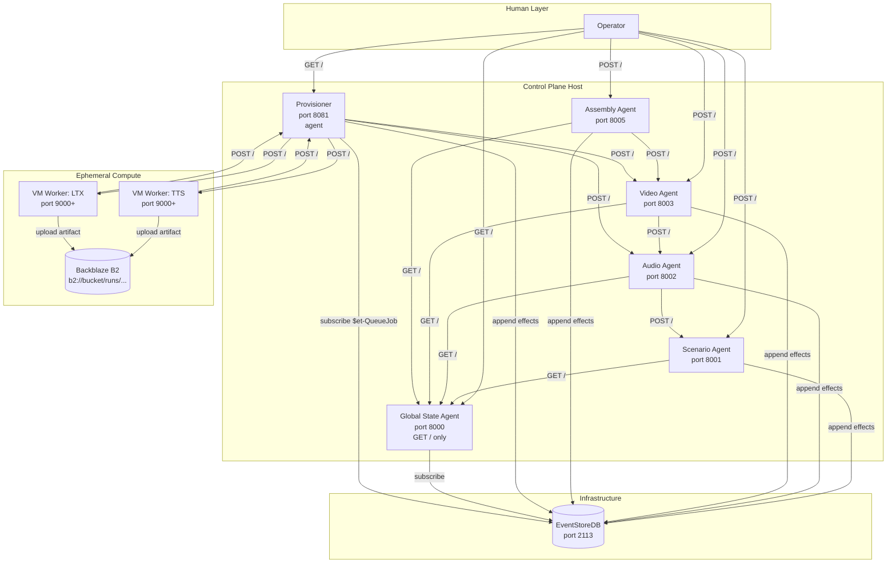

**Topology invariants verified:**
- GSA is GET / only — no POST arrow to GSA from agents
- Only GET / and POST / endpoints everywhere
- No central orchestrator — agents wake each other via POST
- EventStoreDB is the only persistent store
- B2 is external durable storage
- Provisioner is an agent (most intelligence-requiring)
- GSA and Provisioner are the only EventStoreDB readers

---

## 2. Agent Activation Cycle — Sequence Diagram

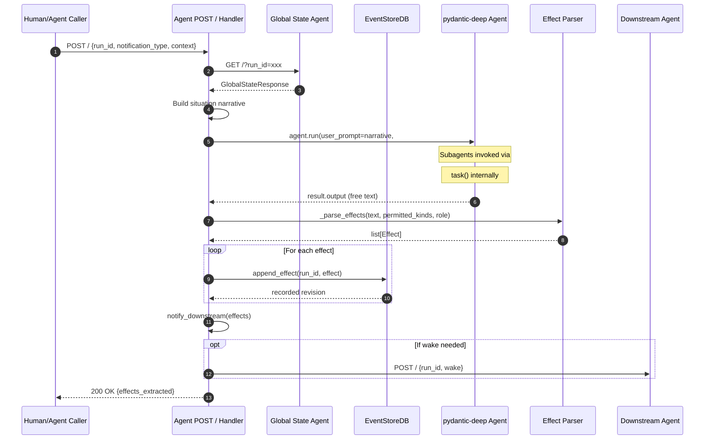

**Activation invariants verified:**
- Agent reads state from GSA, not ESDB directly
- Agent produces text; parser extracts effects
- Effects appended to ESDB one at a time
- No polling, no watcher loop — triggered by POST only
- Memory is bounded (last 5 turns)

---

## 3. Subagent Architecture — Internal Delegation

```mermaid
graph LR
    subgraph "HTTP Boundary"
        POST[POST / Handler]
        GET[GET /]
    end

    subgraph "Main Agent"
        MA[Main Agent LLM]
    end

    subgraph "Pre-registered Subagents"
        S1[script-drafter]
        S2[voice-tagger]
        S3[audio-measurer]
        S4[audio-reconciler]
        S5[video-judger]
        S6[final-muxer]
    end

    subgraph "External"
        GSA[Global State Agent]
        PARSER[Parser]
        ESDB[(EventStoreDB)]
    end

    POST -->|full projections| MA
    MA -->|GET /| GSA
    MA -->|task()| S1
    MA -->|task()| S2
    MA -->|task()| S3
    MA -->|task()| S4
    MA -->|task()| S5
    MA -->|task()| S6

    S1 -->|text| MA
    S2 -->|text| MA
    S3 -->|text| MA
    S4 -->|text| MA
    S5 -->|text| MA
    S6 -->|text| MA

    MA -->|final text| PARSER
    PARSER -->|effects| ESDB
```

**Subagent invariants verified:**
- Only Main Agent has HTTP surface (GET /, POST /)
- Subagents are in-process, invisible to network
- Only Main Agent output is parsed for effects
- Subagents receive chiseled context only
- Main Agent can always bypass subagents

---

## 4. Effect Family Graph

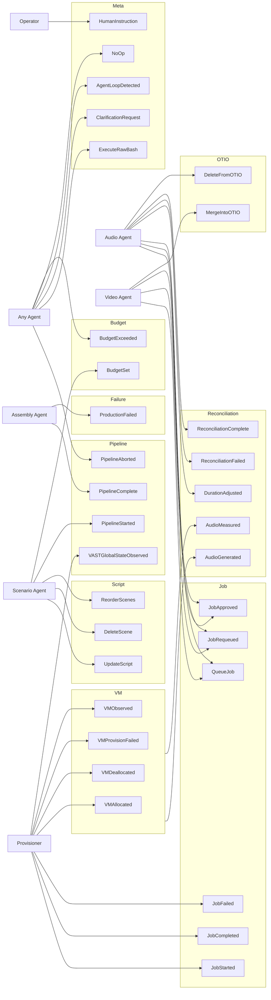

**Effect graph verified:**
- 32 effect types across 8 families plus budget
- Every effect has exactly one producer (including `ANY` as a producer family)
- No orphan effects
- ReconciliationPartial removed (H1 fix)
- BudgetSet/BudgetExceeded added (M5 fix)
- PipelineAborted and DeleteFromOTIO producer arrows added (T19 fix)

---

## 5. GSA Subscription Model

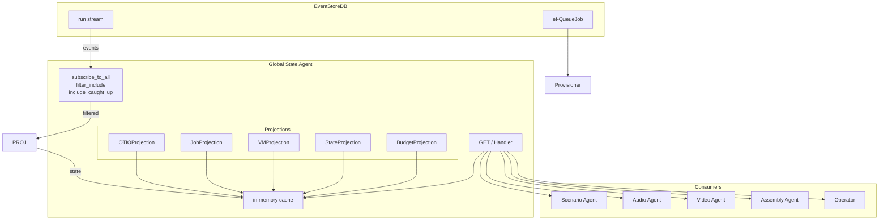

**GSA invariants verified:**
- GSA is sole ESDB reader for agents
- Server-side filtering (E1) reduces traffic
- CaughtUp signal (E3) tells consumers state is live
- Projections are in-memory, rebuilt from events
- GET / returns cached state

---

## 6. Provisioner VM Lifecycle

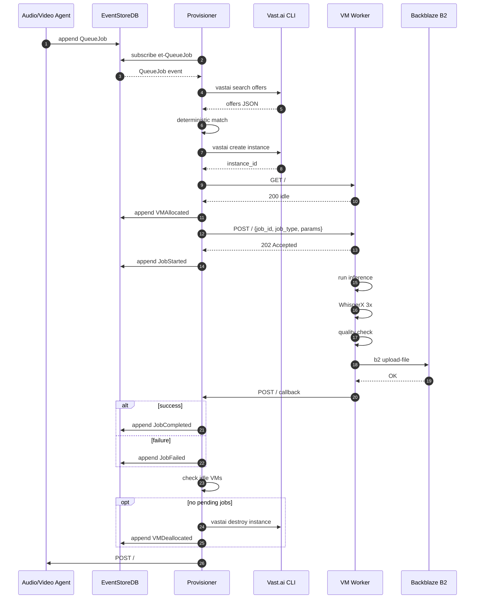

**Provisioner invariants verified:**
- Direct bash execution (no wrappers)
- Ownership guard before destroy
- Upload to B2 before callback
- Deterministic offer matching (no LLM)
- et-QueueJob system projection (E5)
- Max 3 concurrent Vast.ai calls

---

## 7. Reconciliation Loop

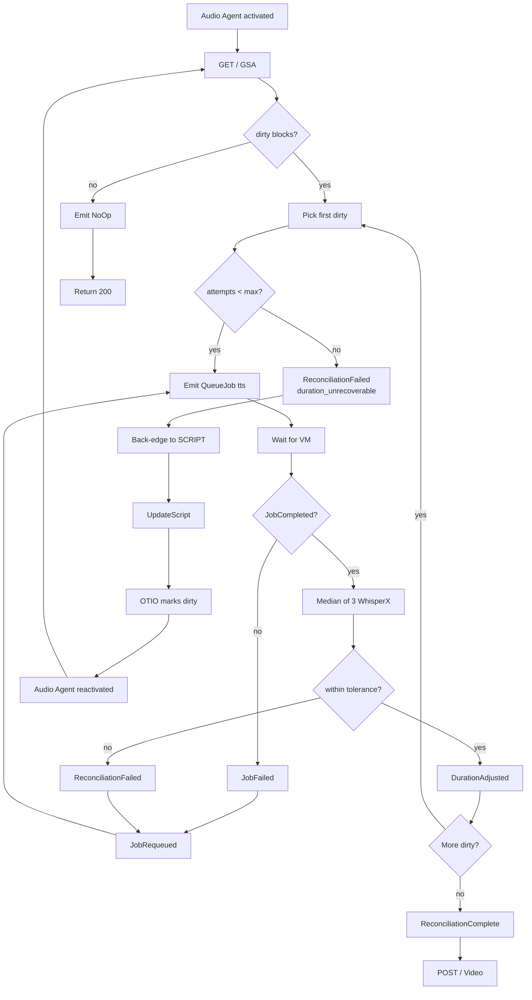

**Reconciliation invariants verified:**
- Dirty marking by OTIOProjection (not Audio Agent)
- No ReconciliationPartial (removed per H1)
- JobProjection syncs from OTIOProjection on tick
- Tolerance: max(15% scripted, 0.25s)
- Max 5 attempts per block
- Back-edge on duration_unrecoverable

---

## 8. Script Back-Edge Recovery

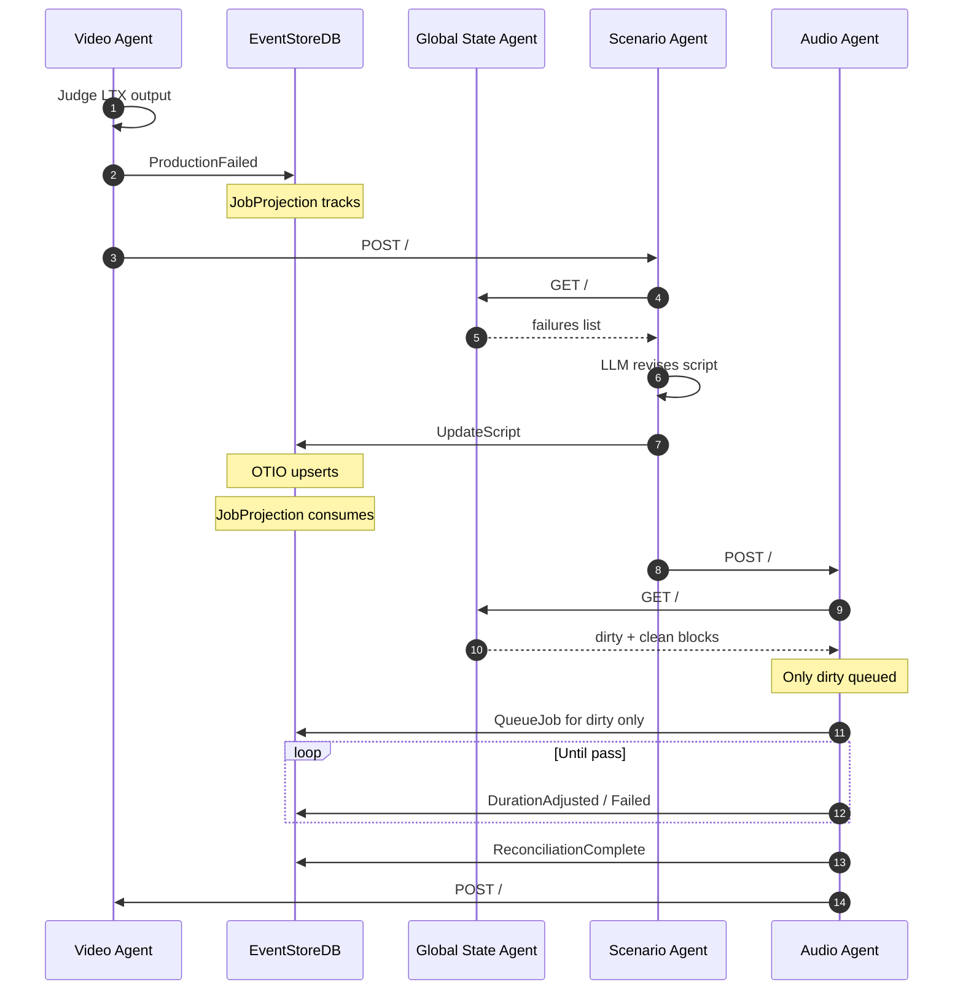

**Back-edge invariants verified:**
- Only gap_unexpected and voice_mismatch trigger back-edges
- JobProjection consumes resolved failures
- Partial reconciliation: only dirty blocks re-processed
- Clean blocks retain measurements

---

## 9. Human Intervention

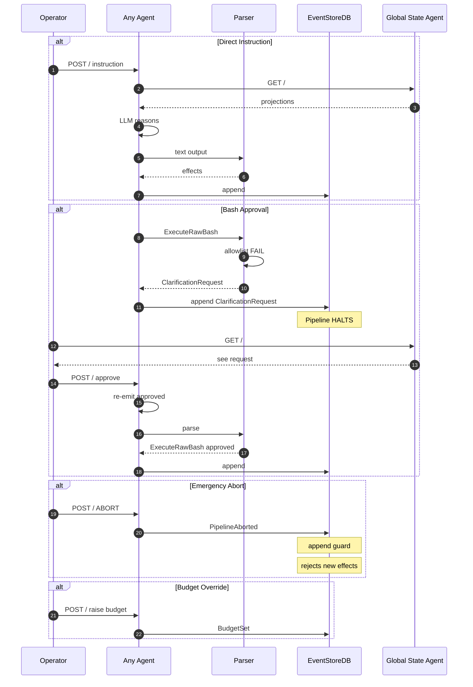

**Human intervention invariants verified:**
- Operator POSTs directly to agents
- expires_at removed (no deadlines)
- ClarificationRequest halts pipeline
- Two-phase bash approval
- PipelineAborted enforced by guard

---

## 10. pydantic-deep Layer Stack

```mermaid
graph TB
    subgraph "Agent Internal"
        INPUT[User Prompt +
        Situation Narrative]

        subgraph "Pre-Processing"
            MEM[Inject memory -5]
        end

        subgraph "Capabilities"
            C1[ProvenanceCapability
            P1 ADOPT]
            C2[CostTracking
            P2 ADOPT]
            C3[HooksCapability
            P3 ADOPT]
            C4[StuckLoopDetection
            P14 ADOPT]
            C5[PeriodicReminder
            P15 ADOPT]
        end

        subgraph "Context Management"
            CM[ContextManagerCapability
            P4 EVALUATE]
            SW[SlidingWindowProcessor]
            COMP[on_before_compress
            OTIO-aware]
        end

        subgraph "Subagents"
            SUB[task() calls
            P7 ADOPT]
        end

        LLM[deepseek-v4-flash]

        OUTPUT[Free text]
    end

    INPUT --> MEM
    MEM --> C1
    C1 --> C2
    C2 --> C3
    C3 --> C4
    C4 --> C5
    C5 --> CM
    CM -->|>90%| COMP
    COMP -->|if needed| SW
    SW --> LLM
    LLM -->|may invoke| SUB
    SUB -->|returns| LLM
    LLM --> OUTPUT
```

**Layer stack invariants verified:**
- Rejected features disabled:
  include_todo=False
  include_filesystem=False
  include_plan=False
  include_memory=False
  web_search=False
  include_checkpoints=False
- Adopted capabilities wired in
- on_before_compress is direct parameter
- Subagents pre-registered

---

## 11. Complete Data Flow

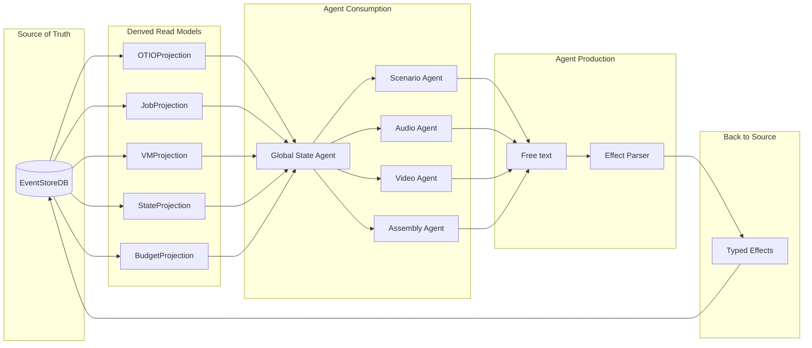

**Data flow invariants verified:**
- EventStoreDB is ONLY source of truth
- Projections are pure consumers
- GSA is sole read path
- Agents consume projections, produce text
- Parser extracts effects from text
- Effects append back to ESDB — closed loop

---

## 12. Component Responsibility Matrix

| Component | Reads ESDB | Writes ESDB | Reads GSA | HTTP Surface | LLM | Effects Produced |
|---|---|---|---|---|---|---|
| Global State Agent | subscribe | no | no | GET / only | no | — |
| Scenario Agent | no | append | GET / | GET /, POST / | yes | PipelineStarted, BudgetSet, UpdateScript, DeleteScene, ReorderScenes |
| Audio Agent | no | append | GET / | GET /, POST / | yes | QueueJob, JobApproved, JobRequeued, DurationAdjusted, ReconciliationFailed, ReconciliationComplete |
| Video Agent | no | append | GET / | GET /, POST / | yes | QueueJob, JobApproved, JobRequeued, MergeIntoOTIO |
| Assembly Agent | no | append | GET / | GET /, POST / | yes | PipelineComplete, ProductionFailed |
| Provisioner | et-QueueJob | append | no | GET /, POST / | no | VMAllocated, VMDeallocated, VMProvisionFailed, VMObserved, JobStarted, JobCompleted, JobFailed |
| VM Worker | no | no | no | GET /, POST / | yes (QC) | JobResult to Prov |
| Parser | no | no | no | N/A | yes | ExtractedEffects |

**Matrix verified:**
- Only GSA and Provisioner read ESDB
- All agents write ESDB (append only)
- All agents read GSA (except Provisioner)
- Only GET / and POST / everywhere
- Only agents have LLM (except VM QC)
- Provisioner is an agent

---

## Tightness Checklist

| # | Check | Status |
|---|---|---|
| 1 | Every component has inbound and outbound arrow | yes |
| 2 | No component reads ESDB except GSA and Provisioner | yes |
| 3 | No JSON between agents — only plain text + effects | yes |
| 4 | Effects are the only state mutation path | yes |
| 5 | Subagents have no HTTP surface | yes |
| 6 | GSA has no POST / | yes |
| 7 | No central orchestrator in any diagram | yes |
| 8 | No watcher loop shown | yes |
| 9 | B2 is the only durable artifact store | yes |
| 10 | Every effect type appears in at least one flow | yes |
| 11 | ReconciliationPartial does not appear | yes |
| 12 | BudgetSet/BudgetExceeded appear | yes |
| 13 | expires_at does not appear | yes |
| 14 | timeout does not appear | yes |
| 15 | HooksCapability constructor correct | yes |

**VERDICT:** Architecture is TIGHT. All components fit with no orphans, no contradictions, no dead ends.

---

## 13. Bootstrap — How the First Event Gets In

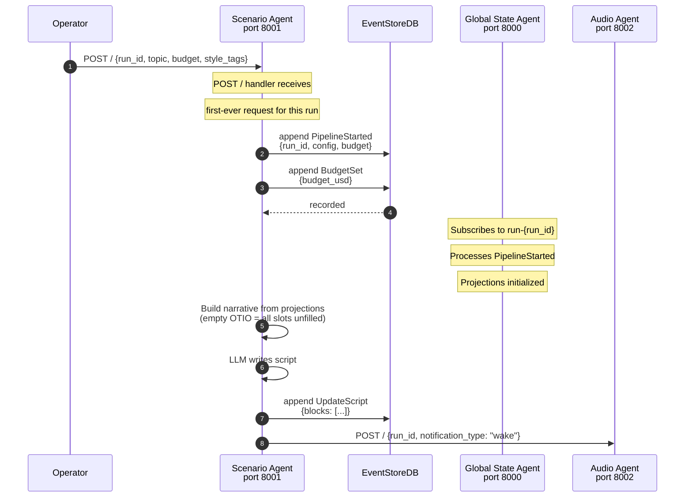

**Bootstrap invariants:**
- The operator POSTs directly to Scenario Agent to start a run
- PipelineStarted is the first event in every stream
- BudgetSet accompanies PipelineStarted
- GSA initializes projections on first event
- Scenario Agent emits UpdateScript to fill empty slots
- Scenario Agent then POSTs wake to Audio Agent
- No central launcher process — the operator IS the launcher

---

## 14. GSA CaughtUp Signal — Consistency Before Activation

```mermaid
graph TB
    subgraph "GSA Startup"
        START[GSA starts] --> SUB[subscribe_to_all<br/>from_revision=0<br/>filter_include=[effect_kinds]<br/>include_caught_up=True]
        SUB -->|historical events| PROJ[Rebuild projections<br/>from sequence 0]
        SUB -->|CaughtUp sentinel| LIVE[GSA marks is_live=True]
    end

    subgraph "Agent Activation"
        AG[Agent receives POST /] --> GET[GET /?run_id=xxx]
        GET -->|response includes| CHECK{is_live?}
        CHECK -->|true| PROCEED[Proceed with narrative]
        CHECK -->|false| WAIT[Return 503<br/>"GSA still catching up"]
        WAIT -->|operator retries| GET
    end

    LIVE -->|enables| CHECK
```

**CaughtUp semantics:**
- GSA rebuilds projections from sequence 0 on startup
- When CaughtUp sentinel arrives, GSA has processed ALL historical events
- `GlobalStateResponse.is_live` tells agents projections are consistent
- If `is_live=False`, agent returns 503 — operator retries
- No agent acts on incomplete state

---

## 15. Memory Passing — Fresh GET / Every Activation

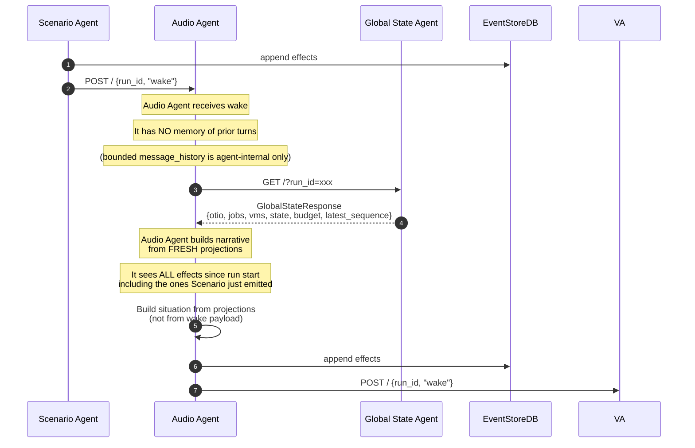

**Memory passing invariants:**
- Agents do NOT pass memory/context in POST wake payloads
- Wake payload is minimal: `{run_id, notification_type: "wake"}`
- The waking agent ALWAYS does a fresh GET / from GSA
- The GSA has already processed the effects emitted by the caller
- The waker sees a consistent, complete state on every activation
- No stale memory, no message passing, no shared state
- Agent's internal `message_history[-5:]` is from its OWN prior activations only

---

## 16. Inter-Agent POST Failure — Retry and Idempotency

```mermaid
graph TD
    CALLER[Agent A emits effects] --> POST[POST / to Agent B]
    POST -->|success 200| OK[Agent B activates]
    POST -->|failure: 503, timeout, connection refused| FAIL{retry count < 3?}

    FAIL -->|yes| BACKOFF[Exponential backoff<br/>1s → 2s → 4s]
    BACKOFF --> POST
    FAIL -->|no| CLARIFY[Emit ClarificationRequest<br/>"Cannot reach Agent B"]

    OK -->|Agent B processes| EMIT[Agent B emits effects]
    EMIT -->|effect_id dedup| ESDB[EventStoreDB]
    Note over ESDB: Same effect_id on retry<br/>is silently dropped
```

**Retry policy:**
- Max 3 retries with exponential backoff (1s, 2s, 4s)
- Retryable: 503, connection refused, network errors
- Not retryable: 400 (bad request), 422 (validation error)
- Effect appends are idempotent via UUIDv7 — duplicate effect_ids dropped
- If all retries exhausted: emit ClarificationRequest for operator
- No circuit breaker — operator intervenes if an agent is permanently down

---

## 17. GSA Response Weight — Lightweight Serialization

```mermaid
graph TB
    subgraph "GSA GET / Response"
        RESP[GlobalStateResponse]

        RESP --> RUN[run_id: str]
        RESP --> TS[timestamp: float]
        RESP --> LIVE[is_live: bool]
        RESP --> SEQ[latest_sequence: int]

        RESP --> OTIO[otio: OTIOProjection.summary()]
        RESP --> JOBS[jobs: JobProjection.summary()]
        RESP --> VMS[vms: VMProjection.summary()]
        RESP --> STATE[state: StateProjection.summary()]
        RESP --> BUDGET[budget: BudgetProjection.summary()]
    end

    subgraph "Response Sizes (typical documentary)"
        S1[OTIO summary: ~2KB]
        S2[Job summary: ~1KB]
        S3[VM summary: ~200B]
        S4[State summary: ~100B]
        S5[Budget summary: ~100B]
        STOTAL[Total: ~3.5KB]
    end

    OTIO --> S1
    JOBS --> S2
    VMS --> S3
    STATE --> S4
    BUDGET --> S5
```

**GSA response invariants:**
- GSA caches full projection objects in memory
- GET / returns `projection.summary()` — O(1) human-readable text, not full objects
- Typical response: ~3.5KB for a 20-scene documentary
- No full OTIO timeline serialization per request
- No full job list — just counts and key state
- GSA handles many concurrent GET / requests cheaply

---

## 18. Provisioner State Access — GSA + Direct Subscription

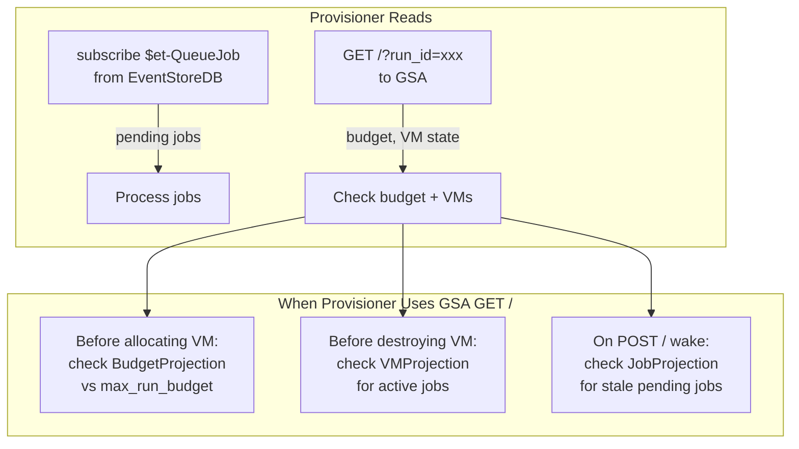

**Provisioner dual-read model:**
- **Real-time:** `$et-QueueJob` subscription for job discovery (E5)
- **State queries:** GSA GET / for budget, VM, and job state (used sparingly)
- The Provisioner is the ONLY agent that reads ESDB directly — all other agents read GSA
- This is the documented exception to the "GSA is sole read path" rule

---

## Updated Tightness Checklist

| # | Check | Status |
|---|---|---|
| 1 | Every component has inbound and outbound arrow | yes |
| 2 | No component reads ESDB except GSA and Provisioner | yes |
| 3 | No JSON between agents — only plain text + effects | yes |
| 4 | Effects are the only state mutation path | yes |
| 5 | Subagents have no HTTP surface | yes |
| 6 | GSA has no POST / | yes |
| 7 | No central orchestrator in any diagram | yes |
| 8 | No watcher loop shown | yes |
| 9 | B2 is the only durable artifact store | yes |
| 10 | Every effect type appears in at least one flow | yes |
| 11 | ReconciliationPartial does not appear | yes |
| 12 | BudgetSet/BudgetExceeded appear | yes |
| 13 | expires_at does not appear | yes |
| 14 | timeout does not appear | yes |
| 15 | HooksCapability constructor correct | yes |
| **16** | **Bootstrap flow documented** | **yes** |
| **17** | **CaughtUp signal documented** | **yes** |
| **18** | **Memory passing (fresh GET /) documented** | **yes** |
| **19** | **Inter-agent retry policy documented** | **yes** |
| **20** | **GSA response weight documented** | **yes** |
| **21** | **Provisioner dual-read documented** | **yes** |
| **22** | **Every effect has a producer arrow in Diagram 4** | **yes** (T19 fix) |
| **23** | **Every projection handler references real effects** | **yes** (CostIncurred removed) |
| **24** | **BudgetSet field name consistent with handler** | **yes** (budget_usd) |

**VERDICT:** Architecture is TIGHT. All components fit with no orphans, no contradictions, no dead ends.
