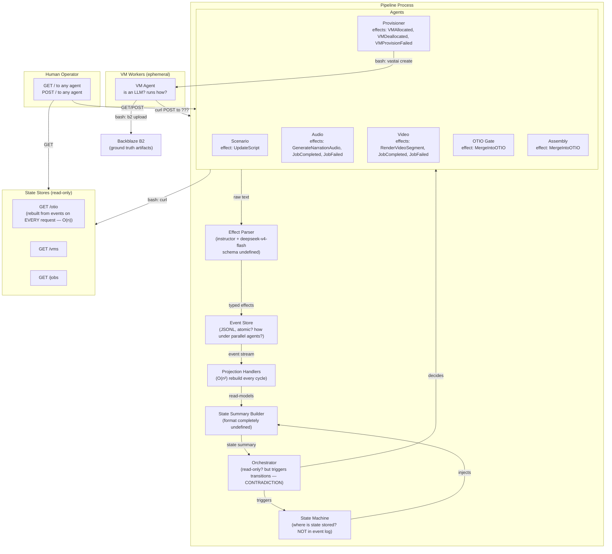
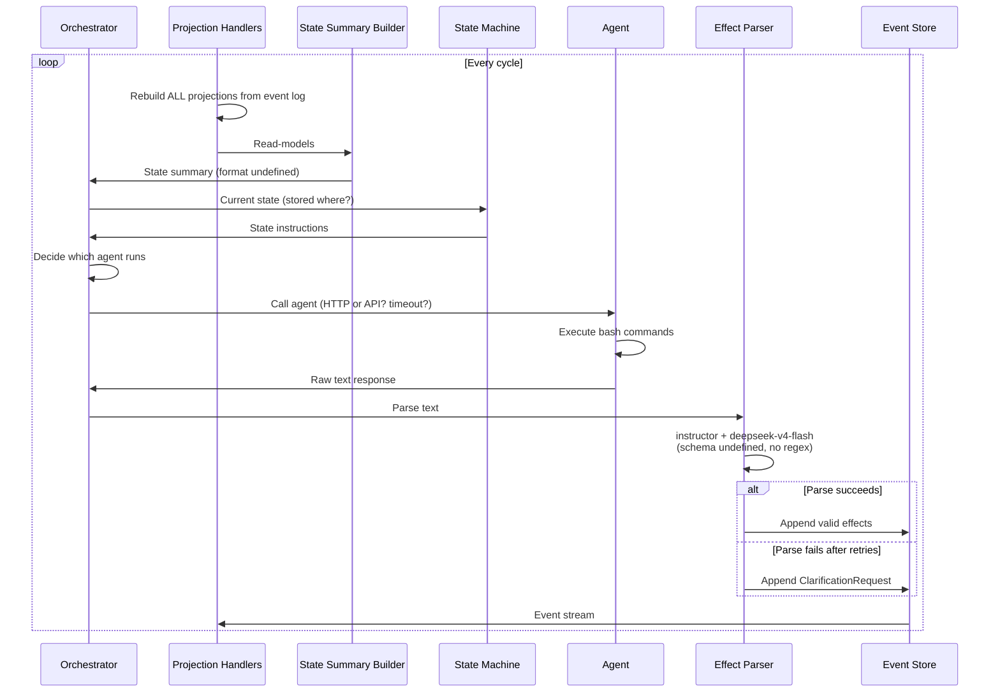
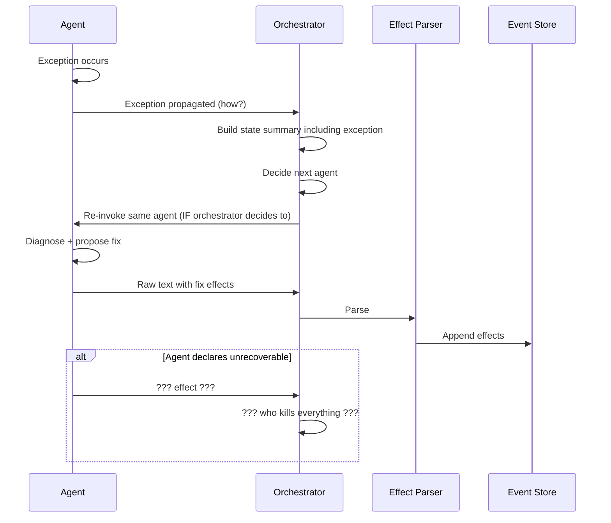
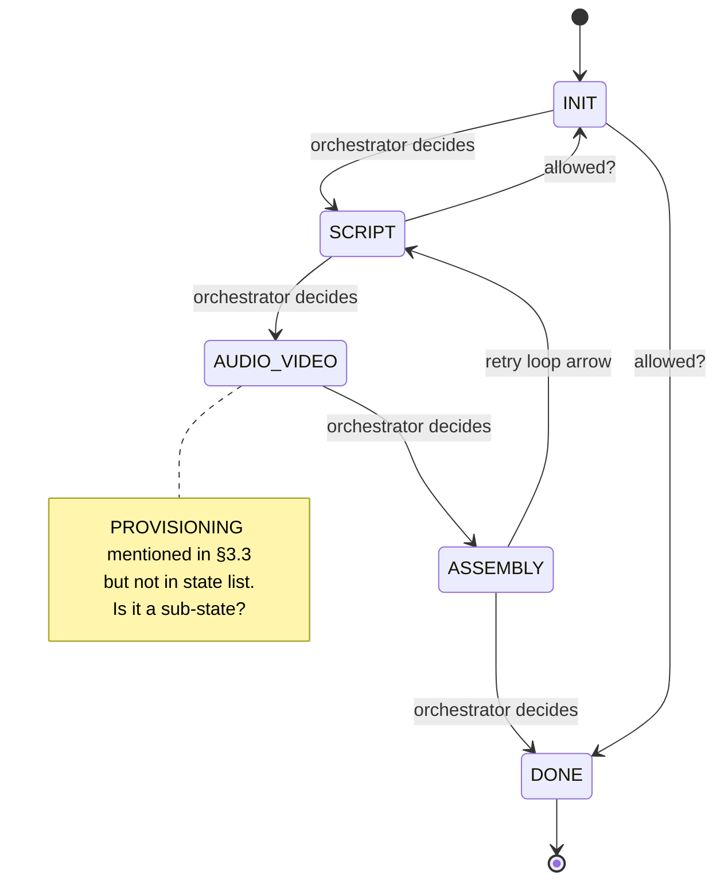
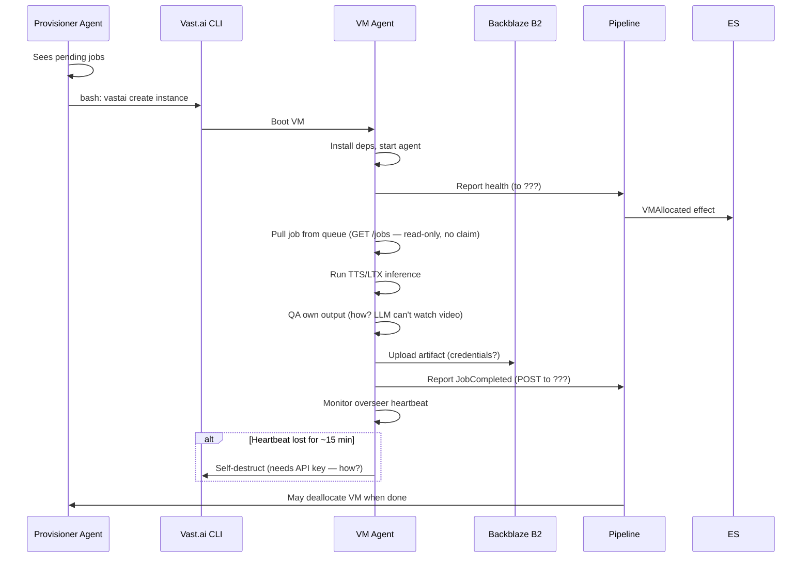
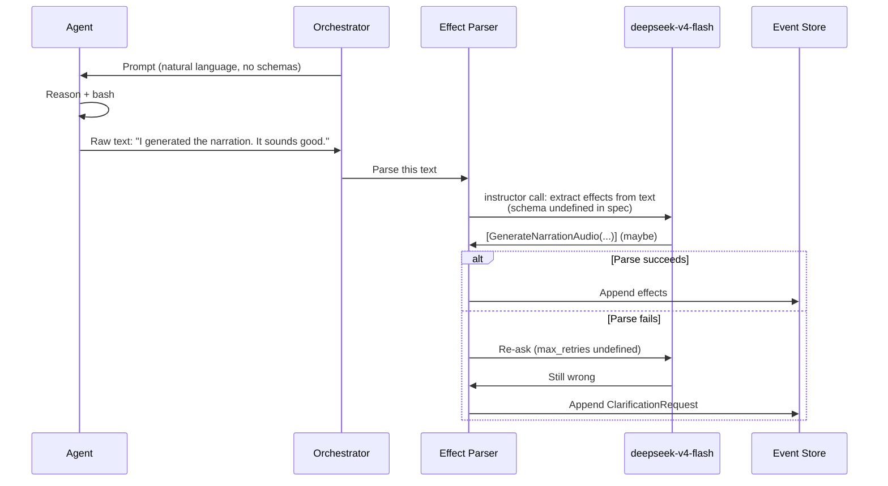
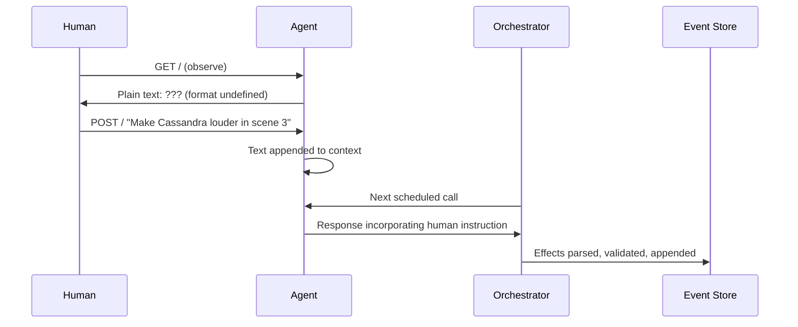
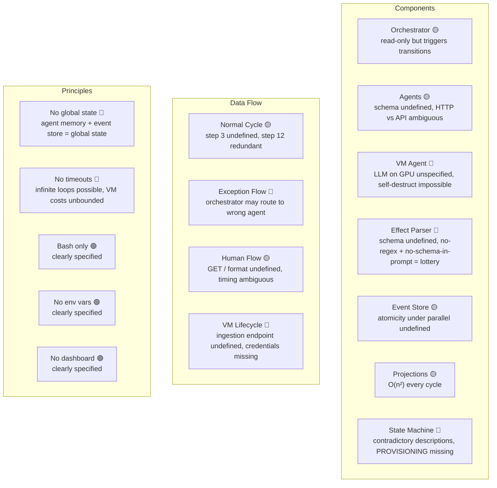

> [!WARNING]
> **NON-AUTHORITATIVE / SECONDARY DOCUMENTATION**
> Only the files inside the `obsidian-vault/` directory are the authoritative, up-to-date documentation for this project. This file is secondary and may be outdated.

# Architecture Tightness Audit — V2 Abstract

> This document audits `ABSTRACT_ARCHITECTURE_V2.md` as a build specification. Each issue is a place where the spec is vague, contradictory, or incomplete enough that a competent engineer would either build the wrong thing or be unable to build anything.
>
> **Severity:** 🔴 BLOCKER = cannot implement without clarification. 🟡 GAP = implementable but behavior undefined. 🟢 AMBIGUITY = multiple valid interpretations.

---

## Summary: 23 Blockers, 19 Gaps, 14 Ambiguities

| Category | Count |
|---|---|
| Missing schemas (effects, prompts, state summaries) | 8 |
| Undefined interfaces (who calls whom, with what) | 10 |
| Contradictions | 6 |
| Race conditions / concurrency undefined | 7 |
| Resource lifecycle holes | 9 |
| Security / credentials flow | 5 |
| Failure mode undefined | 11 |

---

## 1. System Topology — Structural Issues

### 🔴 BLOCKER: No return path from VM Workers to Pipeline

The topology diagram (§1) shows a one-way flow:
```
Pipeline → VM Workers → B2
```

But §2.3 says the VM agent "reports `JobCompleted` or `JobFailed` back to pipeline via bash (curl POST)." §3.5 step 7 repeats this.

**Missing:** What URL does it POST to? Is there an ingestion endpoint? If the pipeline has "only GET / and POST /" per agent (§2.8), which agent receives the VM's report? The Audio agent? The Orchestrator? A dedicated ingestion endpoint that violates the "only GET/POST per agent" rule?

**What an engineer would do:** Guess. Create a `/ingest` endpoint. Then violate §2.8 and §7.3.

---

### 🔴 BLOCKER: VM Agent is an LLM on a GPU instance — unspecified how

§2.3: "Is an LLM. Reasons about survival, output quality, and retry strategy."

The GPU instance runs on Vast.ai. For the VM agent to be an LLM, it must either:
1. Run a local model (requires model weights, VRAM for both inference model + LLM)
2. Call an external API (requires internet access, API key on the VM)

**Neither is specified.** LTX-2.3 alone needs ~48-80GB VRAM. Adding an LLM pushes this higher or starves LTX. Who provisions the LLM? Is it in the VM image? Does the VM agent use the same deepseek-v4-flash model via API? If so, the VM needs the API key file.

**What an engineer would do:** Put the API key in the on-start script. Now credentials are on ephemeral VMs.

---

### 🟡 GAP: Two VM-worker communication patterns are described but not reconciled

§2.8 says agents have `GET /` and `POST /` only.
§5.3 says pipeline ↔ VM workers use "GET / health, POST / jobs."

Are the VM workers "agents" (with GET/POST per §2.8) or "workers" (with GET /health and POST /jobs per §5.3)? If workers are agents, why do they have `/health` and `/jobs` paths when §2.8 says "No other endpoints. No special paths for special actions"?

---

## 2. Components — Specification Holes

### 🔴 BLOCKER: Effect schema is completely undefined

§2.2 lists effect types per agent in a table: `UpdateScript`, `GenerateNarrationAudio`, `JobCompleted`, `JobFailed`, `RenderVideoSegment`, `VMAllocated`, `VMDeallocated`, `VMProvisionFailed`, `MergeIntoOTIO`, `ClarificationRequest` (§2.4).

But nowhere does the spec define:
- What fields each effect has
- What the discriminated union looks like
- What `MergeIntoOTIO` actually merges (a clip? a track? with what parameters?)
- What `JobCompleted` contains (artifact URL? B2 path? duration?)
- What `JobFailed` contains (error message? retry suggestion?)

§2.4 says "Pydantic discriminated unions enforce schema" but the schema itself is absent.

**What an engineer would do:** Invent fields. The QA and recovery logic depends on these fields. Invention = divergence.

---

### 🔴 BLOCKER: State Summary format is undefined

§2.7: "Output: Human-readable state summary string fed to orchestrator"
§3.1 step 2: "Build state summary from projections"

**Missing:** What goes in the string? A bulleted list? A narrative? What fields from OTIO, queues, VMs? How are pending jobs described? How are VM health statuses represented? How long can the string be before it overflows the LLM context window?

The orchestrator's entire decision depends on this string. If the format is wrong, the orchestrator hallucinates state.

**What an engineer would do:** Build a template. Different template = different orchestrator behavior.

---

### 🔴 BLOCKER: State machine is described twice, differently

§4.1 shows a 5-state linear machine:
```
[INIT] → [SCRIPT] → [AUDIO+VIDEO parallel] → [ASSEMBLY] → [DONE]
```

§3.3 mentions transitioning from "SCRIPT to PROVISIONING" — PROVISIONING is not in the state list.

§4.2 says "The orchestrator is free to transition between any states based on the actual state summary." But §4.1 draws a specific graph. If the orchestrator can jump from INIT to DONE, the diagram is meaningless. If it cannot, §4.2 is wrong.

§3.1 step 3 says "Reconstruct state machine from transition effects." What are "transition effects"? No such effect type is defined. Is the state machine part of the event log or external to it?

**What an engineer would do:** Build a flat enum and let the orchestrator pick freely. No state machine enforcement at all.

---

### 🟡 GAP: "No separate Maintainer agent" but exception handling requires one

§3.2 Exception Flow: "Exception is returned to the SAME agent as context."

But the orchestrator decides which agent runs next (§2.1). If an exception occurs during an Audio agent turn, and the orchestrator next decides to run the Provisioner agent (because it sees pending jobs), the exception never reaches the Audio agent.

To guarantee the same agent handles its own exception, either:
1. The orchestrator must be told about the exception before deciding (but §2.1 says its input is "state summary", not "last exception")
2. The exception bypasses the orchestrator and directly re-invokes the agent (violating "orchestrator decides which agent runs")

**What an engineer would do:** Add exception state to the state summary. But then the orchestrator might still choose a different agent if it prioritizes jobs over error handling.

---

### 🟡 GAP: Agent statefulness has two incompatible mechanisms

§2.2: "Stateful. All agents accumulate wisdom across turns. Conversation history persists."
§5.1: "The pipeline passes a thread_id to the LLM provider. Prior context persists."
§2.8: "POST / (instruction, appends to agent context)" — implies agent service maintains context server-side.

**Conflict:** If agents are HTTP services (§2.8) that maintain their own context, why does the pipeline pass a `thread_id` to an LLM provider? The HTTP agent IS the LLM provider in this model. Or are some agents HTTP services and others direct API calls? Which ones?

§5.1 says "Plain text over HTTP (or direct LLM API)." This suggests a hybrid. But the spec never says which agents use which mechanism.

**What an engineer would do:** Make all agents direct API calls (simpler). Then the HTTP agent surface (§2.8) is dead code. Or make all agents HTTP services. Then `thread_id` is meaningless.

---

### 🟡 GAP: Effect parser "ClarificationRequest" effect — who consumes it?

§2.4: "If instructor exhausts retries, emit a `ClarificationRequest` effect to the same agent."

But effects go to the event store (§2.5). The event store is append-only. How does a `ClarificationRequest` effect "go to" an agent? The orchestrator reads the event log, builds state summary, decides which agent runs. If it sees a `ClarificationRequest`, does it know to run the same agent again? What if the orchestrator decides something else is more urgent?

**What an engineer would do:** Treat `ClarificationRequest` as a regular event. The orchestrator may or may not run the same agent again. Clarification becomes best-effort.

---

## 3. Data Flow — Concurrency and Ordering

### 🔴 BLOCKER: Event store atomicity under parallel agents

§2.5: "Interface: append(effect) — atomic, append-only"
§4.1: "AUDIO+VIDEO parallel" — orchestrator can run audio and video agents simultaneously.

If two agents produce effects concurrently, who serializes them? File-level locking? A single writer thread? The orchestrator serializes by only running one agent at a time? But §4.1 explicitly allows parallel.

If there's no serialization mechanism, events can be interleaved or lost.

**What an engineer would do:** Use a file lock. But file locks across processes are OS-dependent and can deadlock. Or run agents sequentially despite "parallel" being allowed.

---

### 🔴 BLOCKER: "Read models are rebuilt from events on every cycle" — O(n²) collapse

§2.6: "Read models are rebuilt from events on every cycle."
§2.9: "Rebuilt from event log projections on every request."

For a 90-minute documentary with thousands of clips, the event log could have 10,000+ events. Rebuilding OTIO, queues, and VM registry from scratch on every cycle means O(n²) total work. After a few hundred cycles, the pipeline spends more time rebuilding state than running agents.

**The spec provides no incremental projection mechanism.** It explicitly forbids caching (§7.1: "No caching, no optimistic updates").

**What an engineer would do:** Secretly add incremental projections. Or watch the pipeline grind to a halt.

---

### 🟡 GAP: Event ordering for parallel agents

If Audio and Video agents run in parallel (§4.1) and both produce effects, what order do they appear in the event log? Timestamp-based? Arrival-order? If timestamps collide (same millisecond), what breaks the tie?

The event store has a `seq` field (mentioned in code context but not in V2). If V2 uses sequence numbers, who assigns them? A central counter requires serialization, which conflicts with parallel agents.

**What an engineer would do:** Use timestamps. Then replay is non-deterministic if two events have the same timestamp.

---

### 🟡 GAP: "Reconstruct state machine from transition effects" — undefined

§3.1 step 3: "Reconstruct state machine from transition effects."

What are "transition effects"? No such effect type is defined in §2.2. Is the state machine's current state stored in the event log? If so, the orchestrator could read it directly instead of "reconstructing" it. If not, where is it stored?

§7.5 says "No global mutable state." If the state machine state is not in the event log and not in global state, where is it?

**What an engineer would do:** Store state machine state in a variable. Now there's global mutable state.

---

## 4. State Machine — Contradictions

### 🔴 BLOCKER: State list doesn't match described behavior

§4.1 states: INIT → SCRIPT → AUDIO+VIDEO → ASSEMBLY → DONE

But §3.3 mentions "PROVISIONING" as a state.
§3.5 describes VM lifecycle as part of the pipeline — when does provisioning happen? During AUDIO+VIDEO? Before? Is it a sub-state?

The orchestrator "is free to transition between any states" (§4.1), but the diagram shows a specific graph. If the orchestrator can jump from INIT to DONE, why have states at all? If it must follow the graph, §4.1 is wrong.

**What an engineer would do:** Ignore the state machine. Let the orchestrator decide everything ad-hoc. The state machine becomes documentation fiction.

---

### 🟡 GAP: Retry arrow from AUDIO+VIDEO goes to SCRIPT, not AUDIO+VIDEO

§4.1 diagram shows:
```
           ↑______________|___________|
                    (retry loops)
```

The arrow from AUDIO+VIDEO goes back to SCRIPT. Why? If audio generation fails, why retry from the script? The script was already approved. Re-running the script agent would regenerate narration text, which may invalidate already-completed audio clips.

**What an engineer would do:** Make the retry loop self-referential (AUDIO+VIDEO → AUDIO+VIDEO). Now the diagram is wrong.

---

## 5. VM Lifecycle — Undefined Mechanics

### 🔴 BLOCKER: VM agent health reporting — no ingestion endpoint

§3.5 step 4: "VM boots, VM agent starts, reports health."

Reports health to what? The pipeline has no health ingestion endpoint. The agent HTTP surface (§2.8) is per-agent GET/POST. The state stores (§2.9) are read-only.

If the VM agent POSTs to, say, the Provisioner agent's POST /, that's an instruction to the Provisioner, not a health report. If it POSTs to a state store, those are read-only.

**What an engineer would do:** Create a dedicated health endpoint. Violate §2.8 and §2.9.

---

### 🔴 BLOCKER: VM self-destruct requires credentials it doesn't have

§2.3: "Monitors overseer heartbeat. Self-destructs on ~15 min heartbeat loss."
§3.5 step 8: "VM agent monitors overseer; if gone → self-destruct (~15 min)."

To self-destruct a Vast.ai instance, the VM needs the Vast.ai API key. §7.6 says credentials are "read from known file paths." But the VM is an ephemeral GPU instance. How does the API key get onto it?

Options:
1. Embed key in the VM image (security risk)
2. Pass key via on-start script (visible in Vast.ai logs)
3. VM asks pipeline for key via HTTP (circular: needs key to authenticate the request)
4. VM doesn't self-destruct; pipeline destroys it (violates "self-destructs")

**What an engineer would do:** Pipeline destroys VMs. The "self-destruct" requirement is unimplementable securely.

---

### 🟡 GAP: VM agent "pulls jobs from queue" — no dequeue mechanism

§2.3: "pulls jobs from queue via bash."
§2.9: `GET /jobs` is read-only.

If GET /jobs is read-only, the VM agent can see pending jobs but cannot claim one. Two VMs could pick the same job. There's no atomic dequeue.

**What an engineer would do:** Add a claim mechanism (POST to claim a job). Violates read-only.

---

### 🟡 GAP: VM agent "QA's own output" — no QA spec

§2.3: "QA's own output using reasoning. Retries on failure with adjusted parameters."

What does "QA" mean for a VM agent? Does it listen to the audio? Does it watch the video? LLMs can't process raw audio or video files. Does it run ffmpeg to extract metadata? What parameters does it adjust? TTS speed? LTX seed? Resolution?

**What an engineer would do:** Skip QA on the VM. Just run inference and upload.

---

### 🟡 GAP: VM agent throttling — no threshold specified

§2.3: "If inference cost exceeds threshold, the VM agent reduces its reasoning frequency."

What threshold? Per-VM? Per-pipeline? Per-scene? How is cost measured? Vast.ai billing? API calls to deepseek-v4-flash? What is the throttling strategy (skip reasoning, shorter reasoning, less frequent)?

**What an engineer would do:** Ignore throttling. Or hardcode a dollar amount.

---

## 6. Effect Parser — Impossible Requirements

### 🔴 BLOCKER: "No regex pre-extraction" + "Types are implied in text" = agent cannot know what to produce

§2.4: "No regex pre-extraction. Types are implied in text — semantically present in the agent's natural language."
§7.3: "Plain text only between agents and pipeline. No JSON, no schemas in prompts."
§7.8: "The agent's ONLY tool is bash."

The agent produces plain text via bash. The parser extracts typed effects from that text using instructor. But the agent is never told what types exist (no schemas in prompts). So the agent produces natural language that may or may not contain the semantic markers the parser expects.

**This is a lottery:** The agent might say "I generated the audio file" and the parser needs to infer `GenerateNarrationAudio`. Or the agent might say "The clip is done" and the parser needs `JobCompleted`. Without the agent knowing the target types, the extraction rate is unpredictable.

**What an engineer would do:** Include effect types in the agent prompt. Violate §7.3.

---

### 🔴 BLOCKER: Effect parser uses instructor + deepseek-v4-flash — second LLM call per agent turn

§2.4: "instructor + deepseek-v4-flash extracts typed effects from raw text."

Every agent turn requires:
1. Call agent (deepseek-v4-flash or other model? §7.6 says deepseek-v4-flash everywhere)
2. Parse agent text with instructor + deepseek-v4-flash

This doubles the LLM cost per cycle. For a pipeline with hundreds of cycles, this is significant. Is the parser cost accounted for? Is there a budget for it?

**What an engineer would do:** Use regex to avoid the second call. Violate §2.4.

---

### 🟡 GAP: "instructor re-asks on validation failure (up to max_retries)" — max_retries undefined

§2.4 mentions `max_retries` but never specifies the value.

**What an engineer would do:** Pick 3. Or 1. Or 0.

---

## 7. Communication — Ambiguous Protocols

### 🟢 AMBIGUITY: "HTTP (or direct LLM API)" — which agents use which?

§5.1: "Protocol: Plain text over HTTP (or direct LLM API)."

The spec never specifies which agents are HTTP services and which are direct API calls. The orchestrator? Direct API (it's an LLM). The scenario agent? Could be either. The VM agent? Must be HTTP (it's on a remote machine). But §2.3 says the VM agent "is an LLM" — does it call an external API or run locally?

**What an engineer would do:** Make all agents direct API calls for simplicity. Then the HTTP agent surface and VM agent LLM are both aspirational.

---

### 🟢 AMBIGUITY: POST / returns response synchronously or asynchronously?

§2.8: "POST / (instruction, appends to agent context)"
§3.1 step 7: "Call agent" → step 8: "Receive raw text response"

This implies synchronous: POST sends instruction, waits for LLM response, returns text. But if the agent is a long-running HTTP service (maintaining context across calls), does it generate a response immediately? What timeout? The spec says "No timeout-based kills" (§7.2), but HTTP has inherent timeouts.

**What an engineer would do:** Set a 5-minute HTTP timeout. Violate §7.2 in practice.

---

### 🟡 GAP: Human intervention appends to "agent context" — what is agent context?

§3.4: "Human POSTs text to the agent's URL. Text is appended to agent context."

If agents are direct LLM API calls (§5.1), "agent context" is the conversation history sent to the LLM provider. Appending text means adding it to the message list. That's straightforward.

If agents are HTTP services (§2.8), "agent context" is server-side state maintained by the agent service. The spec never says how the agent service stores context. In-memory? Disk? Database?

**What an engineer would do:** Store context in memory. Lose it on restart.

---

## 8. Hard Principles — Internal Contradictions

### 🔴 BLOCKER: "No global mutable state" + "Agent memory persists across runs" + event store is a file

§7.5: "No global mutable state. Everything flows through projections."
§7.5: "Agent memory persists across runs."

Agent memory persisting across runs requires storage. If it's not global mutable state, where is it? Per-agent files? A database? The event store is a file — that's global mutable state.

**What an engineer would do:** Store agent memory in files. Now there's global mutable state. Or store it in the event log (as effects). But the event log is append-only; memory updates would require new events on every turn, bloating the log.

---

### 🔴 BLOCKER: "Orchestrator never runs tools" + "orchestrator calls state machine transition"

§2.1: "No side effects. Read-only observer."
§2.1: "The orchestrator is the ONLY component that triggers state machine transitions."

A state machine transition IS a side effect. It changes state. If the orchestrator triggers it, it has side effects. Contradiction.

**What an engineer would do:** Accept that the orchestrator has side effects. Or make state transitions effects produced by the orchestrator (but §2.1 says orchestrator never produces effects; it only decides).

---

### 🔴 BLOCKER: "No timeout-based kills" + VM costs money per hour

§7.2: "No timeout-based kills in the pipeline. Agent turns run until the agent decides to stop."

If an agent enters an infinite loop (e.g., repeatedly trying the same failing command), the pipeline never terminates. The VM keeps billing. There's no circuit breaker.

**What an engineer would do:** Add a timeout. Violate §7.2.

---

### 🟡 GAP: "Vast.ai CLI is source of truth" + "VM registry projection exists"

§7.7: "Vast.ai CLI is source of truth. No wrapper abstractions."
§2.6: Projections include "VM registry (active VMs)."

If Vast.ai CLI is source of truth, why maintain a projection? The projection will drift if a VM dies without emitting a `VMDeallocated` event. Who reconciles? The spec says "No procedural logic overriding agent decisions" — so an agent must decide to reconcile. But the orchestrator might not run the provisioner agent if it thinks all VMs are healthy (based on the drifted projection).

**What an engineer would do:** Periodically call `vastai show instances` to reconcile. But who triggers this? The orchestrator? That's procedural logic.

---

### 🟡 GAP: "Kill everything on unrecoverable failure" — who decides? How?

§7.4: "Kill everything on unrecoverable failure. Destroy all VMs, stop all processes."

Who decides it's unrecoverable? The agent? It produces an effect. The orchestrator reads it and decides to kill? But §7.4 says "If stuck, report to human immediately" — so the human decides? But there's no dashboard (§1, §7.3).

How is "kill everything" executed? A bash command? A Python `sys.exit()`? A signal to subprocesses? What if the orchestrator itself crashes?

**What an engineer would do:** Add a kill switch effect. The pipeline process traps it and calls `vastai destroy` on all instances. But who handles the trap?

---

### 🟢 AMBIGUITY: "Each pipeline run is self-contained" + "Agent memory persists across runs"

§7.5: "Each pipeline run is self-contained."
§7.5: "Agent memory persists across runs."

If agent memory persists, runs are not self-contained. A previous run's context influences the current run. This is desirable ("accumulated wisdom") but contradicts "self-contained."

**Resolution:** "Self-contained" means no shared mutable state EXCEPT agent memory. But this needs to be explicit.

---

## 9. Security and Credentials

### 🔴 BLOCKER: Credential flow for VM agents completely unspecified

§7.6: "External credentials are hardcoded or read from files. Vast.ai key, B2 credentials, LLM API key — read from known file paths, not env vars."

The pipeline process has these files. But the VM agent (§2.3) also needs:
- Vast.ai API key (to self-destruct)
- B2 credentials (to upload artifacts)
- LLM API key (if it's an LLM calling an external API)

How do these get onto the VM? The spec never says.

**What an engineer would do:** Embed credentials in the on-start script. Security nightmare.

---

### 🟡 GAP: B2 is "ground truth" but agents upload via bash — how do they authenticate?

§7.1: "B2 is ground truth for artifacts."
§2.3: "Uploads artifacts to B2 immediately via bash."

The bash command would be something like `b2 upload-file ...`. This requires B2 credentials. Are they in the VM's filesystem? Passed via environment variable (forbidden by §7.6)? Hardcoded in the bash command?

**What an engineer would do:** Pass credentials via a file mounted into the VM image.

---

## 10. Failure Modes — Undefined Behavior

### 🔴 BLOCKER: What happens when the event log grows unbounded?

§2.5: JSONL file, append-only, immutable. No compaction, no rotation, no archiving.

For a 90-minute documentary, the event log could be megabytes or gigabytes. On every cycle, it's read in full (§2.6, §2.9). Eventually, reading it dominates cycle time.

**What an engineer would do:** Add log rotation. Violate "immutable."

---

### 🔴 BLOCKER: Disk full during event append

§2.5: Atomic append to JSONL. No disk space check mentioned.

If the disk is full, append fails. The effect is lost. The pipeline is now in an inconsistent state (agent produced an effect that was never stored). Does the pipeline crash? Retry? Report to human?

**What an engineer would do:** Check disk space before append. But §7.8 says agents only use bash; the pipeline can use Python.

---

### 🟡 GAP: LLM API outage — what happens?

§7.6: Hardcoded `deepseek-v4-flash` everywhere.

If the DeepSeek API is down, the entire pipeline stops. There's no fallback model. No retry with backoff. "No timeout-based kills" means the pipeline waits indefinitely.

**What an engineer would do:** Add a timeout and fallback. Violate §7.2 and §7.6.

---

### 🟡 GAP: Vast.ai API outage — what happens?

§7.7: "Vast.ai CLI is source of truth."

If Vast.ai is down, the Provisioner agent cannot provision VMs. Jobs queue up indefinitely. The pipeline is stuck. Does the orchestrator keep trying? Does it report to human? How?

**What an engineer would do:** Add exponential backoff. Not specified.

---

### 🟡 GAP: B2 upload failure — artifact lost

§2.3: "Uploads artifacts to B2 immediately."

If B2 is temporarily unavailable, the upload fails. The VM may self-destruct (§2.3, §3.5). The artifact is lost. The pipeline doesn't know (the VM reported `JobCompleted` before upload? Or after?).

**What an engineer would do:** Upload first, then report completion. But if upload fails, report `JobFailed`. The spec doesn't specify this ordering.

---

### 🟡 GAP: "Report to human immediately" — via what channel?

§7.4: "Never silently fail. If stuck, report to human immediately."

But §1 says "No dashboard. No approval UI." The human observes via GET / to an agent. If the pipeline is stuck, does it still serve GET /? What if the pipeline process crashed? How does the human know?

**What an engineer would do:** Print to stderr. Hope the human is watching.

---

## 11. Prompt Construction — Missing Specs

### 🟡 GAP: Base persona content undefined

§6.1: "Base Persona — Hardcoded identity"

What does each agent's persona say? What constraints does it include? What examples? The persona defines the agent's behavior. Without it, every agent build is different.

**What an engineer would do:** Write generic personas. Agents behave unpredictably.

---

### 🟡 GAP: "Skills, reference material" — where do they live? How are they loaded?

§6.1 table: "Domain Knowledge — Skills, reference material"
§6.3: "D — Domain Knowledge — Skills, reference material"

Where are skills stored? How are they loaded into the prompt? Are they files? A database? Hardcoded strings? The glossary defines "Skill" as "A loadable prompt fragment" but doesn't say how to load it.

**What an engineer would do:** Hardcode skills in Python files.

---

### 🟢 AMBIGUITY: "State machine selects R and adjusts W" — how?

§6.3: "The state machine selects R and adjusts W."

What mapping exists between state and R/W? Is it a lookup table? A function? An LLM prompt that generates R and W? The spec doesn't say.

**What an engineer would do:** Hardcode R and W per state.

---

## 12. Glossary — Terms Used But Undefined

| Term | Used In | Missing Definition |
|---|---|---|
| `ScriptApproved` | §3.3 | Not in effect table (§2.2). What produces it? |
| `thread_id` | §5.1 | What is it? A string? An integer? Who generates it? |
| `overseer` | §2.3, §3.5 | What is the overseer? The pipeline process? The orchestrator? A heartbeat daemon? |
| `Transition effects` | §3.1 step 3 | Never defined. |
| `QA comments` | §4.3 | Format? Content? Who writes them? |
| `reasoning frequency` | §2.3 | What does this mean? Number of LLM calls per unit time? Per clip? |
| `state patches` | Not in V2 | Used in old docs but absent here. Related to recovery. |
| `B2` | Throughout | Defined as "Backblaze B2" but bucket name, region, auth mechanism undefined. |

---

## Appendix A: The As-Built Diagrams (What V2 Actually Specifies)

Below are faithful Mermaid diagrams of what V2 **actually says**, with tightness issues annotated inline as `%% NOTE` comments.

### A.1 Actual System Topology



### A.2 Actual Normal Cycle



### A.3 Actual Exception Flow



### A.4 Actual State Machine (as specified)



### A.5 Actual VM Lifecycle



### A.6 Actual Effect Flow (the parser paradox)



### A.7 Actual Human Intervention



### A.8 Tightness Heat Map



---

## Appendix B: The Minimal Set of Fixes to Make V2 Tight

To make this architecture implementable without guessing, the following must be specified:

1. **Effect schema** — Full Pydantic models for every effect type, including all fields and validation rules.
2. **State summary format** — Template or function that produces the state summary string. What information, in what order, in what prose style.
3. **State machine definition** — Single source of truth: either a strict graph or free transitions. Pick one. Define all states including PROVISIONING.
4. **VM ingestion endpoint** — Dedicated endpoint (or agent) that receives VM health reports, job completions, and job failures. Specify URL, format, authentication.
5. **VM agent implementation** — How the LLM runs on the GPU instance (local model vs API call). If API, how credentials get there. If local, what model and how loaded.
6. **Credential flow to VMs** — Explicit, secure mechanism for B2 and Vast.ai credentials on ephemeral instances.
7. **Agent communication mode** — Per-agent specification: HTTP service or direct API call. No ambiguity.
8. **Effect parser schema exposure** — Either tell agents about effect types (violate "no schemas in prompts") or accept that extraction is probabilistic.
9. **Event store serialization** — How concurrent appends are serialized. File locking? Single writer? Sequential agent execution?
10. **Projection incrementality** — Either accept O(n²) or specify incremental updates. Don't pretend rebuild-every-cycle is viable.
11. **Kill switch protocol** — What effect type signals unrecoverable failure. Who receives it. How VMs are destroyed. How the pipeline process exits.
12. **Exception routing** — How the orchestrator knows to re-run the same agent after an exception, vs running a different agent.
13. **Human notification mechanism** — How the pipeline reports "stuck" state when there's no dashboard.
14. **Recovery budget** — Max retries per agent, per pipeline, or none? The spec says "Agent decides" but doesn't say how the agent knows the budget.
15. **Agent personas** — Full text of each agent's base persona. This defines behavior more than any other spec.

Without these 15 items, every implementation will diverge from the abstract architecture in incompatible ways.
