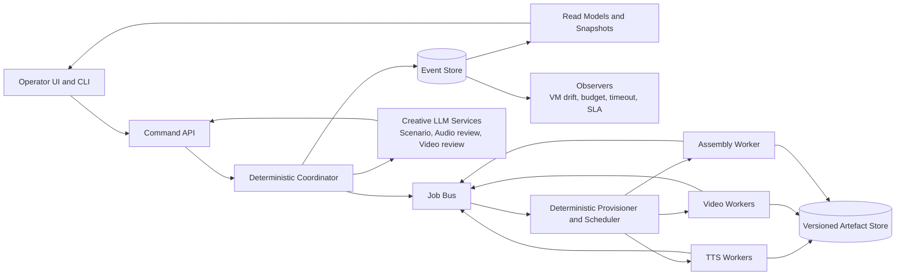
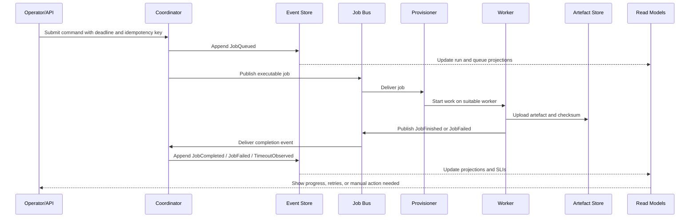
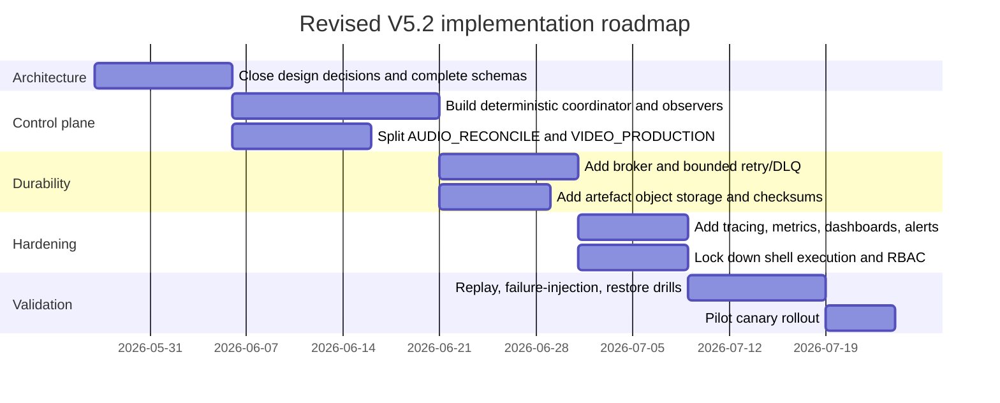

> [!WARNING]
> **NON-AUTHORITATIVE / SECONDARY DOCUMENTATION**
> Only the files inside the `obsidian-vault/` directory are the authoritative, up-to-date documentation for this project. This file is secondary and may be outdated.

# Refining and settling the V5 documentary pipeline architecture

## Executive summary

The documented V5 architecture has a strong conceptual spine: an append-only event log, projection-based read models, a deterministic state machine, and specialised creative agents for script, audio, video, and provisioning. However, the uploaded materials also surface several release-blocking weaknesses: direct Provisioner-to-Agent callbacks that bypass the event model, incomplete or inconsistent effect typing, unbounded retry loops, ambiguous assembly ownership, guard-name drift, reliance on unrestricted shell execution, and a “no timeouts anywhere” policy that would allow calls to wait indefinitely. In its current form, this architecture is **not ready for production use**; it is suitable only as a design prototype. fileciteturn0file1 fileciteturn0file0

That conclusion is reinforced by primary guidance on event sourcing and distributed systems. Microsoft’s Event Sourcing guidance explicitly warns that the pattern is powerful but complex, that projections are eventually consistent read models, and that event streams need versioning, idempotent consumers, and snapshots as they grow. SQLite’s own documentation says WAL mode improves concurrency, but still permits only one writer at a time and requires all processes to be on the same host. gRPC’s deadline guidance warns that a client with no deadline can wait effectively forever. Those facts make the current combination of immutable-event ambitions, single-node SQLite, projection reconstruction from ever-growing logs, and “no timeouts anywhere” unsuitable as a production baseline. citeturn28view0turn4view1turn4view2turn22view0

The recommended path is to adopt a **revised V5.2 baseline** with these decisions settled:

| Area | Settled recommendation | Why |
|---|---|---|
| Workflow control | Use a **deterministic coordinator**; keep LLMs out of provisioning, state transitions, retries, and assembly. | Command handling and business rules belong in the write path; read models should stay read-only, and infrastructure control benefits from determinism. citeturn28view0turn4view6turn4view5 |
| State model | Split `AUDIO_VIDEO` into **`AUDIO_RECONCILE`** and **`VIDEO_PRODUCTION`**, then `ASSEMBLY`. | The current monolith hides materially different failure modes, budgets, and SLIs. fileciteturn0file1 fileciteturn0file0 |
| Persistence | Keep **SQLite for local development and single-host pilot use only**; use **PostgreSQL by default in production**; consider EventStoreDB only if event sourcing becomes strategically central. | SQLite WAL still has one writer and same-host limits; PostgreSQL has mature HA/replication options; purpose-built event stores add optimistic concurrency and snapshots. citeturn4view1turn4view2turn15view0turn28view0turn21view1 |
| Communication pattern | Use a **hybrid model**: synchronous HTTP/gRPC for operator commands and queries, asynchronous messaging for jobs, observations, and projections. | Event sourcing commonly combines command handlers with queues/topics and read-model updates; brokers are distribution layers, not event stores. citeturn28view0turn16view6turn19view0 |
| Time handling | Replace “no timeouts anywhere” with **explicit deadlines plus observed-timeout events**. | gRPC recommends explicit deadlines; retries need bounded attempts and backoff to avoid waiting forever or creating storms. citeturn22view0turn23view0turn23view3 |
| Security | Replace unrestricted `ExecuteRawBash` with an **allowlisted tool runner**, sandboxed execution, and human approval for break-glass operations. | OWASP recommends avoiding direct OS commands where possible, or using parameterisation plus allowlists when unavoidable. Kubernetes recommends least privilege and constrained pod policies. citeturn10view4turn10view5turn10view6turn10view0turn10view2 |
| Artefact storage | Use **local scratch storage on workers plus durable, versioned object storage** for pipeline artefacts. | Versioning supports recovery from overwrite/deletion; lifecycle rules manage cost and retention. citeturn26view0turn26view1turn27view0 |
| Observability | Standardise on **OpenTelemetry + W3C Trace Context + Prometheus/Alertmanager**. | This enables end-to-end trace correlation, structured logs, and routed/deduplicated alerts. citeturn25view1turn25view3turn8view5turn8view6turn8view3turn25view0 |

The net recommendation is therefore: **No-go on the current V5 as documented; Go on a revised V5.2 after schema completion, workflow hardening, safe command execution, durable artefact storage, and observability are in place.** fileciteturn0file1 fileciteturn0file0

## Current architecture and interface baseline

The current documentation defines a single-run, tick-driven, event-sourced documentary pipeline. The principal components are a human overseer, a Python state machine, four HTTP-exposed agents, an append-only SQLite event store with a single writer, four projections, an effect parser, and ephemeral GPU VM workers. Every box is constrained to expose only `GET /` and `POST /`, and the state machine advances on a one-second watcher loop. The canonical states are `INIT`, `SCRIPT`, `AUDIO_VIDEO`, `ASSEMBLY`, and `DONE`, with `AUDIO_VIDEO` currently carrying both narration reconciliation and video production. fileciteturn0file1

| Component | Current documented responsibility | Documented interface | Statefulness | Immediate concern |
|---|---|---|---|---|
| Human / Overseer | Observe and correct agents | `GET /`, `POST /` | External to system | Human interventions are not yet a fully modelled operational workflow. fileciteturn0file1 |
| State machine | Tick-driven phase transitions | Internal watcher loop, agent prompt injection | Derived from projections | It coordinates work even though the document says “No orchestrator”; the terminology is misleading. fileciteturn0file1 |
| Scenario Agent | Write and revise script | `GET /`, `POST /` | Stateless per turn | Good fit for LLM use, but outputs still need stronger schema guarantees. fileciteturn0file1 |
| Audio Agent | Run narration reconciliation loop | `GET /`, `POST /` | Stateless per turn; state reconstructed from events | Loop-bounding, uncertainty handling, and partial rework rules remain underspecified. fileciteturn0file1 fileciteturn0file0 |
| Video Agent | Generate and judge video clips | `GET /`, `POST /` | Stateless per turn | Shares a state with reconciliation even though lifecycle, costs, and failure semantics differ. fileciteturn0file1 |
| Provisioner Agent | Provision VMs, capture VM/job results, notify media agents | `GET /`, `POST /` | Reconstructed from events plus external polling | The synthesis notes correctly identify that direct POST back into agents violates the intended event discipline. fileciteturn0file1 fileciteturn0file0 |
| Event Store | Append-only SQLite | SQLite table `events(...)`, single writer, `BEGIN IMMEDIATE` | Source of truth | Strong local simplicity, but single-writer and same-host limitations are structural. fileciteturn0file1 citeturn4view2turn4view3 |
| Projections | OTIO, Job, VM, State read models | `tick()` over new events | Mutable caches rebuilt from log | The Azure CQRS/Event Sourcing guidance treats projections as read models; having them emit events is an architectural smell. fileciteturn0file1 citeturn28view0turn4view5 |
| VM Workers | Run inference and report outcomes | `GET /`, `POST /` | Ephemeral | Worker heartbeats exist, but the control plane’s “no timeouts” policy conflicts with practical failure handling. fileciteturn0file1 citeturn22view0 |
| Effect parser | Extract typed effects from agent text | LLM-assisted parsing via `instructor` | Stateless | The design is schema-oriented, but the synthesis note reports that many effect models are still missing in practice. fileciteturn0file1 fileciteturn0file0 |

The current interface model is also too coarse for a production system. A universal `GET /` and `POST /` surface is easy to prototype, but it collapses distinct semantics—commands, status queries, approvals, observations, retries, and administrative actions—into a single undifferentiated shape. CQRS guidance recommends task-based commands rather than low-level updates, and the Event Sourcing pattern assumes a clearer separation between command handling, event persistence, read models, and external integrations. citeturn4view6turn28view0

The most important baseline conclusion is that the **architecture idea is stronger than the current operational form**. The existing written design already contains the right primitives—events, projections, a state machine, append-only storage, and a worker fleet—but the interfaces and invariants are not yet specified tightly enough to support safe implementation. fileciteturn0file1 fileciteturn0file0

## Prioritised gaps risks and settled decisions

The uploaded synthesis note is already an effective issue inventory. It identifies consensus concerns across multiple reviewers: direct Provisioner callbacks, missing effect schemas, unbounded retries, the need for an Assembly Agent or equivalent, guard inconsistencies, context-window blow-up, unsafe raw shell execution, and overconfidence in WhisperX measurements. Those are correctly prioritised as critical or high severity. fileciteturn0file0

| Priority | Gap or unresolved decision | Why it blocks usage | Settled decision |
|---|---|---|---|
| Critical | **Unbounded retry and requeue loops** | This is both a cost risk and an availability risk. The Event Sourcing guidance explicitly warns about circular logic and requires idempotent consumers. citeturn28view0 | Bound every retry path by **max attempts, max elapsed time, and max budget**, then route to a **dead-letter / manual review state**. |
| Critical | **“No timeouts anywhere”** | gRPC notes that without a deadline a client can wait effectively forever; that is not an acceptable default for production control paths. citeturn22view0 | Replace with **deadlines + cancellation + `TimeoutObserved` events + bounded retry policy**. |
| Critical | **Provisioner direct POST back into agents** | It bypasses the event store as the authoritative mutation path. | Provisioner becomes a **deterministic scheduler/service** that emits events only; agents consume state via projections or subscriptions, not direct callback mutation. |
| Critical | **Incomplete event envelope and missing schemas** | Versioning, replay, idempotency, and traceability all depend on a stable envelope and complete schemas. Azure recommends version identifiers in event envelopes and tolerant deserialisation / upcasting. citeturn28view0 | Add base envelope with `event_id`, `run_id`, `stream_id`, `causation_id`, `correlation_id`, `schema_version`, `occurred_at`, `producer`, and optional `trace_id`. Complete schemas for every persisted event before rollout. |
| Critical | **Unsafe `ExecuteRawBash`** | OWASP advises avoiding direct OS commands, or otherwise using parameterisation and allowlists. citeturn10view4turn10view5turn10view6 | Replace with **typed tool actions**; keep a gated break-glass path requiring approval, sandboxing, and audit logging. |
| High | **Mixed command/event semantics** | Event sourcing guidance says events should capture business intent, while CQRS says commands should be task-based. Mixing the two inside one “Effect” family harms replay semantics. citeturn28view0turn4view6 | Separate **Commands** from **Events**. Persist only past-tense facts in the event store. |
| High | **`AUDIO_VIDEO` state is overloaded** | Narration reconciliation and video production have different inputs, SLIs, cost profiles, and rollback rules. | Split into **`AUDIO_RECONCILE` → `VIDEO_PRODUCTION` → `ASSEMBLY`**. |
| High | **Projection purity and VM drift handling** | Read models should not own business logic; Azure CQRS treats the read model as query-oriented and eventually consistent. citeturn4view5turn28view0 | Keep projections read-only; move polling/drift detection into a separate **Observer** service that emits observation events. |
| High | **Single-node event store and local-only artefacts** | SQLite WAL is same-host with one writer; local artefacts are vulnerable to node loss. citeturn4view1turn4view2 | Use **PostgreSQL + object storage** in production; keep local disk as worker scratch only. |
| High | **LLM in infrastructure control paths** | Provisioning, assembly, and retry control are deterministic enough not to require LLM variability. | Use LLMs only for creative/script/audio/video judgement, never for core infra control loops. |
| Medium | **WhisperX treated as absolute truth** | The synthesis note correctly flags measurement uncertainty; total clip duration and speech alignment are different questions. fileciteturn0file0 | Use a **deterministic media duration measurement as the timing authority**, and treat speech alignment as an auxiliary confidence signal with thresholds and escalation rules. |
| Medium | **Context rebuilt from full event history on every agent turn** | Azure notes replay cost grows with event-stream length and recommends snapshots. citeturn28view0 | Add **snapshots, prompt compaction, and per-state summaries**. |

The recommended answer to the architecture’s “deep questions” is therefore:

| Decision family | Recommended answer |
|---|---|
| Timeout paradox | **Observed deadlines** rather than “no timers” absolutism. |
| “No orchestrator” semantics | Be explicit: this is a **deterministic coordinator**, not a peerless system. |
| Effect identity | Add **full envelope metadata**, including causation and correlation. |
| State granularity | Split `AUDIO_VIDEO`. |
| Provisioner role | Make it **deterministic**; if an LLM is ever used for diagnosis, keep it out of the primary path. |
| Projection purity | Use a separate **Observer** component. |
| Naming | Persist **past-tense events** only. |
| Retry bounds | Use **attempt + duration + budget** limits. |
| Raw bash policy | **Allowlist plus break-glass approval**. |
| Human UI | Provide **both**: a small web dashboard for operators and a CLI for engineering. |

A concise risk matrix shows why these decisions matter:

| Risk | Likelihood | Impact | Treatment |
|---|---|---:|---|
| Event duplication or replay drift | High | Critical | Event IDs, idempotent consumers, consumer checkpoints, replay tests |
| Store outage or single-node failure | Medium | Critical | PostgreSQL HA or managed DB; backups; restore drills |
| Cost runaway from retries / hanging jobs | High | Critical | Deadlines, max attempts, per-run budgets, DLQ |
| Command injection / privilege escalation | Medium | Critical | Remove raw shell path, sandbox tools, least privilege, restricted policies |
| Artefact loss or overwrite | Medium | High | Versioned object storage, lifecycle, retention, checksums |
| LLM outage or degraded responses | Medium | High | Circuit breakers, retries with backoff, fallback modes, manual queue |
| Projection lag or inconsistent reads | Medium | Medium | Lag metrics, snapshotting, invariants, operator visibility |
| Compliance failure on personal data | Medium | High | Data minimisation, externalised PII, encryption, retention and deletion controls |

The release-blocking set is small enough to be tractable, but serious enough that skipping it would create an expensive failure pattern rather than a launch. fileciteturn0file0 citeturn28view0turn14view0

## Revised architecture and alternative patterns

The target should be a **hybrid, event-centred control plane**: deterministic where the domain is operational, agentic only where the domain is genuinely creative. Event sourcing can still remain the backbone, but it needs a stricter write model, cleaner event taxonomy, and a storage/transport split that respects the differences among commands, events, queues, projections, and artefacts. Azure’s reference pattern is useful here: commands enter the write model, events are appended immutably, and event handlers update projections or integrate with external systems. Brokers fan out events, but they do not replace the event store. citeturn28view0



In this revised model, the command path is synchronous and strict. Operator actions, workflow decisions, approvals, and scheduler directives arrive as **commands** with validation, authorisation, idempotency keys, and explicit deadlines. Those commands either succeed and emit one or more **events**, or fail deterministically. Long-running GPU work, observer findings, and cross-service fan-out move asynchronously. This aligns with CQRS guidance that commands should be task-based and that event sourcing commonly uses queues/topics to decouple event producers from consumers. citeturn4view6turn28view0

A reliable job lifecycle for the revised architecture looks like this:



The architecture should also settle the topological question differently for the two deployment styles the brief asked to cover.

Kubernetes distinguishes between stateless and stateful workloads. Deployments manage stateless pods and support declarative updates and rollbacks; StatefulSets are meant for stable identities, persistent storage, and ordered rollouts; liveness, readiness, and startup probes support robust health signalling; HPA can scale on multiple metrics, including custom metrics. That means a cloud-native variant should place the command API, coordinator, parser, and read-model services in **Deployments**, while self-hosted stateful components such as a broker or database belong in **StatefulSets**, unless a managed service is used instead. citeturn6view0turn6view3turn6view4turn6view6turn6view7

For a VM-based or modular-monolith variant, the best starting point is simpler: one control-plane process (API, coordinator, parser, projections, observer framework), a durable SQL store, one message broker, and separate worker processes or nodes for GPU tasks. This gives most of the architectural benefits without forcing an early microservices tax. That recommendation is consistent with Microsoft’s warning that event sourcing already adds significant complexity and is costly to change later. citeturn3view0turn28view0

A practical topology comparison is therefore:

| Option | Best fit | Advantages | Disadvantages | Recommendation |
|---|---|---|---|---|
| Modular monolith on VMs | Early production, smaller team, uncertain scale | Lowest operational complexity, faster debugging, easier local development, easier replay/invariant testing | Less autonomous scaling, weaker tenant isolation | **Recommended starting point** unless Kubernetes operations are already mature |
| Cloud-native microservices on Kubernetes | Existing platform team, multiple product teams, high concurrency, stricter isolation | Elastic scaling, better fault isolation, standard rollout and probe mechanisms, clearer platform boundaries | Higher ops burden, more moving parts, harder local development | Strong second step, or first step only if platform maturity already exists |

The persistence and messaging choices should likewise be treated as explicit trade-offs:

| Technology | Role in this architecture | Strengths | Limits | Recommendation |
|---|---|---|---|---|
| SQLite | Local dev or single-host pilot event store | Very simple deployment; WAL allows readers and writer concurrency, but still only one writer and same-host operation. citeturn4view1turn4view2turn4view3 | No multi-node HA; unsuitable on network filesystems; operational bottleneck beyond one host | **Dev only** |
| PostgreSQL | Production event store and relational metadata | Mature HA/replication choices; synchronous vs asynchronous trade-offs are well understood. citeturn15view0turn28view0 | Requires more operations than SQLite | **Default production choice** |
| EventStoreDB | Specialised event store | Designed for event sourcing, with official clients and a dedicated operational model. citeturn21view1turn28view0 | Extra platform footprint and adoption cost | Use only if event sourcing becomes core strategy |
| MongoDB | Read models or flexible metadata store | Single-document atomicity and multi-document transactions, including across shards. citeturn16view0turn16view1 | Cross-shard visibility semantics can still surprise; not ideal as primary event log | Good for selected read models, not default event store |
| RabbitMQ | Job bus and workflow queueing | Acknowledgements and publisher confirms support at-least-once delivery; heartbeats help detect dead connections. citeturn16view5turn16view6 | Requires explicit idempotency and DLQ handling | Strong default broker |
| NATS JetStream | Lightweight streaming/replay broker | Built-in persistence/replay, replication, and a good resilience/performance balance at three replicas. citeturn19view0 | Different operational ergonomics; still not an event store | Strong alternative to RabbitMQ |

The communication-pattern decision should be settled as **hybrid** rather than ideological:

| Pattern | Use where | Why |
|---|---|---|
| Request-driven HTTP/gRPC | Operator commands, approvals, state queries, health checks, synchronous validation | Clear SLAs, tracing, deadlines, authn/authz, and instant feedback. gRPC explicitly supports deadlines and retries. citeturn22view0turn23view0 |
| Event-driven messaging | Long-running jobs, worker outcomes, external observations, projection fan-out | Better decoupling, durability, replay, and tolerance for variable processing times. citeturn28view0turn16view6turn19view0 |
| Hybrid | Whole system | Best fit because this workload contains both transactional commands and asynchronous media generation. |

The revised event envelope should be minimal but sufficient for replay, tracing, and compliance:

```json
{
  "event_id": "uuidv7",
  "run_id": "run-...",
  "stream_id": "run:...",
  "event_type": "JobQueued",
  "schema_version": 1,
  "causation_id": "uuidv7",
  "correlation_id": "uuidv7",
  "trace_id": "w3c-trace-id",
  "occurred_at": "2026-05-26T12:00:00Z",
  "producer": "coordinator",
  "payload": {}
}
```

This shape reflects Azure’s recommendation to version the event envelope and keep the stream immutable, while aligning cross-service observability with W3C trace propagation and OpenTelemetry correlation. citeturn28view0turn25view1turn8view5turn8view6

Finally, the current “no B2 for now” rule should be retired. A production-grade pipeline needs two storage classes: **scratch on the worker** and **durable artefact storage**. Versioned object storage supports recovery from accidental deletion or overwrite, Object Lock adds retention controls where required, and lifecycle rules help manage storage cost. AWS S3 is only one implementation example; the architectural need is for those capabilities, not for one vendor specifically. citeturn26view0turn26view1turn27view0

## Testing deployment rollback and observability

The revised architecture needs a test strategy that matches event sourcing rather than one bolted on afterwards. Microsoft’s guidance explicitly says event-sourced systems need given-when-then style domain tests, plus integration tests for projections, idempotency, and schema evolution. GDPR Article 32 also requires organisations to implement a process for **regularly testing, assessing, and evaluating** the effectiveness of security measures. NIST’s SSDF likewise recommends integrating secure development practices into the SDLC rather than treating them as an afterthought. citeturn28view0turn14view0turn12view0

| Test layer | Purpose | Must-pass exit criteria |
|---|---|---|
| Schema and contract tests | Ensure every command and event is fully specified, versioned, and validated | 100% of persisted events have machine-validated schemas; no undocumented fields |
| Replay determinism tests | Prove that projections and state rehydrate correctly | Replaying the same stream produces identical state and checksums |
| Invariant and property tests | Protect rules such as no overlap, no double approval, monotonic sequence numbers, bounded budgets | Zero invariant violations on seeded histories |
| Integration tests | Exercise store, broker, workers, object storage, and observers together | Happy path and known-error scenarios pass on production-like infrastructure |
| Failure-injection tests | Validate recovery from worker loss, duplicate delivery, partial writes, lag, and slow upstream services | System recovers without data corruption or runaway retries |
| Performance tests | Confirm throughput, queue drain time, append latency, assembly runtime, and concurrency headroom | Agreed SLOs met at 2x expected peak |
| Security tests | Validate least privilege, sandboxing, authn/authz, input validation, secrets handling, and supply-chain checks | No critical findings open |
| Restore and rollback drills | Prove operability under failure | Recovery point and recovery time targets achieved from backup and object store |

For Kubernetes deployments, health and rollout controls should be explicit. Readiness probes keep unready pods out of service traffic, liveness probes restart unhealthy containers, and startup probes protect slow starters from premature restarts. Deployments support declarative rollout and rollback to earlier revisions. HPA can scale based on multiple metrics, which makes queue lag and job throughput suitable autoscaling signals once custom metrics are exposed. Stateful components should use StatefulSets or managed services rather than ad hoc singleton pods. citeturn6view0turn6view3turn6view4turn6view6turn6view7

For VM-based deployments, the operational equivalent should be **blue/green** rather than in-place mutation. Run old and new control-plane instances side by side against a replica or staging copy, perform replay and smoke checks, switch traffic, and preserve the previous version until hard rollback criteria expire. The point is the same in both models: **never let deployment be the first time replay, schema evolution, or worker coordination is exercised.**

Rollback should be triggered by explicit criteria, not by operator intuition alone:

| Rollback trigger | Threshold |
|---|---|
| Event append failure rate | > 0.5% over 5 minutes |
| Projection lag | > 60 seconds sustained over 10 minutes |
| Duplicate side-effect rate | Any confirmed duplication in production |
| Worker completion SLA | p95 job completion latency worsens by > 50% versus baseline for 15 minutes |
| Retry / DLQ escalation | > 3x baseline or any runaway loop detected |
| Parser/schema failure | > 1% invalid-command or invalid-event rate |
| Cost burn rate | > 125% of expected burn for current run cohort |
| Security | Any break-glass shell path executed without approval; any critical authz fault |

A production observability stack should be treated as part of the architecture, not as supporting infrastructure. OpenTelemetry traces describe the path of a request through the application, context propagation correlates traces, metrics, and logs, and W3C Trace Context standardises headers such as `traceparent` and `tracestate`. OpenTelemetry also recommends structured logs for production because they are easier to validate, correlate, and analyse at scale. Prometheus Alertmanager handles grouping, deduplication, routing, silencing, and inhibition of alerts. citeturn8view0turn25view1turn25view2turn8view5turn8view7turn25view0turn8view3

The minimum dashboard pack should therefore be:

| Dashboard | Core metrics | Alert focus |
|---|---|---|
| Pipeline health | Run success rate, stage dwell time, completions per hour, budget burn, manual intervention count | Stalled runs, rising failure rates, overspend |
| Event platform | Append latency, writer queue depth, sequence gaps, replay duration, snapshot age | Store contention, lag, replay regression |
| Messaging and jobs | Queue depth, redelivery count, ack latency, DLQ size, consumer lag | Backlog growth, duplicate delivery, slow consumers |
| Worker fleet | Provision time, heartbeat age, GPU utilisation, disk usage, artefact upload latency | Lost workers, under-utilisation, saturation |
| Creative services | LLM response latency, parse-failure rate, fallback usage, token cost, approval/rework ratios | Upstream degradation, prompt drift, spend spikes |
| Security and compliance | Break-glass events, denied actions, secrets age, failed authn/authz, backup success, restore test status | Privilege misuse, incomplete controls, restore risk |

The architecture should also log and expose **business observability** metrics rather than infrastructure-only ones: reconciliation attempts per block, scene rewrite rate, audio/video approval rate, assembly defect rate, and median manual touches per run. Those metrics will matter more to successful operation than raw CPU or RAM numbers alone.

## Effort timeline resources and roadmap

Because the target scale is unspecified, the best estimate is to present two implementation tracks. The first is a production-capable **modular-monolith / VM baseline**. The second is a **cloud-native Kubernetes variant** that adds platform work, autoscaling, and stronger isolation. The scope below assumes an existing codebase close to the uploaded documentation, not a greenfield rewrite.

| Track | Target outcome | Estimated calendar | Core team |
|---|---|---|---|
| Modular-monolith / VM baseline | Revised V5.2 in production for low-to-moderate scale | **8–10 weeks** | 1 technical lead, 2 backend engineers, 1 media/pipeline engineer, 0.5 QA/SDET, 0.5 SRE/security |
| Cloud-native Kubernetes variant | Same architecture with managed rollouts, autoscaling, and stronger service separation | **12–16 weeks** | 1 technical lead, 3 backend/platform engineers, 1 media/pipeline engineer, 1 SRE/platform engineer, 1 QA/SDET, 0.5 security/compliance |

A reasonable phased roadmap is:

| Phase | Duration | Milestone | Exit criteria |
|---|---:|---|---|
| Architecture closure | 1–2 weeks | Decisions frozen; schemas complete | Command/event split agreed; state split agreed; event envelope finalised |
| Reliable control plane | 2–3 weeks | Deterministic coordinator, provisioner, observer, and finaliser implemented | No direct agent callbacks; no infra-path LLM dependency |
| Durable execution path | 2 weeks | Broker, object storage, bounded retries, budgets, DLQ live | Happy path and failure path working in staging |
| Observability and security hardening | 1–2 weeks | Tracing, metrics, structured logs, RBAC, shell gating | All critical alerts and audit events visible |
| Performance, replay, and restore | 1–2 weeks | Load tests, replay determinism, backup/restore, rollback drills | SLOs met and restore exercises passed |
| Pilot rollout | 1 week | Limited production launch | Canary stable and rollback criteria clear |

The implementation sequence is shown below for the recommended modular-monolith baseline:



The corresponding effort profile by role is:

| Role | Peak involvement | Key deliverables |
|---|---:|---|
| Technical lead / architect | Full time in first half, then 50% | Architecture freeze, event model, control-plane decisions, rollout authority |
| Backend engineers | Full time throughout | API, coordinator, projections, persistence, messaging, schema contracts |
| Media/pipeline engineer | Full time | Audio reconciliation rules, video pipeline, assembly determinism, worker integration |
| SRE / platform engineer | 25–100% depending on track | CI/CD, infra, observability, rollback automation, backups, autoscaling |
| QA / SDET | 25–75% | Replay tests, integration suites, failure injection, release gating |
| Security / compliance | 25–50% | Shell gating, authz, secrets, data retention, DPIA / control review where needed |

On cost, the architecture should explicitly track three classes of spend from day one: **LLM spend**, **GPU compute spend**, and **storage/egress spend**. Per-run and per-stage budgets are both worth implementing. Per-run budgets are simpler and stop total runaway; per-stage budgets make troubleshooting easier when one phase dominates cost. For this architecture, the right answer is **both**. The object-store lifecycle capability should then be used to move or expire non-current artefacts after defined retention periods so that storage does not quietly become the long-tail cost centre. citeturn27view0turn27view2

## Open questions and limitations

Some important specifics remain unknown, so a few recommendations are intentionally conditional.

The first unknown is **actual scale**: expected concurrent runs, events per second, GPU-job concurrency, operator count, and retention expectations. Those details determine whether PostgreSQL plus a simple broker is sufficient for several years, or whether a specialised event store and more aggressive partitioning should be considered earlier.

The second unknown is **data sensitivity**. If the system processes personal data, voice biometrics, or identifiable documentary subjects, GDPR Articles 25 and 32 become directly relevant and a DPIA may be required, especially if automated profiling, large-scale sensitive processing, or systematic monitoring is involved. In such a case, the design should keep personal data outside immutable event payloads where possible, use encryption and deletion-friendly indirection, and formalise retention and access controls. citeturn13view0turn13view1turn14view0

The third unknown is **team platform maturity**. If there is already strong Kubernetes, Prometheus, OpenTelemetry, and managed-data-store capability, the cloud-native path is realistic immediately. If not, the modular-monolith baseline is the safer way to start using the architecture without paying the microservices tax before the workflow itself has stabilised.

The final limitation is that the uploaded material documents the intended architecture and a reviewer synthesis, but not the complete running implementation. The recommendation above therefore treats the V5 document as the source of architectural intent and the synthesis note as the best current evidence of implementation/design gaps. fileciteturn0file1 fileciteturn0file0