> [!WARNING]
> **NON-AUTHORITATIVE / SECONDARY DOCUMENTATION**
> Only the files inside the `obsidian-vault/` directory are the authoritative, up-to-date documentation for this project. This file is secondary and may be outdated.

# Documentary Pipeline — Architecture Flow Diagrams

This document is the companion to [ARCHITECTURE.md](./ARCHITECTURE.md). It specifies the correct (intended) shape of the pipeline as a set of eleven Mermaid diagrams. Each diagram carries its rationale as inline `%%` comments so the specification travels with the diagram source.

GitHub renders Mermaid fenced blocks natively — open any section to see the rendered flowchart.

## 1. Top-level flow (entry → stages → final render)

The OTIO shown here is the authoritative timeline, crystallised only after narration reconciliation (see diagram 2). Everything before that is draft.

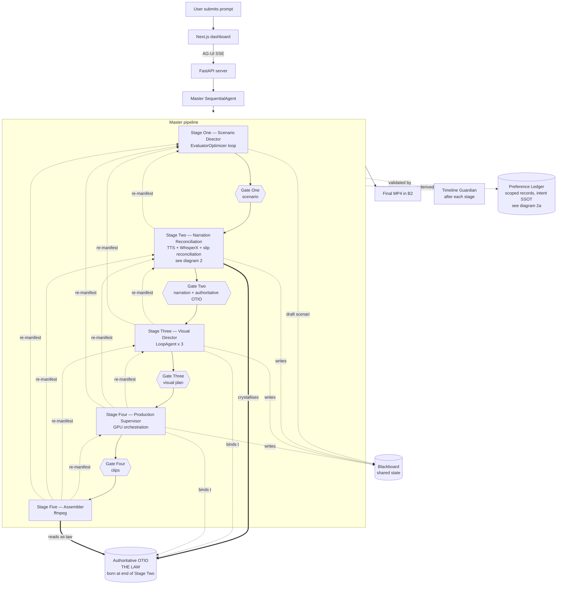

## 2. Narration reconciliation — how the authoritative OTIO is born

Scripted durations never survive contact with TTS. WhisperX measures what actually came out. The pipeline reconciles the slip through an L0–L4 ladder calibrated for cheap, fast audio — low tiers are deliberately permissive with wide retry budgets because reconciliation is the mechanism by which the OTIO is born, not a failure mode. Every block must also pass stylistic QA invariants (uniform LUFS across narration, voice continuity between adjacent blocks, character voice consistency, no clicks, no truncated plosives) before it exits the ladder; stylistic invariants can be overridden only by an explicit Preference Ledger record for a specific scope. The OTIO that emerges at the end is THE LAW for every downstream stage. Trimming, stretching, and frozen frames remain forbidden by the Media Immutability Invariant — retries are always regenerate, never edit.

```mermaid
%% Narration reconciliation -- how the authoritative OTIO is born.
%% Scripted durations never survive contact with TTS. WhisperX measures what
%% actually came out. The pipeline reconciles the slip through an L0-L4
%% ladder that is PERMISSIVE at the low tiers because audio reconciliation
%% IS the process by which the authoritative OTIO is born; escalation is
%% normal operating mode, not an exception. Abandoning L0 early would
%% starve the OTIO of the narration it needs.
%% Audio retry budgets (wide at bottom, narrow at top):
%%   L0 WIDE -- many attempts per block, varying seed, reference sample,
%%     breath phrasing, micro-script rewrites. Cheap and fast.
%%   L1 GENEROUS -- multi-shot audio-understanding consultation; converse
%%     across many models and perturbations.
%%   L2 NARROW-MULTI -- multi-shot, bounded exploration of voices and
%%     TTS providers within the speaker-role frame.
%%   L3 BOUNDED -- small budget; coordination cost is real.
%%   L4 HUMAN -- single decision, possibly re-entered after a directive.
%% Stylistic QA invariants (enforced on EVERY output regardless of tier):
%%   - uniform loudness target (LUFS) across all narration blocks
%%   - voice continuity: no jarring register shifts between adjacent blocks
%%     of the same speaker role
%%   - character voice consistency: same speaker role maps to same voice
%%     identity across the whole film
%%   - peak-limiter compliance; no clicks, no truncated plosives, no
%%     hiss-floor discontinuities
%% A Preference Ledger record with scope covering a block can DELIBERATELY
%% override a stylistic invariant for that block only (e.g. "Cassandra
%% louder in scene 3"); invariants are checked against the ledger, not
%% hard-coded.
%% A block that passes timing but fails a stylistic invariant does NOT
%% exit L0 as a pass; it re-enters the ladder with the invariant violation
%% as the failure signal.
%% Media Immutability Invariant applies: no trimming, no stretching, no
%% frozen frames. Retries are always REGENERATE, never edit.
flowchart TD
    IN["Approved scenario<br/>draft voice blocks<br/>target durations"]
    IN --> DRAFT[("Draft OTIO<br/>placeholder slots")]
    DRAFT --> TTS["TTS synthesis"]
    TTS --> WAV["Narration WAV<br/>newly-generated, immutable"]
    WAV --> WX["WhisperX<br/>word-level alignment"]
    WX --> MEAS["Measured durations<br/>per voice block"]

    MEAS --> TIMING{"Timing vs<br/>scenario pacing"}
    TIMING -->|within tolerance| STYLE["Stylistic QA invariants<br/>uniform LUFS across all narration<br/>voice continuity adjacent blocks<br/>character voice consistency<br/>no clicks, no truncated plosives<br/>checked against Preference Ledger<br/>for scoped deliberate overrides"]
    TIMING -->|slip detected| LAD["Reconciliation ladder"]
    STYLE -->|pass| CRYS["Crystallise authoritative OTIO"]
    STYLE -->|fail| LAD

    subgraph LADDER["Narration reconciliation ladder (permissive)"]
        direction TB
        L0["L0 FIX — WIDE retry budget<br/>many attempts per block<br/>reseed TTS, alternate reference sample<br/>rephrase shorter or longer<br/>insert or remove breath phrase<br/>split or merge blocks<br/>adjust inter-block silence within pacing slack"]
        L1["L1 RETRY — GENEROUS budget<br/>audio-understanding consultation<br/>converse across many audio models<br/>diagnose what changed vs target<br/>multi-shot bounded param perturbations<br/>script and model family unchanged"]
        L2["L2 CREATIVE — NARROW but MULTI-SHOT<br/>bounded exploration inside<br/>Scenario + draft OTIO frame<br/>alternative voices, alternative TTS providers<br/>external MCPs and LLM APIs as consultants<br/>the frame is sacred"]
        L3["L3 COLLABORATIVE — BOUNDED<br/>frame becomes negotiable<br/>Scenario, Visual, Audio, Timeline Guardian<br/>upstream artifacts may be altered<br/>no media-gen model swaps (too radical)<br/>coordination cost is real, so budget is small"]
        L4["L4 HUMAN — single decision<br/>re-enterable after directive<br/>see diagram 2a"]
        L0 -->|budget exhausted| L1
        L1 -->|budget exhausted| L2
        L2 -->|budget exhausted| L3
        L3 -->|budget exhausted| L4
    end

    LAD --> L0
    L0 -->|resolved| TTS2["Re-run TTS<br/>only on changed blocks"]
    L1 -->|resolved| TTS2
    L2 -->|resolved| TTS2
    L3 -->|resolved| TTS2
    TTS2 --> WX

    CRYS --> LAW[("Authoritative OTIO<br/>THE LAW<br/>immutable baseline for all downstream work")]
    LAW --> OUT["Stage Two complete<br/>→ Gate Two"]
```

## 2a. Preference Ledger as intent SSOT and pipeline re-manifestation

The pipeline is a running manifestation of a scoped Preference Ledger, not of a flat prompt. Each entry is a preference record with scope, polarity, subject, content, and origin. The original user prompt is parsed into records at run start and every L4 directive is parsed by a Preference Interpreter into one or more additional records. Stages do not read a prompt; they assemble a virtual brief by collecting the records whose scope matches, sorted by specificity and recency. Scope is what makes re-manifestation surgical: a narrow preference invalidates narrow artifacts, a global preference propagates widely. L0–L3 never touch the ledger; only L4 does.

```mermaid
%% Preference Ledger as intent SSOT and pipeline re-manifestation.
%% The pipeline is a running MANIFESTATION of a scoped Preference Ledger,
%% NOT a flat prompt. Each ledger entry is a preference record with five
%% fields: scope, polarity, subject, content, origin.
%% Scope is hierarchical: global, stage, scene, voice block, artifact type,
%% element. Polarity: prefer, avoid, require, forbid. Subject: tone, voice,
%% pacing, visual style, structure, duration, music. Content: free-form.
%% Origin: which event added it (R0 seed, L4 directive #N).
%% The original user prompt is parsed into records at run start -- there is
%% no special-cased "prompt" artifact. R0 is simply the first batch.
%% L4 is the ONLY trigger that writes to the ledger. A Preference Interpreter
%% parses each human directive into one or more scoped records; one directive
%% may yield several records (a scene-scoped fix plus a global preference).
%% L0-L3 never write to the ledger.
%% Stages never read a "prompt". They assemble a virtual brief by collecting
%% ledger records whose scope matches their current work, sorted by
%% specificity (global < stage < scene < block < element) and recency.
%% The consistency checker fires on every stage boundary, gate poll, and
%% tool call, comparing the ledger revision the stage was derived against
%% to the current ledger revision.
%% Re-manifestation is surgical because scope is first-class: a narrow
%% record invalidates narrow artifacts, a global record propagates widely.
%% Conflict resolution: more specific scope wins; more recent within scope
%% wins; hard polarities dominate soft. Two hard records that contradict
%% each other are an unresolvable conflict and re-escalate to the human.
flowchart TD
    subgraph LEDGER["Preference Ledger (intent SSOT)"]
        direction TB
        R0[("R0 records<br/>parsed from original brief<br/>global tone, length, style")]
        R1[("Scene-scoped record<br/>rewrite scene 3 tighter")]
        R2[("Speaker-scoped record<br/>avoid Cassandra lower register")]
        R3[("Global record<br/>prefer shorter narration")]
        R0 -.append-only.-> R1
        R1 -.append-only.-> R2
        R2 -.append-only.-> R3
    end

    L4["L4 HUMAN directive<br/>free-form natural language"]
    L03["L0 FIX / L1 RETRY / L2 CREATIVE / L3 COLLABORATIVE<br/>resolve inside the ladder<br/>DO NOT write to the ledger"]

    PI["Preference Interpreter agent<br/>parses directive into scoped records<br/>infers scope, polarity, subject<br/>may emit 1..N records per directive"]

    L4 --> PI
    PI --> WRITE["Append records to ledger<br/>bump ledger revision"]
    WRITE --> LEDGER
    L03 -.no-op on ledger.-> NOOP["no ledger change"]

    SEED["Run start<br/>parse original brief"]
    SEED --> PI

    LEDGER --> ASM["Context assembly<br/>per stage, per scope<br/>filter by matching scope<br/>sort by specificity then recency<br/>apply conflict resolution"]
    ASM --> BRIEF["Virtual brief for this stage<br/>merged, scope-filtered view"]
    BRIEF --> STAGE["Stage runs against virtual brief"]

    STAGE --> CHECK["Consistency checker<br/>on every stage boundary,<br/>gate poll, and tool call"]
    CHECK --> CMP{"Stage ledger revision<br/>vs current ledger revision"}
    CMP -->|match| CONTINUE["Stage continues normally"]
    CMP -->|drift| IMP["Impact analyzer<br/>walks the ledger diff<br/>scope-matches new records<br/>against existing artifacts"]

    IMP --> PLAN["Re-manifestation planner<br/>minimal DAG of regeneration tasks<br/>scope determines breadth<br/>preserves anything unmatched"]
    PLAN --> VAL["Plan validator<br/>check vs all pipeline invariants<br/>Media Immutability, OTIO, budget,<br/>single-writer, stage-boundary,<br/>no-conflicting-hard-records"]
    VAL -->|violation| PLAN
    VAL -->|unresolvable conflict| RESC["Re-escalate to human"]
    VAL -->|valid| EXEC["Executor re-enters impacted stages<br/>each runs its own L0–L4 ladder<br/>against the new virtual brief"]

    EXEC --> BG["Budget guard"]
    BG -->|over budget| RESC
    EXEC -->|sub-task exhausts to L4| RESC
    RESC --> L4

    EXEC -->|settled| RESUME["Resume stage at new revision"]
    RESUME --> CONTINUE
```

## 3. Production stage (clip generation detail)

Video is expensive. Unlike the audio ladder (diagram 2), the video content ladder is strict: **one failure per level only**. Each tier gets exactly one attempt; a failure escalates immediately to the next tier. A second failure at the same tier is not permitted — escalating gives the next-higher-authority agent a genuinely different strategy space, which is more likely to help than another roll of the same dice. Infra failures (diagram 8) are classified separately and consume the infra ladder's budget, not this one.

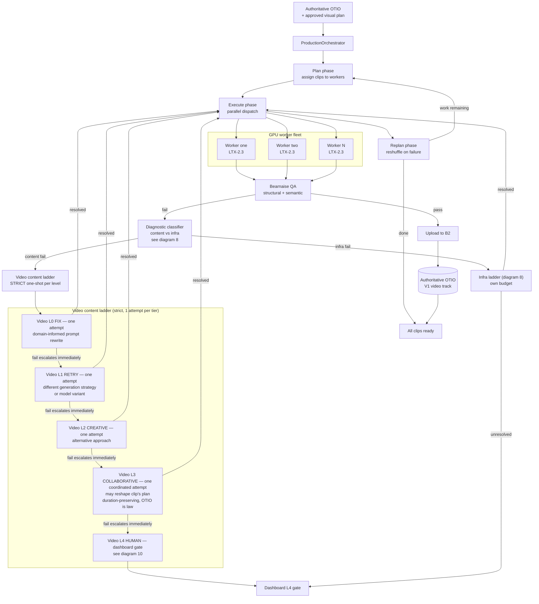

## 4. Escalation ladder (intended design)

The ladder shape is shared, but per-tier **retry budgets are asymmetric by medium**. Audio (diagram 2) is cheap and its reconciliation is the mechanism that produces the authoritative OTIO — tiers L0 and L1 are permissive with wide retry budgets. Video (diagram 3) is expensive and its outputs are bounded by an OTIO that is already law — the content ladder is strict with exactly one attempt per tier. Infra failures (diagram 8) run on a separate ladder with its own budget, classified away from the content ladder by a diagnostic agent.

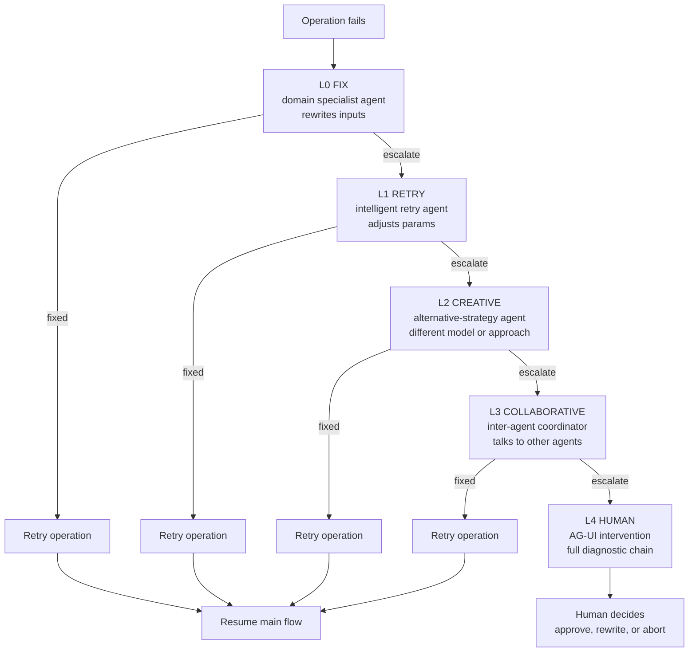

## 5. Recovery decision shape

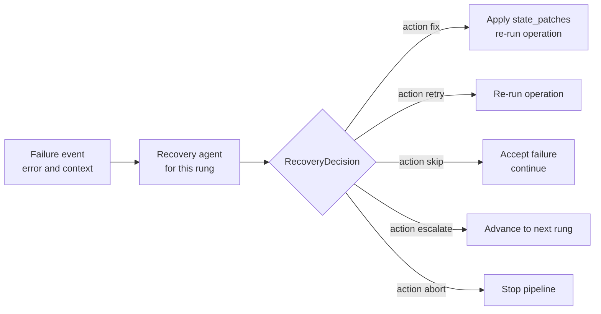

## 6. Critique and QA substrate

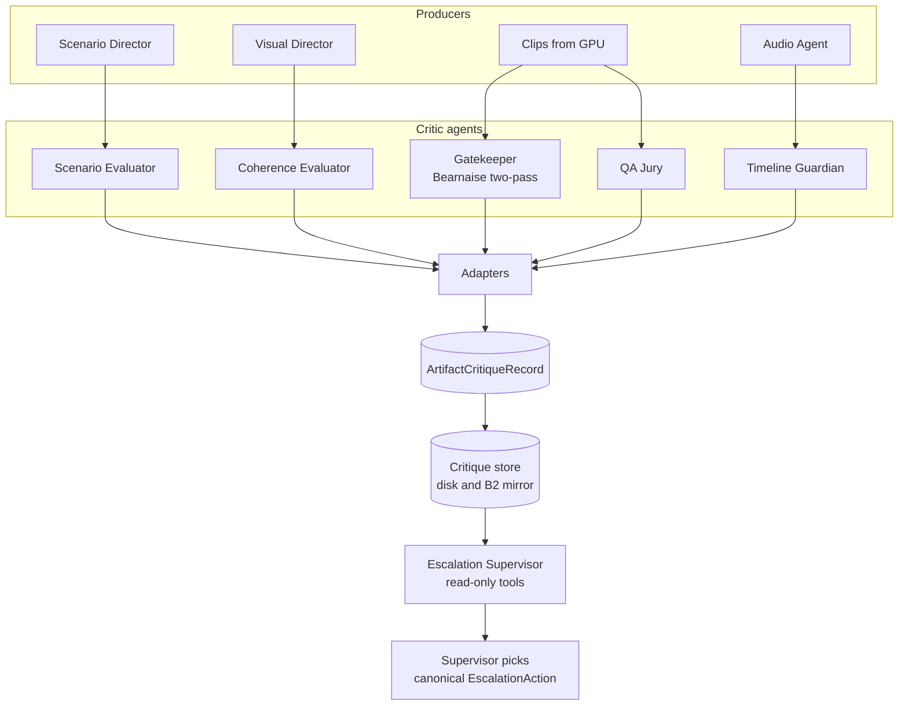

## 7. Human gates and approval flow

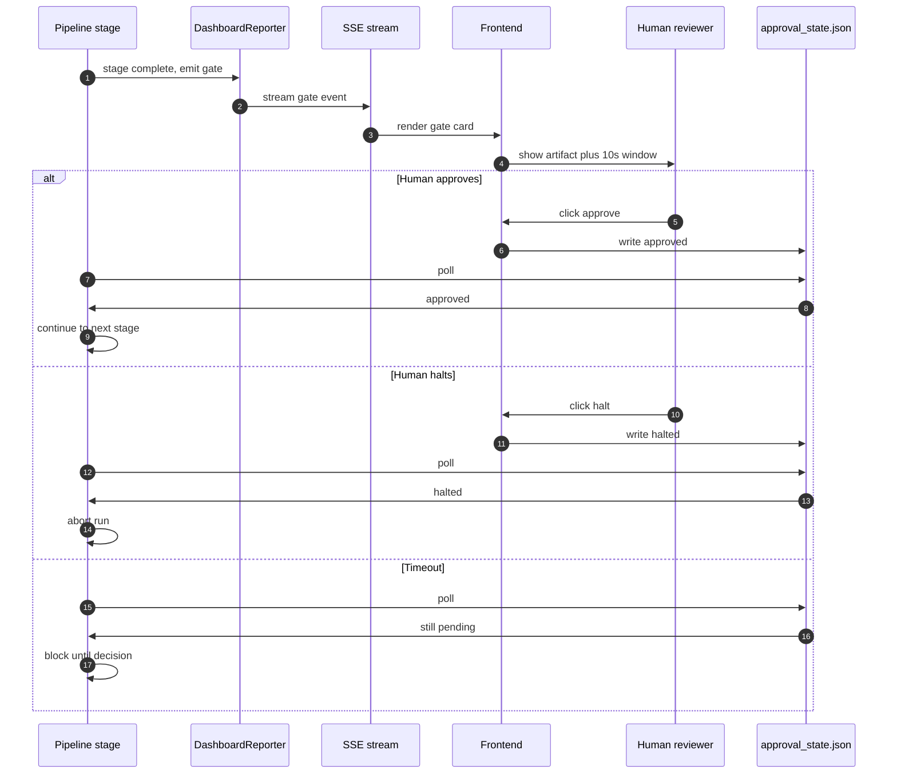

## 8. GPU fleet lifecycle, health, and the infra escalation ladder

Infrastructure failure is an escalation axis in its own right, orthogonal to content failure. Every clip failure is classified as content, infra, or unclear; each axis has its own L0–L4 ladder; both terminate at the same L4 human gate on the dashboard. Worker health is inferred from infra observation, never from job outcomes — a single failed clip does not condemn a worker, and a single good clip does not exonerate one.

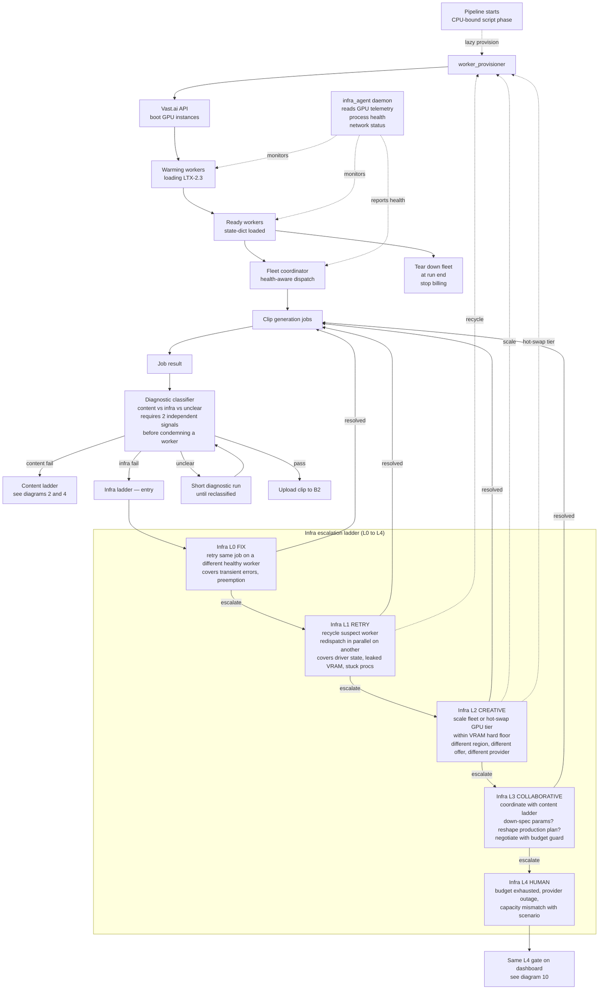

## 9. Intermediate preview assemblies

Final assembly is not the only assembly — it is the last in a sequence. At every logical coherence boundary the pipeline produces a preview: a rough cut of everything that currently exists, with honest placeholders for what does not. Previews are QA artifacts that feed both agents and humans, never deliverables. They are how "I don't like this movie" becomes actionable before the whole film is generated.

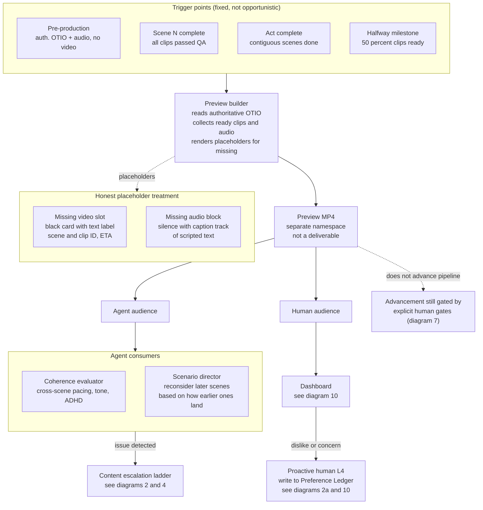

## 10. Dashboard: OTIO timeline as centerpiece, continuity, and proactive user-initiated L4

The dashboard's primary surface is the authoritative OTIO rendered as a visual timeline with every produced asset laid on it in its actual slot. Everything else — event streams, reasoning digests, fleet health, cost, ETA — is peripheral metadata orbiting the timeline. Before the authoritative OTIO crystallises at the end of Stage Two, the draft OTIO is shown with a reconciliation overlay. Clicking a slot is the entry point to everything about that slot: artifact history, QA verdicts, reasoning digests, in-scope Preference Ledger records, current rung in the content or infra ladder, and the latest preview assembly containing it. Directives typed while a slot is selected are implicitly scoped to that slot by the Preference Interpreter. Preview assemblies play directly on the timeline. Continuity is the precondition for good human intervention, not an aesthetic choice.

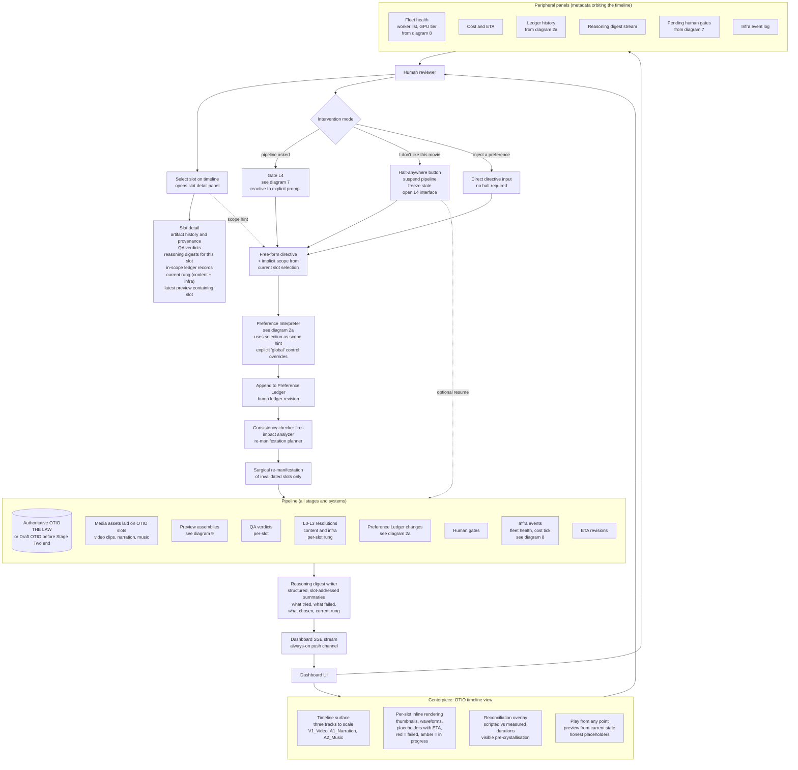
