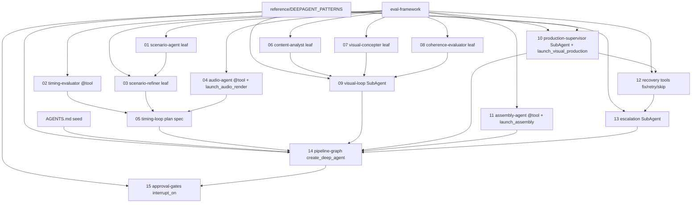

# SEQUENCE — build order and dependency graph

The migration is **component-by-component**. Each component lands in its
own PR, ships with an evals harness, and passes CI before the next
component is started.

The target architecture is a **DeepAgent orchestrator driving Strands
leaves** (see [`ARCHITECTURE.md`](./ARCHITECTURE.md)). The build order
ships the leaves first, then the task-pool plumbing, then the orchestrator
on top, then approval gates.

---

## Dependency graph

Arrows point from **prerequisite → dependant**: `A --> B` means A must be
shipped and evals-passing before B starts.

---

## Build order rationale

1. **`eval-framework/` first.** Every component depends on it. Until the
   harness exists, there is no definition of "done" for any component.
   Orchestration evals (trajectory, parallel launch, memory honouring) are
   specified here too — see
   [`eval-framework/EVAL_ARCHITECTURE.md`](./eval-framework/EVAL_ARCHITECTURE.md).

2. **`reference/DEEPAGENT_PATTERNS.md`** — not a shippable component, but
   the reference that every orchestrator-touching component cites. Ship
   this together with `eval-framework/`.

3. **`AGENTS.md` seed** — the invariants + planning heuristics the
   orchestrator will boot with. Ship alongside the eval framework so the
   `MemoryHonouringEvaluator` has something to check against.

4. **`01-scenario-agent`** — zero upstream dependencies. Exercises the
   Strands-leaf pattern (single `Agent`, internal tool-calling loop,
   `SlidingWindowConversationManager`, hooks, evals). Template for the
   rest.

5. **`02-timing-evaluator`** — deterministic `@tool`. Validates the
   "no-LLM leaf ships as a pure `@tool`" pattern. Fastest to ship; the
   evaluator math is ported verbatim from
   `server/agents/timing_evaluator.py` (see the component spec for the
   exact tolerance model, including the `±2s absolute` BriefIntent path
   and the `max(target * 0.15, 5s)` legacy path, plus gap-overhead
   accounting at 1.5s / 2.5s).

6. **`03-scenario-refiner`** — small LLM leaf. Conditionally invoked by
   the orchestrator (it just doesn't call the tool when `timing_passed`
   is already true).

7. **`04-audio-agent`** — deterministic `@tool` wrapping TTS + WhisperX,
   **plus** the `launch_audio_render` task-pool tool that the orchestrator
   uses to parallelise per-scene audio generation. First use of the
   MiroThinker AsyncTaskPool pattern. Tests use `ToolSimulator` for the
   worker calls.

8. **`06`, `07`, `08` (visual leaves)** — three independent PRs, can move
   in parallel once `eval-framework` lands. Same Strands-leaf pattern as
   scenario.

9. **`10-production-supervisor`** — the first `SubAgent`. Wraps the
   existing GPU-dispatch logic into a deepagents SubAgent with its own
   isolated context, plus the `launch_visual_production` task-pool tool
   and per-scene QA invocations. Ships with recovery wiring but the
   recovery tools themselves come next.

10. **`11-assembly-agent`** — deterministic `@tool` + `launch_assembly`
    task-pool tool. Validates OTIO/ffmpeg integration.

11. **`12-recovery-agents`** — three small Strands leaves (fix, retry,
    skip) exposed as `@tool`s to the production SubAgent. Tactical
    in-context recovery. Ships after `10` because their interfaces are
    defined by how the production SubAgent needs to call them.

12. **`13-escalation-supervisor`** — the escalation SubAgent. Orchestrator
    delegates via the built-in `task` tool when tactical recovery (12)
    fails or AGENTS.md rules say the situation is beyond the production
    SubAgent's authority. Ships after `12` so the escalation SubAgent can
    receive structured diagnostic context.

13. **`05-timing-loop`** and **`09-visual-loop`** — these are **plans, not
    compositions**. No new code beyond what ships in `01`–`04` and `06`–`08`.
    The spec documents describe the orchestration trajectory (tool-call
    sequence) and the orchestration evals that check the DeepAgent
    produces that trajectory. Can be finalised once their leaves exist.

14. **`14-pipeline-graph`** — the `create_deep_agent(...)` call itself:
    model, system prompt, backend, `tools=[...]`, `subagents=[...]`,
    `memory=[...]`. First moment the whole pipeline runs end-to-end.
    Ships with an integration `Experiment` running the orchestrator
    against 3–5 full-pipeline cases.

15. **`15-approval-gates`** — `interrupt_on={...}` configuration and the
    caller-side resume protocol (`accept` / `edit` / `respond` / `reject`).
    Replaces `.approval_state.json` polling.

---

## Per-component summary

| # | Component | Kind | Complexity | Blast radius if wrong | Key risk |
|---|-----------|------|------------|----------------------|----------|
| 01 | scenario-agent | Strands leaf (may also be SubAgent) | L | Entire pipeline quality | Prompt too long; token limit |
| 02 | timing-evaluator | `@tool` (deterministic) | S | Timing loop correctness | Off-by-one in scene boundary math; tolerance regression |
| 03 | scenario-refiner | Strands leaf | M | Convergence of timing loop | Refiner edits break structural checks |
| 04 | audio-agent | `@tool` + `launch_audio_render` | M | All downstream depends on it | TTS worker flakiness not captured in ToolSimulator |
| 05 | timing-loop | Orchestration trajectory spec | S | Duration compliance | Planner gives up too early on a fixable scene |
| 06 | content-analyst | Strands leaf | M | Visual direction quality | Misclassified phrase type → wrong camera language |
| 07 | visual-concepter | Strands leaf | L | Clip prompts | Style-lock drift |
| 08 | coherence-evaluator | Strands leaf | M | Visual loop termination | LLM-as-judge bias |
| 09 | visual-loop | DeepAgent SubAgent | M | Visual pipeline composition | SubAgent context starves of scenario + timing info |
| 10 | production-supervisor | DeepAgent SubAgent + `launch_*` | XL | GPU spend, recovery correctness | Escalation decision bias |
| 11 | assembly-agent | `@tool` + `launch_assembly` | S | Final output integrity | OTIO timeline edge cases (gaps, overlaps) |
| 12 | recovery-agents | 3 Strands `@tool`s | L | Recovery success rate | Retry loop that re-triggers the same failure |
| 13 | escalation-supervisor | DeepAgent SubAgent | M | Human escalation signal quality | SubAgent context window too small |
| 14 | pipeline-graph | `create_deep_agent(...)` spec | L | End-to-end correctness | System prompt + AGENTS.md drift |
| 15 | approval-gates | `interrupt_on={...}` + resume protocol | M | UX; run interruption | Interrupt not persisted across process restart |

Complexity: S ≤ 1 day, M ≤ 3 days, L ≤ 1 week, XL > 1 week.

---

## Definition of done (applies to every component)

- [ ] Implementation file(s) under `server/strands_agents/` — ≤ 400 LOC
      per file where avoidable.
- [ ] Either a `@tool` + unit tests (deterministic leaves), or a Strands
      `Agent` + `Experiment` (LLM leaves), or a `SubAgent` TypedDict +
      orchestration `Experiment` (subagent components), or an
      orchestrator-level integration `Experiment` (components 05, 09, 14).
- [ ] Evals pass every threshold in
      [`eval-framework/THRESHOLDS.md`](./eval-framework/THRESHOLDS.md).
- [ ] `Experiment.to_file(...)` JSON checked into
      `server/strands_agents/evals/` and referenced by a CI job.
- [ ] For orchestrator-touching components: documented entry in
      `AGENTS.md` (hard invariant or planning heuristic) if the change
      introduces a new rule the orchestrator must honour.
- [ ] OTel traces visible in Langfuse for a sample run.
