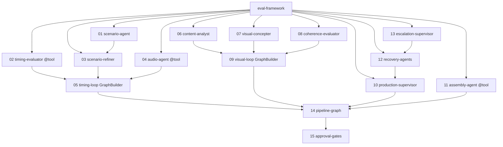

# SEQUENCE — build order and dependency graph

The migration is **component-by-component**. Each component lands in its
own PR, ships with an evals harness, and passes CI before the next
component is started.

---

## Dependency graph

---

## Build order rationale

1. **`eval-framework/` first.** Every component depends on it. Until the
   harness exists, there is no definition of "done" for any component.
2. **`01-scenario-agent`** — zero upstream dependencies. Exercises the full
   Strands pattern (single `Agent`, internal loop via tool calls,
   `SlidingWindowConversationManager`, hooks, evals). Template for the rest.
3. **`02-timing-evaluator`** — deterministic. Validates the "no-LLM
   component ships as a `@tool` function" pattern. Fastest to ship, builds
   confidence in the evals harness.
4. **`03-scenario-refiner`** — small LLM agent, conditional activation
   (skip-if-timing-passed hook). First use of `cancel_node`.
5. **`04-audio-agent`** — deterministic. Validates worker integration
   (TTS + WhisperX) behind `ToolSimulator` in tests.
6. **`05-timing-loop`** — first `GraphBuilder` composition. Cycle edge with
   condition `lambda s: not s.results["timing"]["timing_passed"]`.
   Graduates the loop pattern from in-agent to cross-agent.
7. **`06`–`09`: visual pipeline** — same patterns as scenario + timing. By
   this point the team can move in parallel; `06`, `07`, `08` are three
   independent PRs that merge before `09` composes them.
8. **`10-production-supervisor`** — most complex single agent. Escalation
   decisions, GPU worker dispatch, recovery ladder. Uses
   `SlidingWindowConversationManager` so the supervisor can reference
   earlier diagnostics within a run.
9. **`11-assembly-agent`** — deterministic. Validates OTIO/ffmpeg
   integration.
10. **`12-recovery-agents`, `13-escalation-supervisor`** — consumed by `10`
    via conditional cycle edges. Ship after `10` so the interfaces are
    settled.
11. **`14-pipeline-graph`** — full composition. First moment the whole
    pipeline runs end-to-end on Strands.
12. **`15-approval-gates`** — `Interrupt`-based human-in-the-loop,
    replacing `.approval_state.json` polling.

---

## Per-component checklist template

Every component spec in `components/` contains the following sections. The
table below is the summary index.

| # | Component | Complexity | Blast radius if wrong | Key risk |
|---|-----------|------------|----------------------|----------|
| 01 | scenario-agent | L | Entire pipeline quality | Prompt too long; token limit |
| 02 | timing-evaluator | S | Timing loop correctness | Off-by-one in scene boundary math |
| 03 | scenario-refiner | M | Convergence of timing loop | Refiner edits break structural checks |
| 04 | audio-agent | S | All downstream depends on it | TTS worker flakiness, not captured in ToolSimulator |
| 05 | timing-loop | M | Duration compliance | Cycle edge condition wrong → infinite loop or premature exit |
| 06 | content-analyst | M | Visual direction quality | Misclassified phrase type → wrong camera language |
| 07 | visual-concepter | L | Clip prompts | Style-lock drift |
| 08 | coherence-evaluator | M | Visual loop termination | LLM-as-judge bias |
| 09 | visual-loop | M | Visual pipeline composition | Same as 05 |
| 10 | production-supervisor | XL | GPU spend, recovery correctness | Escalation decision bias |
| 11 | assembly-agent | S | Final output integrity | OTIO timeline edge cases (gaps, overlaps) |
| 12 | recovery-agents | L | Recovery success rate | Agents re-trigger the same failure |
| 13 | escalation-supervisor | M | Human escalation signal quality | Conversation manager window too small |
| 14 | pipeline-graph | L | End-to-end correctness | Implicit cross-node state |
| 15 | approval-gates | M | UX; run interruption | Interrupt not persisted across process restart |

Complexity: S ≤ 1 day, M ≤ 3 days, L ≤ 1 week, XL > 1 week.

---

## Definition of done (applies to every component)

- [ ] Implementation file(s) under `server/strands_agents/` — ≤ 400 LOC per
      file where avoidable.
- [ ] Pytest unit tests for every `@tool` function.
- [ ] `Experiment` JSON committed alongside the agent (e.g.
      `experiments/scenario_experiment.json`).
- [ ] CI workflow runs the experiment and enforces thresholds from
      `eval-framework/THRESHOLDS.md`.
- [ ] OTel spans visible for every `Agent` invocation and every tool call
      (verify via `Experiment` run locally; `get_tracer()` is wired in
      `strands-evals`).
- [ ] Component spec in `docs/strands-migration/components/NN-*.md`
      updated with the actual file paths and any deviations from the spec.
