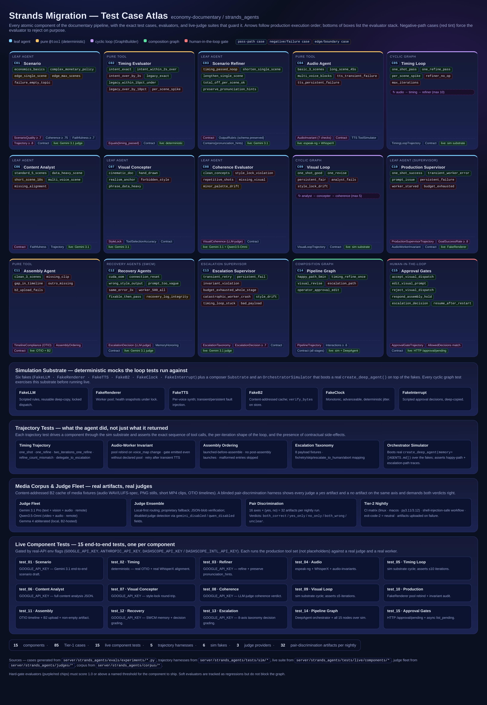

# Test Case Atlas

A single-page, process-diagram view of **every test case** guarding the
Strands migration of the `economy-documentary` pipeline.



## What you're looking at

Three rows of five components each — the 15 atomic components of the
pipeline in production execution order. Each box carries:

- **Component kind** (leaf agent, pure `@tool`, cyclic loop, composition
  graph, or human-in-the-loop gate) as a top stripe and subtitle.
- **Tier-1 case names** as colored chips:
  - green tint = pass-path case
  - red tint   = negative / forced-failure case
  - yellow tint = edge / boundary case
- **Evaluator stack** at the bottom. Hard-gate evaluators are tagged
  purple, live-judge evaluators green.

Four cross-cutting bands sit below the grid:

1. **Simulation Substrate** — the six fakes plus `OrchestratorSimulator`
   that boots a real `create_deep_agent(memory=[AGENTS.md])` on top of
   them.
2. **Trajectory Tests** — what the agent *did*, not just what it
   returned (timing · audio-worker · assembly-ordering ·
   escalation-taxonomy · orchestrator).
3. **Media Corpus & Judge Fleet** — Gemini 3.1, Qwen3.5-Omni, and
   abliterated Gemma 4 running the blinded pair-discrimination harness
   over real artifacts stored in B2.
4. **Live Component Tests** — one end-to-end test per component, gated
   by real-API env flags.

## How the atlas is generated

The HTML file is the source of truth. Cases are hand-synced from the
`Experiment` definitions under
`server/strands_agents/evals/experiments/*.py`. The PNG is rendered
headlessly so it can be embedded in markdown and in the PR description:

Run from the repo root:

```bash
python3 -m pip install playwright
python3 -m playwright install chromium
python3 - <<'PY'
import asyncio
from pathlib import Path
from playwright.async_api import async_playwright

ROOT = Path.cwd()
HTML = ROOT / "docs" / "strands-migration" / "diagrams" / "test-case-atlas.html"
PNG  = HTML.with_suffix(".png")

async def main():
    async with async_playwright() as p:
        browser = await p.chromium.launch()
        ctx = await browser.new_context(
            viewport={"width": 1620, "height": 900},
            device_scale_factor=2,
        )
        page = await ctx.new_page()
        await page.goto(HTML.resolve().as_uri())
        await page.wait_for_load_state("networkidle")
        await page.screenshot(path=str(PNG), full_page=True)
        await browser.close()

asyncio.run(main())
PY
```

## Totals

| | |
|---|---|
| Components | 15 |
| Tier-1 cases | 85 |
| Live component tests | 15 |
| Trajectory harnesses | 5 |
| Simulation fakes | 6 |
| Judge providers | 3 |
| Pair-discrimination artifacts / nightly | 32 |
