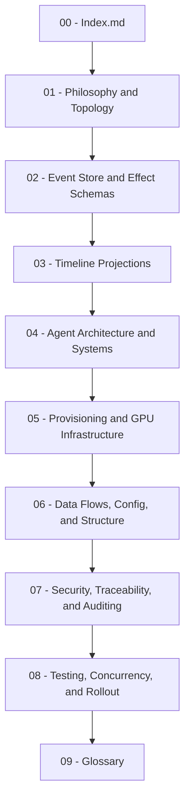

---
{
  "title": "Architecture V7.1 Index",
  "section": "Index",
  "tags": [
    "architecture",
    "index",
    "v7.1"
  ]
}
---

# 🎥 Documentary Pipeline — Architecture & Topology (V7.1)

Welcome to the canonical technical documentation vault for the **Autonomous Documentary Production Pipeline**. This suite is built for high-fidelity, long-form documentary generation (ranging from 1-minute prototypes to 60-minute feature films) leveraging multi-agent orchestration, event sourcing, and dynamic GPU allocation.

---

## 🗺️ Architectural Module Directory

The documentation is organized into **10 cohesive architectural modules** that define the invariants, schemas, data flows, and concurrency protections of the system.

| Module | Core Purpose & Scope | Key Architecture Targets |
| :--- | :--- | :--- |
| 📖 **[[01 - Philosophy and Topology|01. Philosophy & Topology]]** | Foundational invariants, the ASGI topology layout, and discarded design propositions. | Hard principles, ASGI process architecture, HTTP boundary rules |
| 🗄️ **[[02 - Event Store and Effect Schemas|02. Event Store & Effect Schemas]]** | Pydantic event definitions, SQLite WAL event log, deduplication, and ESDB migration path. | `EffectUnion`, UUIDv7 creation, `events.db` schema, transaction locks |
| ⏱️ **[[03 - Timeline Projections|03. Timeline Projections]]** | In-memory read models, OpenTimelineIO (`.otio`) timeline validation, and retry attempts. | `Timeline`, `Jobs`, `VMs`, `Budget`, and `State` projections |
| 🤖 **[[04 - Agent Architecture and Systems|04. Agent Architecture & Systems]]** | Agent structure (`pydantic-deep`), prompt layout, and semantic instructor parsing. | `create_pipeline_agent`, context compaction, semantic parser |
| ☁️ **[[05 - Provisioning and GPU Infrastructure|05. Provisioning & GPU Infrastructure]]** | Vast.ai integration, GPU fleet allocation, VRAM matching, and remote VM agent setup. | Provisioner Agent tools, Vast.ai offer matching, `vm_agent.py` |
| ⚙️ **[[06 - Data Flows, Config, and Structure|06. Data Flows, Config, and Structure]]** | Event-driven pipeline execution flows, central `.env` properties, and directory tree. | Startup sequence, config schema, project file tree |
| 🔐 **[[07 - Security, Traceability, and Auditing|07. Security, Traceability, and Auditing]]** | Access controls, provenance DAG, execution audit trail, and dependency analysis. | Provenance capability, token budgeting, Pydantic ecosystems |
| 🧪 **[[08 - Testing, Concurrency, and Rollout|08. Testing, Concurrency, and Rollout]]** | BDD integration tests, concurrency serialization via loop-bound lock, and progressive rollout. | BDD scenarios, `LoopBoundLock`, 1-to-60 minute scaling |
| 📚 **[[09 - Glossary|09. Glossary]]** | Master vocabulary of terms and abbreviations used in the documentary pipeline codebase. | OTIO, GSA, WAL, LTX, Qwen-TTS, ESDB |
| 🛡️ **[[10 - Simulation Covers|10. Simulation Covers]]** | Master registry mapping simulated features to real-world integration verification tests. | Covered-Simulation registry, SC-01 through SC-10 |

---

## ⚡ Global System Invariants (The "Non-Negotiables")

Every developer or agent modifying the codebase must preserve these 6 fundamental system invariants:

> [!IMPORTANT]
> **1. Event Log as Sole Source of Truth**  
> All pipeline state is derived passively by folding over the SQLite `events.db` log. Direct updates to databases or projections from agents are strictly banned.

> [!IMPORTANT]
> **2. Natural Language Only (No Structured Output from Agents)**  
> Agents emit only free-form conversational prose. They do NOT know about schemas, JSON, or effect markers. All structured data extraction is performed post-hoc by the semantic parser.

> [!IMPORTANT]
> **3. Isolated Read Path via GSA**  
> The Global State Agent (port 8000) is the sole component reading `events.db`. All other agents query the GSA via `GET /` to obtain the current timeline, jobs, and VM status.

> [!IMPORTANT]
> **4. Concurrency via LoopBoundLock**  
> Within each agent process, reasoning turns are globally serialized using `LoopBoundLock` (`run_lock_manager`) to prevent concurrent event-store writes or state corruption.

> [!IMPORTANT]
> **5. Time-based timeouts are strictly forbidden across all execution and test code**  
> Test execution flows must wait passively or determine timeout using domain-specific conditions. Hard timeouts (like wait loops capped at 15 minutes) are prohibited. Crucially, shell subprocesses (such as `ffmpeg` or `vastai` operations) must never be launched with timeout limits; they must be executed asynchronously and observed for completion. Hang detection, resource unreachability, and execution delays are observed and reacted to dynamically by the helper LLM agent operating from outside the pipeline, usually connected to a human operator directly. Test runners and test harnesses are not exempt from the rule of NO-TIMEOUT.

> [!IMPORTANT]
> **6. Emerging Pipeline Phases**  
> Pipeline execution phases (SCRIPT, AUDIO_RECONCILE, VIDEO_PRODUCTION, ASSEMBLY, DONE) are descriptive labels emerging from projection states, never hardcoded state machines.

> [!IMPORTANT]
> **7. Covered-Simulation**  
> If a simulator or mock implementation (e.g. `DryRunModel`, `TtsJobSimulator`, `LtxJobSimulator`) is utilized anywhere in any test suite, the underlying real, non-simulated production process (the actual LLM API calls, live Vast.ai VM rental, SSH tunneling, and remote CUDA-based media synthesis) **must be tested in non-simulation form very robustly** to ensure live correctness. Mocks must never be used as a replacement for live, uncompromised boundary validation.

---

*Documentary Pipeline Architecture Suite — V7.1. Last Updated: June 2026.*