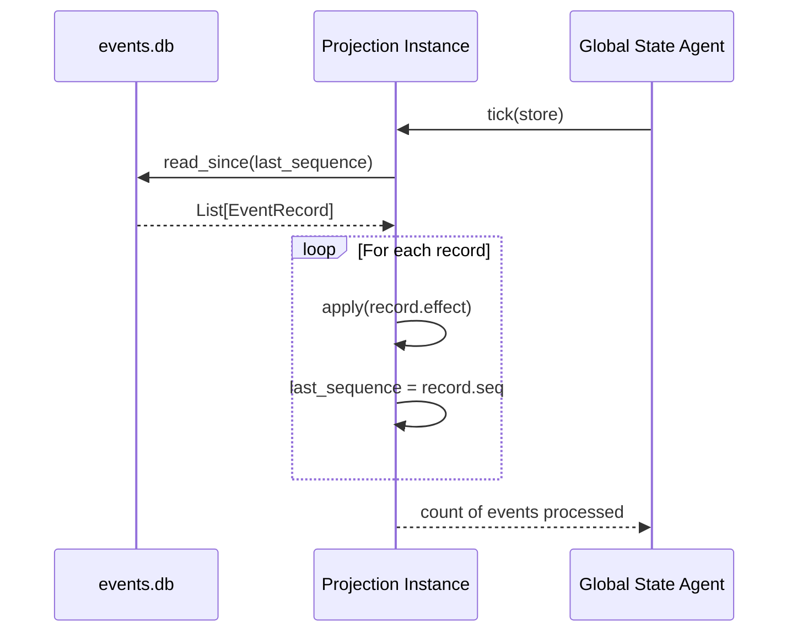

---
{
  "title": "Timeline Projections",
  "section": "3",
  "tags": [
    "architecture",
    "projections",
    "v7.1",
    "otio"
  ]
}
---

[[00 - Index|◀ Back to Index]]

# ⏱️ Timeline Projections

#### Incremental read model updates from event log
Projections must be designed as incremental read models that rebuild state passively by tracking the `last_sequence` and processing only new events on each `tick`. Direct modification of projection state is prohibited.

---

## 1. Projection Lifecycle

---

## 2. Projection Base Class

All projections inherit from `Projection`, an abstract base class defining `tick(store)` and `apply(event)`.

---

## 3. OpenTimelineIO (OTIO) Core Specifications

#### OpenTimelineIO as canonical timeline representation
The pipeline must use OpenTimelineIO (OTIO) 0.16+ as the canonical timeline representation. All timelines, tracks, and clips must be modeled using OTIO schema sequences and clip structures.

#### Narration text and screenplay scripts must not be subject to arbitrary length heuristics or trimming
⚡ Narration text and screenplay scripts must not be forced to fit fixed durations using crude character length limits or string trimming once downstream execution has commenced

⚡ Narration text and screenplay scripts must not be forced to fit fixed durations using crude character length limits or string trimming once downstream execution has commenced

⚡ Narration text and screenplay scripts must not be forced to fit fixed durations using crude character length limits or string trimming once downstream execution has commenced

Screenplay scripts and narration blocks must not be forced to fit fixed duration intervals using crude character length limits or string trimming rules. Narration length evaluation must rely on semantic, model-based judgment or speech-rate duration heuristics. Additionally, narration text must not be repeatedly changed or edited once downstream execution has commenced.

### 3.1 Track Layout

| Index | Track Name | Content | Producer |
| :---: | :--- | :--- | :--- |
| **0** | `A1_Narration` | Narration audio per block | Scenario Agent (script), Audio Agent (media) |
| **1** | `V1_Video` | Video clips per block | Video Agent (media) |
| **2** | `A2_Music` | Background music track | Assembly Agent |

### 3.2 Canonical Slot Addressing

Timeline slots are addressed using a abbreviated coordinate scheme:
* **`A1:3:2`** — Narration, Scene 3, Block 2.
* **`V1:3:2`** — Video, Scene 3, Block 2.

### 3.3 Clip Lifecycle

---

## 4. Concrete Projections

### 4.1 Timeline Projection

---

### 4.2 Job Projection

---

### 4.3 VM Projection

---

### 4.4 Budget Projection

---

### 4.5 CoordinateTimeline Projection

The `CoordinateTimeline` read model represents a grid-centric/timespan timeline. Instead of keying slots on logical IDs, it organizes clips by their physical track intervals, keeping a relational pointer to Scenario anchors.

#### Strict clip collision prevention on physical media tracks
Clips mapped to physical media tracks must not overlap in their coordinate timespans. If a newly merged clip overlaps with any existing clip on the same track, a collision error must be raised to prevent timeline corruption.

---

## 5. Serialized Response Schemas (GSA)

Projections are served as JSON-serialized Pydantic models by the GSA.

### 5.1 GlobalStateResponse

