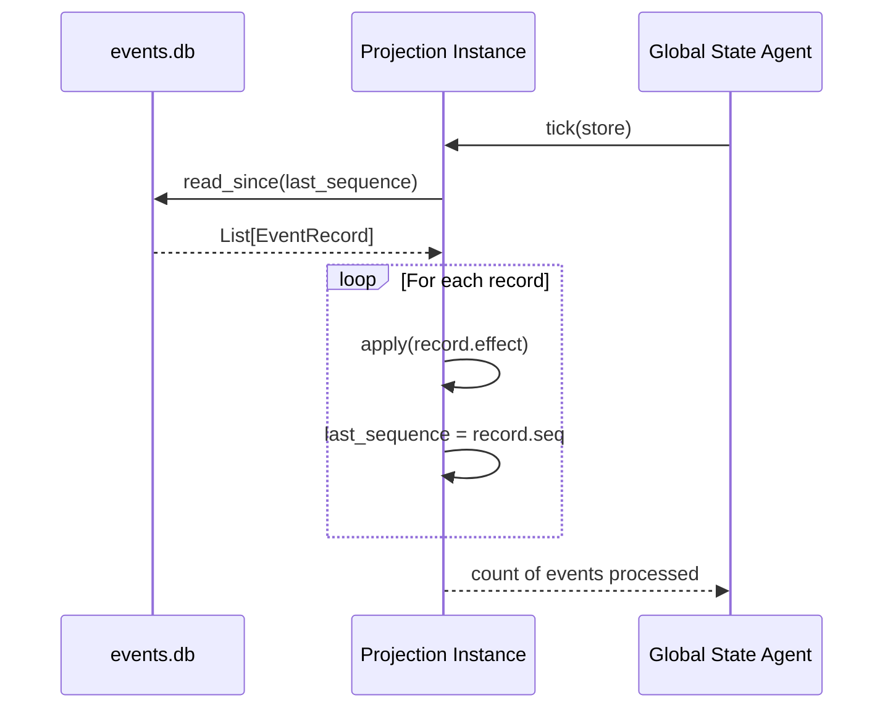

---
{
  "title": "Timeline Projections",
  "section": "3",
  "tags": [
    "architecture",
    "projections",
    "v7.1",
    "otio"
  ]
}
---

[[00 - Index|◀ Back to Index]]

# ⏱️ Timeline Projections

Projections are **incremental read models** rebuilt from the event log. Each projection tracks `last_sequence` and processes only new events on every `tick`.

---

## 1. Projection Lifecycle



---

## 2. Projection Base Class

All projections inherit from `Projection`, an abstract base class defining `tick(store)` and `apply(event)`.

```python
from abc import ABC, abstractmethod
from typing import Protocol

class Effect(Protocol):
    kind: str

class Projection(ABC):
    """Abstract base for all incremental read models.

    Subclasses implement ``apply()`` to define how each event kind mutates state.
    The ``tick()`` method handles event fetching and sequence tracking.
    """

    def __init__(self) -> None:
        self.last_sequence: int = 0

    def tick(self, store: EventStore) -> int:
        """Fetch events since ``last_sequence`` and apply each."""
        records = store.read_since(self.last_sequence)
        processed = 0
        for record in records:
            self.apply(record.effect)
            self.last_sequence = record.seq
            processed += 1
        return processed

    @abstractmethod
    def apply(self, event: Effect) -> None:
        """Mutate projection state in response to a single event."""
        ...

    def summary(self) -> str:
        return f"{self.__class__.__name__}(last_sequence={self.last_sequence})"
```

---

## 3. OpenTimelineIO (OTIO) Core Specifications

The pipeline uses **OpenTimelineIO (OTIO) 0.16+** as the canonical timeline representation.

### 3.1 Track Layout

| Index | Track Name | Content | Producer |
| :---: | :--- | :--- | :--- |
| **0** | `A1_Narration` | Narration audio per block | Scenario Agent (script), Audio Agent (media) |
| **1** | `V1_Video` | Video clips per block | Video Agent (media) |
| **2** | `A2_Music` | Background music track | Assembly Agent |

### 3.2 Canonical Slot Addressing

Timeline slots are addressed using a abbreviated coordinate scheme:
```
{track_short}:{scene_num}:{phrase_idx}
```
* **`A1:3:2`** — Narration, Scene 3, Block 2.
* **`V1:3:2`** — Video, Scene 3, Block 2.

### 3.3 Clip Lifecycle

```
[MissingReference] (Init UpdateScript)
         │
         ▼ (MergeIntoOTIO)
[ExternalReference] (Delivered Media URI)
         │
         ▼ (DurationAdjusted)
[MeasuredDuration] (WhisperX Confirmed)
```

---

## 4. Concrete Projections

### 4.1 Timeline Projection

```python
import opentimelineio as otio
from typing import Optional

class Timeline(Projection):
    """Builds and validates an OpenTimelineIO timeline from events."""

    def __init__(self) -> None:
        super().__init__()
        self.timeline: otio.schema.Timeline = otio.schema.Timeline(
            name="Documentary", global_start_time=otio.opentime.RationalTime(0, 24)
        )
        self.slots: dict[str, dict] = {}  # slot_addr -> metadata

    def apply(self, event: Effect) -> None:
        match event.kind:
            case "update_script":
                self._build_from_script(event)
            case "merge_into_otio":
                self._merge_clip(event)
            case "duration_adjusted":
                self._adjust_slot_duration(event)
            case "delete_scene":
                self._delete_scene(event)
            case "reorder_scenes":
                self._reorder_scenes(event)
            case "delete_from_otio":
                self._remove_clip(event)

    def _build_from_script(self, event: UpdateScript) -> None:
        track_name = "A1_Narration"
        if not self.timeline.tracks:
            track = otio.schema.Sequence(name=track_name)
            self.timeline.tracks.append(track)
        else:
            track = self.timeline.tracks[0]

        new_slot_addrs = set()
        for block in event.blocks:
            slot_addr = f"A1:{block.scene_num}:{block.block_id}"
            new_slot_addrs.add(slot_addr)

            existing = self.slots.get(slot_addr)
            if existing is not None:
                unchanged = (
                    existing.get("text") == block.text
                    and existing.get("speaker") == block.speaker
                    and abs(existing.get("scripted_sec", 0.0) - block.duration_sec) < 0.001
                )
                if unchanged:
                    continue
                existing.update({
                    "text": block.text,
                    "speaker": block.speaker,
                    "scripted_sec": block.duration_sec,
                    "measured_sec": None,
                    "status": "scripted",
                    "artifact_uri": None
                })
                self._update_clip_duration(slot_addr, block.duration_sec)
            else:
                rate = 24
                duration_rt = otio.opentime.RationalTime(block.duration_sec * rate, rate)
                clip = otio.schema.Clip(
                    name=slot_addr,
                    source_range=otio.opentime.TimeRange(
                        start_time=otio.opentime.RationalTime(0, rate),
                        duration=duration_rt
                    ),
                    media_reference=otio.schema.MissingReference()
                )
                track.append(clip)
                self.slots[slot_addr] = {
                    "scene_num": block.scene_num,
                    "block_id": block.block_id,
                    "speaker": block.speaker,
                    "text": block.text,
                    "scripted_sec": block.duration_sec,
                    "measured_sec": None,
                    "status": "scripted",
                    "artifact_uri": None
                }

        for addr in list(self.slots.keys()):
            if addr not in new_slot_addrs:
                clip = self._find_clip_by_name(addr)
                if clip is not None:
                    t = clip.parent()
                    if t is not None:
                        t.remove(clip)
                self.slots.pop(addr, None)

    def _update_clip_duration(self, slot_addr: str, duration_sec: float) -> None:
        clip = self._find_clip_by_name(slot_addr)
        if clip is None:
            return
        rate = 24
        new_duration = otio.opentime.RationalTime(duration_sec * rate, rate)
        clip.source_range = otio.opentime.TimeRange(
            start_time=clip.source_range.start_time,
            duration=new_duration
        )

    def _merge_clip(self, event: Effect) -> None:
        slot_addr = event.slot_id
        clip = self._find_clip_by_name(slot_addr)
        if clip is None:
            return
        clip.media_reference = otio.schema.ExternalReference(
            target_url=event.artifact_uri,
            available_range=clip.source_range
        )
        if slot_addr in self.slots:
            self.slots[slot_addr]["status"] = "delivered"
            self.slots[slot_addr]["artifact_uri"] = event.artifact_uri

    def _adjust_slot_duration(self, event: Effect) -> None:
        slot_addr = event.block_id
        clip = self._find_clip_by_name(slot_addr)
        if clip is None:
            return
        rate = 24
        new_duration = otio.opentime.RationalTime(event.measured_sec * rate, rate)
        clip.source_range = otio.opentime.TimeRange(
            start_time=clip.source_range.start_time,
            duration=new_duration
        )
        if slot_addr in self.slots:
            self.slots[slot_addr]["measured_sec"] = event.measured_sec
            self.slots[slot_addr]["status"] = "measured"

    def _delete_scene(self, event: Effect) -> None:
        scene_num = event.scene_num
        to_remove = [addr for addr, slot in self.slots.items() if slot["scene_num"] == scene_num]
        for addr in to_remove:
            clip = self._find_clip_by_name(addr)
            if clip is not None:
                track = clip.parent()
                if track is not None:
                    track.remove(clip)
            self.slots.pop(addr, None)

    def _reorder_scenes(self, event: ReorderScenes) -> None:
        if not self.timeline.tracks:
            return
        track = self.timeline.tracks[0]

        scene_to_clips = defaultdict(list)
        for child in list(track):
            if isinstance(child, otio.schema.Clip):
                parts = child.name.split(":")
                if len(parts) >= 2:
                    try:
                        scene_num = int(parts[1])
                        scene_to_clips[scene_num].append(child)
                    except ValueError:
                        pass

        new_clips = []
        for scene_num in event.new_order:
            clips = scene_to_clips.get(scene_num, [])
            clips.sort(key=lambda c: c.name)
            new_clips.extend(clips)

        track.clear_children()
        for clip in new_clips:
            track.append(clip)

        new_slots = {}
        for clip in new_clips:
            if clip.name in self.slots:
                new_slots[clip.name] = self.slots[clip.name]
        self.slots = new_slots

    def _remove_clip(self, event: Effect) -> None:
        clip = self._find_clip_by_name(event.slot_id)
        if clip is not None:
            track = clip.parent()
            if track is not None:
                track.remove(clip)

    def _find_clip_by_name(self, name: str) -> Optional[otio.schema.Clip]:
        for track in self.timeline.tracks:
            for child in track:
                if isinstance(child, otio.schema.Clip) and child.name == name:
                    return child
        return None

    def all_slots_filled(self) -> bool:
        slots = getattr(self, "slots", {})
        if not slots:
            return False
        return all(s.get("status") == "delivered" for s in slots.values())

    def get_timeline_duration_sec(self) -> float:
        dur = self.timeline.duration()
        return dur.value / dur.rate if dur and dur.rate else 0.0

    def summary(self) -> str:
        total = len(self.slots)
        measured = sum(1 for s in self.slots.values() if s["status"] == "measured")
        delivered = sum(1 for s in self.slots.values() if s["status"] == "delivered")
        scenes = len({s["scene_num"] for s in self.slots.values()})
        return f"OTIO: {scenes} scenes, {total} slots, {measured} measured, {delivered} delivered"
```

---

### 4.2 Job Projection

```python
class JobState:
    def __init__(self, job_id: str, job_type: str, slot_id: str) -> None:
        self.job_id: str = job_id
        self.job_type: str = job_type
        self.slot_id: str = slot_id
        self.status: str = "pending"
        self.params: dict = {}
        self.artifact_uri: Optional[str] = None
        self.duration_sec: Optional[float] = None
        self.error_message: Optional[str] = None
        self.requeue_count: int = 0
        self.created_at: float = 0.0
        self.completed_at: Optional[float] = None

class Jobs(Projection):
    """Tracks job lifecycle, reconciliation state, budget, and production failures."""
    
    SCRIPT_RESOLVABLE_TYPES: set[str] = {"gap_unexpected", "voice_mismatch"}

    def __init__(self) -> None:
        super().__init__()
        self.jobs: dict[str, JobState] = {}
        self.reconciliation_complete: bool = False
        self.dirty_blocks: set[str] = set()
        self.clean_blocks: set[str] = set()
        self.block_attempts: dict[str, int] = defaultdict(int)
        self.spent_usd: float = 0.0
        self.production_failures: list[dict] = []

    def apply(self, event: Effect) -> None:
        match event.kind:
            case "queue_job":
                self._on_queue(event)
            case "job_started":
                self._on_start(event)
            case "job_completed":
                self._on_complete(event)
            case "job_failed":
                self._on_fail(event)
            case "job_requeued":
                self._on_requeue(event)
            case "reconciliation_complete":
                self.reconciliation_complete = True
                self.dirty_blocks.clear()
            case "reconciliation_failed":
                self.reconciliation_complete = False
            case "production_failed":
                self.production_failures.append({
                    "slot_id": getattr(event, "slot_id", ""),
                    "failure_type": getattr(event, "failure_type", ""),
                    "expected": getattr(event, "expected", ""),
                    "actual": getattr(event, "actual", ""),
                    "suggested_fix": getattr(event, "suggested_fix", "")
                })
            case "update_script":
                self._resolve_failures_on_script_update(event)
                self._sync_from_otio(event)

    def _on_queue(self, event: Effect) -> None:
        job_id = event.job_id
        if job_id not in self.jobs:
            job = JobState(job_id=job_id, job_type=event.job_type, slot_id=getattr(event, "slot_id", ""))
            job.params = getattr(event, "params", {})
            job.created_at = getattr(event, "timestamp", 0.0)
            self.jobs[job_id] = job
            block_id = getattr(event, "slot_id", None)
            if block_id and event.job_type == "tts":
                self.block_attempts[block_id] += 1

    def _on_start(self, event: Effect) -> None:
        job = self.jobs.get(event.job_id)
        if job:
            job.status = "running"

    def _on_complete(self, event: Effect) -> None:
        job = self.jobs.get(event.job_id)
        if job:
            job.status = "completed"
            job.artifact_uri = getattr(event, "artifact_uri", None)
            job.duration_sec = getattr(event, "duration_sec", None)
            job.completed_at = getattr(event, "timestamp", None)
            block_id = job.slot_id
            if block_id in self.dirty_blocks:
                self.dirty_blocks.discard(block_id)
                self.clean_blocks.add(block_id)

    def _on_fail(self, event: Effect) -> None:
        job = self.jobs.get(event.job_id)
        if job:
            job.status = "failed"
            job.error_message = getattr(event, "error_message", "unknown")

    def _on_requeue(self, event: Effect) -> None:
        job = self.jobs.get(event.job_id)
        if job:
            job.status = "pending"
            job.requeue_count += 1
            job.error_message = None
            if getattr(event, "new_params", None):
                job.params.update(event.new_params)
            if job.slot_id:
                self.dirty_blocks.add(job.slot_id)
                self.clean_blocks.discard(job.slot_id)

    def _sync_from_otio(self, event: UpdateScript) -> None:
        updated_block_ids = {f"A1_Narration:{b.scene_num}:{b.block_id}" for b in event.blocks}
        for bid in updated_block_ids:
            self.dirty_blocks.add(bid)
            self.clean_blocks.discard(bid)

    def _resolve_failures_on_script_update(self, event: UpdateScript) -> None:
        updated_block_ids = {f"A1_Narration:{b.scene_num}:{b.block_id}" for b in event.blocks}
        self.production_failures = [
            f for f in self.production_failures
            if not (f.get("slot_id") in updated_block_ids and f.get("failure_type") in self.SCRIPT_RESOLVABLE_TYPES)
        ]
```

---

### 4.3 VM Projection

```python
from dataclasses import dataclass

@dataclass
class VMRecord:
    instance_id: str
    status: str = "active"
    role: str = ""
    offer_id: str = ""
    worker_url: str = ""
    hourly_rate_usd: float = 0.0
    started_at: float = 0.0
    observed_status: Optional[str] = None

class VMs(Projection):
    """Pure read model of the VM fleet. No active polling hooks."""

    def __init__(self) -> None:
        super().__init__()
        self.vms: dict[str, VMRecord] = {}

    def apply(self, event: Effect) -> None:
        match event.kind:
            case "vm_allocated":
                self.vms[event.instance_id] = VMRecord(
                    instance_id=event.instance_id,
                    status="active",
                    role=getattr(event, "role", ""),
                    offer_id=getattr(event, "offer_id", ""),
                    worker_url=getattr(event, "worker_url", ""),
                    hourly_rate_usd=getattr(event, "cost_per_hour", 0.0),
                    started_at=getattr(event, "timestamp", 0.0)
                )
            case "vm_deallocated":
                rec = self.vms.get(event.instance_id)
                if rec:
                    rec.status = "destroyed"
            case "vm_observed":
                rec = self.vms.get(event.instance_id)
                if rec:
                    rec.observed_status = getattr(event, "observed_status", None)
                    if rec.observed_status == "not_found" and rec.status == "active":
                        rec.status = "observed_gone"

    def active_vms(self, role: Optional[str] = None) -> list[VMRecord]:
        return [v for v in self.vms.values() if v.status == "active" and (role is None or v.role == role)]
```

---

### 4.4 Budget Projection

```python
class BudgetProjection(Projection):
    """Tracks budget limits and cumulative spends across VM runs."""

    def __init__(self) -> None:
        super().__init__()
        self.budget_cap_usd: float = 0.0
        self.spent_usd: float = 0.0
        self.vm_costs: dict[str, float] = {}
        self.exceeded: bool = False
        self.exceeded_at: Optional[float] = None

    def apply(self, event: Effect) -> None:
        match event.kind:
            case "budget_set":
                self.budget_cap_usd = getattr(event, "budget_usd", 0.0)
                self.exceeded = False
            case "vm_deallocated":
                instance_id = getattr(event, "instance_id", "")
                cost = getattr(event, "final_cost", 0.0)
                if instance_id:
                    self.vm_costs[instance_id] = self.vm_costs.get(instance_id, 0.0) + cost
                self.spent_usd += cost
                if not self.exceeded and self.budget_cap_usd > 0 and self.spent_usd > self.budget_cap_usd:
                    self.exceeded = True
                    self.exceeded_at = getattr(event, "timestamp", 0.0)
            case "pipeline_aborted":
                if getattr(event, "reason", "") == "budget_exceeded":
                    self.exceeded = True
```

---

## 5. Serialized Response Schemas (GSA)

Projections are served as JSON-serialized Pydantic models by the GSA.

### 5.1 GlobalStateResponse

```python
class GlobalStateResponse(BaseModel):
    """Authoritative API response from GSA GET /."""
    timestamp: float
    otio: OTIOResponse
    jobs: JobResponse
    vms: VMResponse
    state: StateResponse
    budget: BudgetResponse
    latest_sequence: int
```