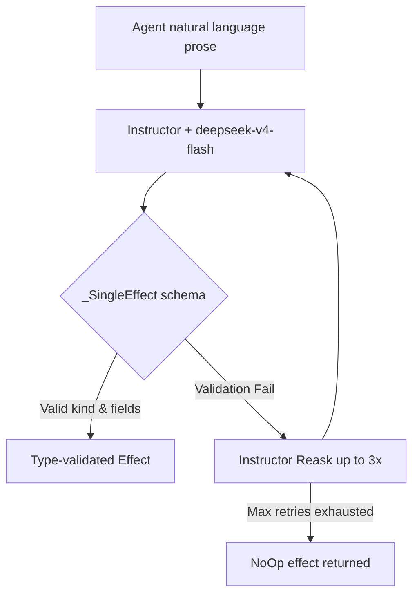

---
{
  "title": "Agent Architecture & Systems",
  "section": "4",
  "tags": [
    "architecture",
    "agents",
    "v7.1",
    "pydantic-deep"
  ]
}
---

[[00 - Index|◀ Back to Index]]

# 🤖 Agent Architecture & Systems

This module specifies the multi-agent execution framework powered by **pydantic-deep**, the structured prompt invariants, and the post-completion semantic extraction parser pipeline.

---

## 1. Agent System Prompts

There is no state machine or rules engine in Python code. Instead, prioritization, filtering, and transitions emerge from structured prompts.

### 1.1 The RULES Block

Every agent system prompt contains a standardized rules block. Pick the highest priority rule that applies (only one action per turn):

---

## 2. Situation Narratives

Projections are converted into natural language narratives by the handler and injected into the user prompt on every turn.

---

## 3. pydantic-deep Layer Stack

Context token limits (128,000 max tokens) are protected by a layered capability stack in `pydantic-deep`.

### 3.1 Factory Function: create_pipeline_agent

---

## 4. FastAPI Handlers & Autonomous Loops

Each pipeline agent runs within its own ASGI process powered by FastAPI. Instead of polling in a blocking loop, agents expose a REST control interface that supports asynchronous execution, state reporting, and immediate cancellation (operator intervention).

### 4.1 Endpoint Architecture

The endpoint topology follows a non-blocking, asynchronous execution design to prevent thread starvation and coordinate concurrent operations safely.

#### Non-blocking query and health checks via GET
The `GET /` endpoint must not block on the running agent turn. Instead, it inspects the lock's state (`lock.locked()`) to return the status (`"busy"` or `"healthy"`), and queries the GSA to determine the current focus task. It returns a human-readable conversational plain-text greeting or health report.

#### Immediate rejection on conflict via POST
The `POST /` endpoint triggers a conversational turn. To avoid multiple overlapping executions, it checks the lock status. If the agent is currently executing a turn (`lock.locked()`), the endpoint must return a `409 Conflict` (or plain-text message indicating the agent is busy) immediately without blocking. If the agent is idle, it executes the turn synchronously and returns the conversational monologue response. Any custom instruction body is appended to the event store as a `HumanInstruction` event.

#### Electric bolt interruption and cancellation via PUT
The `PUT /` endpoint provides immediate operator intervention. If the agent is currently running a background turn, sending a `PUT /` request instantly cancels the active asyncio task. It schedules the new execution turn to run asynchronously in the background and responds immediately with `204 No Content` to avoid blocking the caller.

#### Production agents must communicate strictly in PlainTextResponse
Production agents and HTTP endpoints are strictly prohibited from exchanging or exposing structured JSON payloads, key-value metadata strings (such as `ltx=yes`, `tts=yes`), or accepting JSON content headers for core agent state checks. All communication between agents must flow as conversational, natural-language plain text responses. The only exception is the GSA endpoint which exposes projections for fold functions.

#### PUT requests to control endpoints must cancel the active turn and start a background run returning no response
The PUT endpoint acts as an operator electric bolt that cancels the active asyncio task and any running subprocess groups immediately, forces background execution of the new payload, and returns 204 No Content with no payload.

---

## 5. Semantic Extraction Pipeline (The Parser)

The parser extracts typed effects from the agent's prose post-turn. The post-turn extraction parser runs the agent's natural language prose to validate and extract output effects, preventing competing transitions.

#### Agents are prohibited from inline polling or blocking sleeps
⚡ Agents must never execute time.sleep or inline polling loops; if a resource is not ready, the agent must end its turn and rely on the external scheduler

⚡ Agents must never execute time.sleep or inline polling loops; if a resource is not ready, the agent must end its turn and rely on the external scheduler

⚡ Agents must never execute time.sleep or inline polling loops; if a resource is not ready, the agent must end its turn and rely on the external scheduler

Agents must never execute `time.sleep` or loop-bound sleeps, nor run inline polling commands. If a resource or VM status is still initializing, the agent must output its current observations and end its turn immediately, relying on the platform's autonomous loop scheduler to trigger the next turn.

#### Narration text and screenplay scripts must not be subject to arbitrary length heuristics or trimming
Screenplay scripts and narration blocks must not be forced to fit fixed duration intervals using crude character length limits or string trimming rules. Narration length evaluation must rely on semantic, model-based judgment or speech-rate duration heuristics. Additionally, narration text must not be repeatedly changed or edited once downstream execution (audio or video generation) has commenced.

### 5.1 Container Models

To enforce single actions per turn, the agent parser uses `_SingleEffect`.

---

## 6. Local Agentic Memory System

We maintain a transparent, local, platform-managed memory system powered by Mem0. Agents remain completely stateless and are not equipped with memory tools.

#### Agents are completely stateless with no memory tools
LLM agents are forbidden from having `remember` or `recall_memory` tool definitions. The platform manages context loading and extraction transparently at the hosting layer in `agent_base.py`, ensuring that the agent codebase remains simple and tool-free.

#### The central event store SQLite database must remain clean of memory effect schemas
Memory state mutations must never be written to the `events.db` database as `Effect` objects. The SQLite event log is strictly reserved for script timeline adjustments, edits, and job/VM status transitions to avoid event-log bloat and state synchronization regressions.

#### Memory persistence is strictly local and independent of cloud services
The hosting platform is prohibited from querying Mem0 Cloud or using online embedding APIs for memory. Memory storage, embedding generation, and vector search must be executed entirely on the local host machine using local Qdrant collections and credentials to ensure local pipeline independence.

---

## 7. Compliance Scanner & Pipeline Conventions

The pipeline's runtime safety and structural invariants are programmatically scanned and enforced by the `/cheat` checker in `server/cheat_check.py`. Every contribution must comply with the canonical conventions.

#### Time-based timeouts are strictly forbidden across all execution and test code
All processes, tests, loop checks, agent tasks, HTTP queries (including lightweight GET health/readiness check queries), wakepost triggers, LLM inference, and test suites must never utilize time-based timeouts. They must run to completion or wait indefinitely. Crucially, shell subprocesses (such as `ffmpeg` or `vastai` operations) must never be launched with timeout limits; they must be executed asynchronously and observed for completion. Hang detection, resource unreachability, and execution delays are observed and reacted to dynamically by the helper LLM agent operating from outside the pipeline, usually connected to a human operator directly.

#### Fixed polling loops or sleeps are prohibited
No `time.sleep()` or `await asyncio.sleep()` calls are allowed inside loops. All agent actions and state check intervals must rely on the watcher tick loop and reasoning-based status checks to prevent thread stalling and blocking behavior.

#### Algorithmic retries without reasoning-based backoff are prohibited
Fixed-range retry loops (e.g. `for attempt in range(N)`) are banned. Retries must be evaluated dynamically by the agent based on the current context, attempts count, and runtime conditions.

#### Exception handlers must not swallow errors silently
Any exception handler containing a `pass` block or a low-severity `logger.debug` call must have a descriptive comment explaining the reason or call a maintainer notification event. This prevents silent execution failures from hiding in production paths.

#### No environment variable fallbacks in media tools
Media generation and rendering tools must not fall back to `os.environ` or read global settings. Directories and configuration parameters must be explicitly passed as inputs to keep tools modular and deterministic.

#### Pipeline state and agent actions must be controlled strictly via HTTP endpoints
Direct manipulation of files or databases, running independent shell scripts, or mutably bypassing control endpoints is strictly prohibited. All execution, monitoring, and human intervention must flow through the ASGI HTTP endpoints (GET, POST, PUT).

#### Production execution paths must not use mock implementations
Mocks, facades, and simulated worker endpoints are strictly forbidden in production runs. All VM provisioning, audio generation, and video generation steps must perform genuine system calls or API queries. Mocks are reserved exclusively for the offline test suites.
