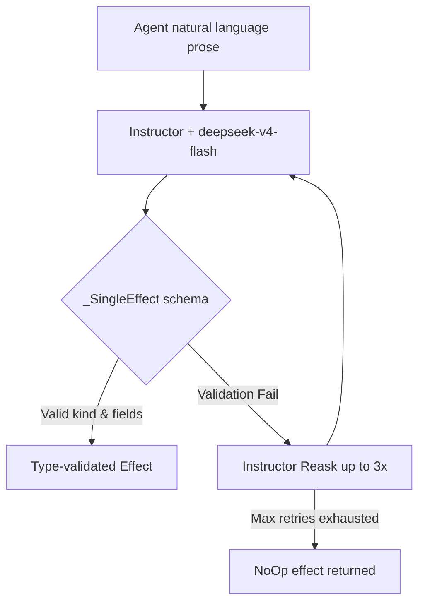

---
{
  "title": "Agent Architecture & Systems",
  "section": "4",
  "tags": [
    "architecture",
    "agents",
    "v7.1",
    "pydantic-deep"
  ]
}
---

[[00 - Index|◀ Back to Index]]

# 🤖 Agent Architecture & Systems

This module specifies the multi-agent execution framework powered by **pydantic-deep**, the structured prompt invariants, and the post-completion semantic extraction parser pipeline.

---

## 1. Agent System Prompts

There is no state machine or rules engine in Python code. Instead, prioritization, filtering, and transitions emerge from structured prompts.

### 1.1 The RULES Block

Every agent system prompt contains a standardized rules block. Pick the highest priority rule that applies (only one action per turn):

```text
=== RULES ===
1. Prioritize safety situations (budget critical, loop detected) above all else.
2. Prioritize blocked situations (stale VM, job queued long) next.
3. Prioritize work situations (dirty block, measurement needed) last.
4. If multiple work situations apply, pick the one with the lowest slot_id.
5. If no situations apply, the parser extracts NoOp.
```

---

## 2. Situation Narratives

Projections are converted into natural language narratives by the handler and injected into the user prompt on every turn.

```text
=== SITE: A1:3:2 ===
Federal Reserve Scene narration.
TARGET: 45.00s | MEASURED: 46.20s | DELTA: 1.20s
ATTEMPTS: 2/5 | VERDICT: PASS (within tolerance)

WHAT'S HAPPENING:
The narration block has been recorded and measured. It falls within the calculated duration tolerance.
WHAT TO DO:
Emit DurationAdjusted to update the OTIO timeline.
```

---

## 3. pydantic-deep Layer Stack

Context token limits (128,000 max tokens) are protected by a layered capability stack in `pydantic-deep`.

```
         Message History (Narrative + Memory)
                        │
                        ▼
         ┌─────────────────────────────┐
         │     ProvenanceCapability    │  pydantic-ai-provenance
         ├─────────────────────────────┤
         │      EvictionCapability     │  Paves large bash outputs
         ├─────────────────────────────┤
         │    SlidingWindowProcessor   │  Hard fallback trim (95%)
         ├─────────────────────────────┤
         │  on_before_compress callback│  OTIO-aware compaction LLM
         ├─────────────────────────────┤
         │  ContextManagerCapability   │  Auto-trigger at 90%
         ├─────────────────────────────┤
         │        CostTracking         │  Enforces $10.00 run budget
         └─────────────────────────────┘
                        │
                        ▼
                  Model Request
```

### 3.1 Factory Function: create_pipeline_agent

```python
from pydantic_ai_provenance.capability import ProvenanceCapability
from pydantic_ai_summarization import ContextManagerCapability, create_sliding_window_processor
from pydantic_ai_shields import CostTracking
from pydantic_deep import create_deep_agent

def create_pipeline_agent(role: str, config: Config):
    """Factory: create pydantic-deep agent with pipeline configuration."""
    provenance = ProvenanceCapability(
        agent_name=role,
        source_tools=["bash_command"]
    )

    agent = create_deep_agent(
        model=config.agent_models[role],
        instructions=ROLE_INSTRUCTIONS[role],
        on_before_compress=otio_aware_compress,
        history_processors=[
            create_sliding_window_processor(
                trigger=("messages", 100),
                keep=("messages", 50),
                max_input_tokens=config.max_tokens
            )
        ],
        eviction_token_limit=None,
        context_manager=True,
        context_manager_max_tokens=config.context_manager_max_tokens,
        include_todo=False,
        include_filesystem=False,
        include_plan=False,
        include_memory=False,
        include_checkpoints=False,
        web_search=False,
        thinking=True,
        cost_tracking=True,
        cost_budget_usd=config.max_run_budget_usd,
        periodic_reminder=PeriodicReminderConfig(every_n_turns=10, first_after=5),
        capabilities=[
            provenance,
            ContextManagerCapability(max_tokens=config.context_manager_max_tokens),
            CostTracking(budget_usd=config.max_run_budget_usd)
        ],
        deps_type=PipelineDeps
    )
    return agent
```

---

## 4. FastAPI Handlers & Autonomous Loops

Agents run inside independent ASGI server processes. They do not send wake triggers to each other. Instead, they expose an HTTP API using natural language text, running all heavy execution turns in background tasks to avoid endpoint hanging.

```python
# GET Endpoint: Conversational query or JSON health status (Blocks on lock if turn is running)
@app.get("/")
async def health(request: Request):
    lock = run_lock_manager.get_lock()
    async with lock:
        accept = request.headers.get("accept", "")
        if "application/json" in accept:
            return _agent_health
        
        status = _agent_health.get("status", "healthy")
        task = _agent_health.get("current_task") or "no active task"
        message = f"Hello. I am the {role} agent. Currently, my status is {status}. I am working on: {task}."
        return PlainTextResponse(message, media_type="text/plain")

# POST Endpoint: Conversational light commands (Blocks on lock, lightweight tasks only)
@app.post("/")
async def post_handler(request: Request):
    body = await request.body()
    instruction_text = body.decode("utf-8").strip()

    lock = run_lock_manager.get_lock()
    async with lock:
        # Performs lightweight tasks (e.g. appends HumanInstruction event if custom text passed)
        if instruction_text and instruction_text not in ("Wake up and check GSA", "Wakeup"):
            await append_human_instruction_event(instruction_text)

        accept = request.headers.get("accept", "")
        if "application/json" in accept:
            return AgentResponse(status="ok", effects_extracted=[], agent=role, timestamp=time.time())

        resp_text = latest_monologues.get(role) or f"I am the {role} agent. I have registered your instruction. Currently my status is healthy."
        return PlainTextResponse(resp_text, media_type="text/plain")

# PUT Endpoint: Interrupting operator intervention (Electric Bolt)
@app.put("/")
async def put_handler(request: Request):
    body = await request.body()
    instruction_text = body.decode("utf-8").strip()

    # Cancel existing task if running
    existing_task = globals()["active_tasks"].get(role)
    if existing_task and not existing_task.done():
        existing_task.cancel()
        try:
            await existing_task
        except asyncio.CancelledError:
            pass

    async def run_turn_in_background():
        _agent_health["status"] = "busy"
        try:
            await execute_agent_turn(role=role, ...)
            _agent_health["status"] = "healthy"
        except Exception as exc:
            _agent_health["status"] = "error"

    task = asyncio.create_task(run_turn_in_background())
    globals()["active_tasks"][role] = task

    return PlainTextResponse("", status_code=204)
```

---

## 5. Semantic Extraction Pipeline (The Parser)

The parser extracts typed effects from the agent's prose post-turn.



### 5.1 Container Models

To enforce single actions per turn, the agent parser uses `_SingleEffect`.

```python
class _SingleEffect(BaseModel):
    """Exactly one effect extracted per turn."""
    chain_of_thought: str = Field(description="Reasoning steps")
    effect: _EffectUnion = Field(description="The single extracted effect")
    confidence: int = Field(ge=0, le=10)

class _MultiEffect(BaseModel):
    """Batch parser schema (used for human/operator inputs only)."""
    chain_of_thought: str = Field(description="Reasoning steps")
    effects: list[_EffectUnion] = Field(description="Extracted list of effects")
    confidence: int = Field(ge=0, le=10)
```