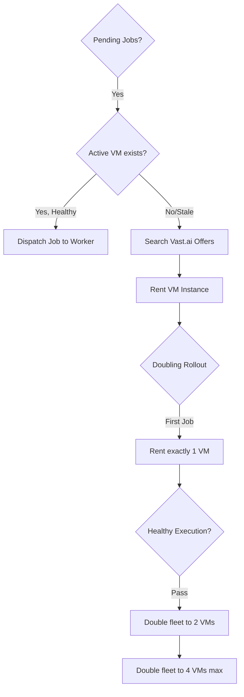

---
{
  "title": "Provisioning and GPU Infrastructure",
  "section": "5",
  "tags": [
    "infrastructure",
    "gpu",
    "vastai",
    "v7.1"
  ]
}
---

[[00 - Index|◀ Back to Index]]

# ☁️ Provisioning & GPU Infrastructure

This module specifies the agent tools, the autonomous **Provisioner Agent**, and the ephemeral **VM Worker** fleet running Qwen3-TTS and LTX-2.3 inference.

---

## 1. Agent Tools

Every agent is equipped with standard capabilities (`list_skills`, `load_skill`, `task`, `web_search`) and a custom asynchronous `bash_command` tool to interact with the GSA, inspect local databases, and run CLI processes.

### 1.1 Command-Line Examples

If an agent needs state, it reads it through `bash_command` curls:

---

## 2. Vast.ai VM Provisioning

The **Provisioner Agent** (port 8081) manages VM creation on the Vast.ai marketplace.

### 2.1 Fleet Allocation Strategy

#### Fleet escalation policy via progressive doubling
⚡ VM fleet allocation must follow exponential doubling capped at a soft limit of 4 active GPU worker VMs per run

⚡ VM fleet allocation must follow exponential doubling capped at a soft limit of 4 active GPU worker VMs per run

⚡ VM fleet allocation must follow exponential doubling capped at a soft limit of 4 active GPU worker VMs per run

The Provisioner must escalate the VM fleet size using a progressive doubling pattern (1 VM → 2 VMs → 4 VMs max soft limit per run). The fleet must start with a single instance to verify happy-path functionality before scaling.

#### GPU VRAM matching constraints per job type
The Provisioner must target specific GPU VRAM requirements and hourly cost limits depending on the job type:
- **TTS Jobs (`job_type="tts"`):** Match RTX 4090 or RTX A6000 GPUs with VRAM ≥ 24 GB and a cost target < \$0.80/hr.
- **Video Jobs (`job_type="ltx"`):** Match RTX A6000 GPUs with VRAM ≥ 48 GB and a cost target < \$1.20/hr.

---

## 3. Remote VM Worker

Workers run as ephemeral `FastAPI` nodes on port `9000+` inside Docker containers (`vastai/worker:tts` or `vastai/worker:ltx`).

### 3.1 On-Start Shell Boot Script

Code is cloned dynamically onto base Ubuntu templates on boot, avoiding image registry dependency friction.

### 3.2 HTTP API Surface

Workers implement the standard agent base endpoint contract:

| Method / Path | Payload | Expected Response | Rationale |
| :--- | :--- | :--- | :--- |
| `GET /` | None | Natural language status text | Polls status and current task of worker |
| `POST /` | Plain text prompt | Natural language result description | Wake/Dispatch job to worker agent |