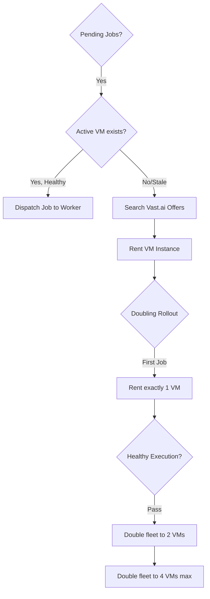

---
{
  "title": "Provisioning and GPU Infrastructure",
  "section": "5",
  "tags": [
    "infrastructure",
    "gpu",
    "vastai",
    "v7.1"
  ]
}
---

[[00 - Index|◀ Back to Index]]

# ☁️ Provisioning & GPU Infrastructure

This module specifies the agent tools, the autonomous **Provisioner Agent**, and the ephemeral **VM Worker** fleet running Qwen3-TTS and LTX-2.3 inference.

---

## 1. Agent Tools

Every agent is equipped with standard capabilities (`list_skills`, `load_skill`, `task`, `web_search`) and a custom asynchronous `bash_command` tool to interact with the GSA, inspect local databases, and run CLI processes.

```python
AGENT_TOOLS = [
    {
        "name": "bash_command",
        "description": "Execute a bash command asynchronously on the local machine.",
        "parameters": {
            "command": {"type": "string", "description": "The bash command to execute"}
        }
    },
    {
        "name": "search_web_brave",
        "description": "Search the web using Brave Search for real-time information.",
        "parameters": {
            "query": {"type": "string"},
            "count": {"type": "integer", "default": 3}
        }
    },
    {
        "name": "search_web_perplexity",
        "description": "Query Perplexity LLM search model for complex reasoning and technical questions.",
        "parameters": {
            "query": {"type": "string"},
            "count": {"type": "integer", "default": 3}
        }
    },
    {
        "name": "search_web_exa",
        "description": "Search the web using Exa neural search to retrieve clean, content-rich web pages.",
        "parameters": {
            "query": {"type": "string"},
            "count": {"type": "integer", "default": 3}
        }
    }
]
```

### 1.1 Command-Line Examples

If an agent needs state, it reads it through `bash_command` curls:

```bash
# Query the GSA state cache
curl -s http://gsa:8000/

# Check the SQLite event store directly
sqlite3 /tmp/documentary-pipeline/events.db "SELECT * FROM events WHERE agent='audio' ORDER BY seq DESC LIMIT 5;"
```

---

## 2. Vast.ai VM Provisioning

The **Provisioner Agent** (port 8081) manages VM creation on the Vast.ai marketplace.

### 2.1 Fleet Allocation Strategy



* **Fleet Escalation Policy:** The Provisioner escalates fleet size via progressive doubling (1 VM → 2 VMs → 4 VMs max soft limit).
* **VRAM Matching Decision Tree:**
  * **TTS Jobs (`job_type="tts"`):** Match RTX 4090 or RTX A6000 (VRAM ≥ 24 GB). Cost target < \$0.80/hr.
  * **Video Jobs (`job_type="ltx"`):** Match RTX A6000 (VRAM ≥ 48 GB). Cost target < \$1.20/hr.

---

## 3. Remote VM Worker

Workers run as ephemeral `FastAPI` nodes on port `9000+` inside Docker containers (`vastai/worker:tts` or `vastai/worker:ltx`).

### 3.1 On-Start Shell Boot Script

Code is cloned dynamically onto base Ubuntu templates on boot, avoiding image registry dependency friction.

```bash
#!/bin/bash
# onstart_tts.sh — runs on VM boot via Vast.ai --onstart-cmd
set -e

# 1. Install system utilities
apt-get update && apt-get install -y python3-pip ffmpeg git

# 2. Clone control repo
git clone --depth 1 "https://github.com/org/economy-documentary-work" /opt/worker
cd /opt/worker/vm_worker

# 3. Install packages
pip install -r requirements.txt

# 4. Prefetch model weights (cached on local disk)
python3 -m worker.download_weights --model qwen3-tts

# 5. Start worker FastAPI service
python3 -m worker.main --port 9000 --role tts
```

### 3.2 HTTP API Surface

Workers implement the standard agent base endpoint contract:

| Method / Path | Payload | Expected Response | Rationale |
| :--- | :--- | :--- | :--- |
| `GET /` | None | `VMHealthResponse` JSON | Polls status and current task of worker |
| `POST /` | Plain text prompt | Natural language result description | Wake/Dispatch job to worker agent |