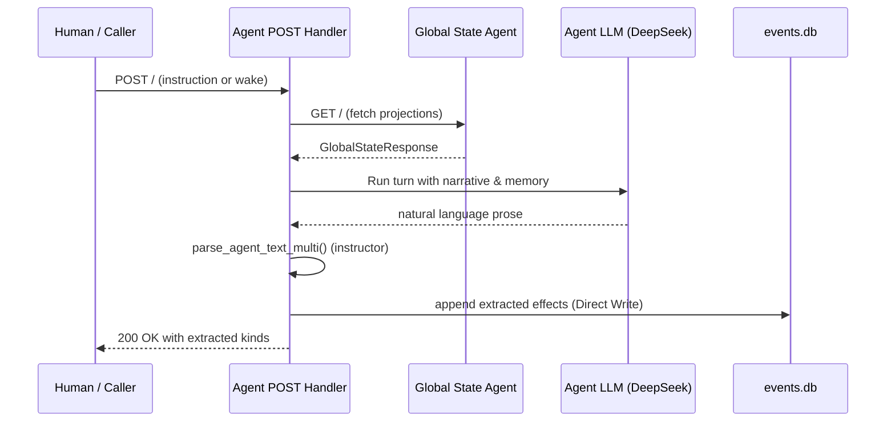
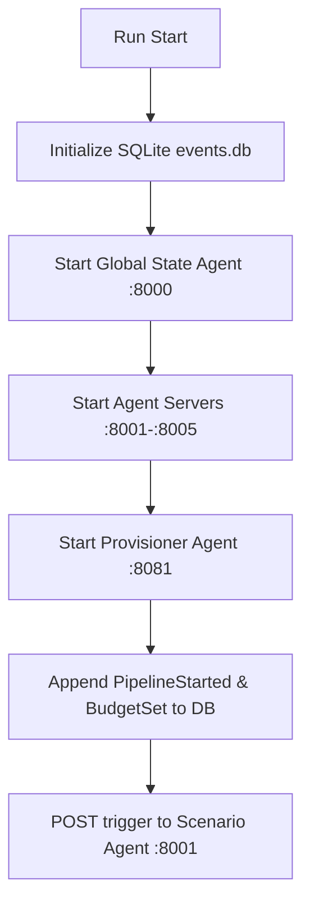

---
{
  "title": "Data Flows, Config, and Structure",
  "section": "6",
  "tags": [
    "architecture",
    "configuration",
    "directory-structure",
    "v7.1"
  ]
}
---

[[00 - Index|◀ Back to Index]]

# ⚙️ Data Flows, Config, & Structure

This module traces the core system data flows, specifies the central Pydantic configuration parameters, and details the project directory hierarchy.

---

## 1. System Data Flows

### 1.1 Agent Activation Cycle

The pipeline uses autonomous agent activation where agents poll the read-only GSA at regular intervals.

### 1.2 Startup Sequence

---

## 2. Configuration Schema

The `Config` Pydantic model is the single source of truth for all parameters.

#### No environment variable fallbacks in media tools
⚡ Configuration must use explicit Pydantic Config objects passed programmatically; environment variables and .env files are prohibited

Media generation and rendering tools must not fall back to `os.environ` or read global settings. Directories and configuration parameters must be explicitly passed as inputs to keep tools modular and deterministic.

### 2.1 Agent URL Registry

To support process-isolated parallel integration test execution where ports are allocated dynamically to prevent network interface binding conflicts, the pipeline utilizes a central **Agent URL Registry** (`AgentRegistry` class in `agent_base.py`).

* **Resolution Order**:
  1. Check for a dynamic port environment override in the format `PORT_<ROLE>` (e.g., `PORT_GSA`, `PORT_SCENARIO`, `PORT_AUDIO`, `PORT_VIDEO`, `PORT_PROVISIONER`, `PORT_ASSEMBLY`).
  2. Fall back to the canonical production ports:
     - GSA: 8000
     - Scenario Agent: 8001
     - Audio Agent: 8002
     - Provisioner Agent: 8003
     - Video Agent: 8004
     - Assembly Agent: 8005

---

## 3. Directory Layout

The codebase has the following structural layout:

