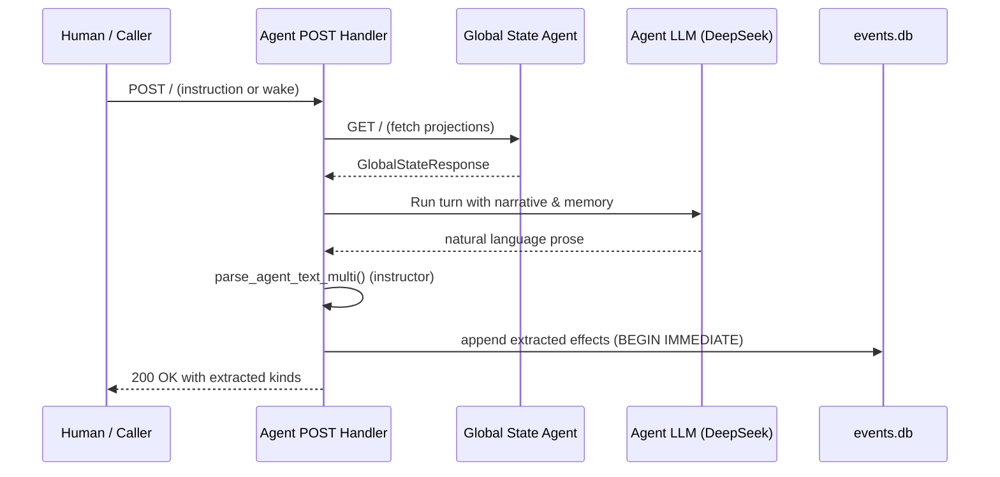
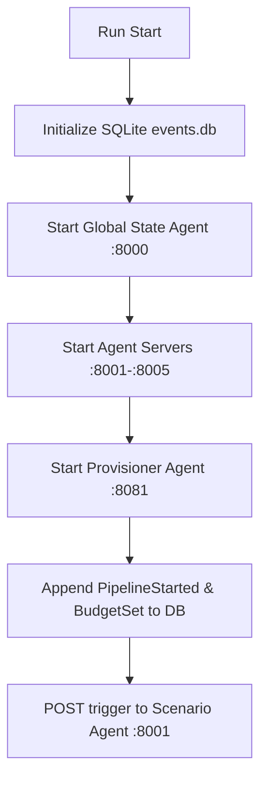

---
{
  "title": "Data Flows, Config, and Structure",
  "section": "6",
  "tags": [
    "architecture",
    "configuration",
    "directory-structure",
    "v7.1"
  ]
}
---

[[00 - Index|◀ Back to Index]]

# ⚙️ Data Flows, Config, & Structure

This module traces the core system data flows, specifies the central Pydantic configuration parameters, and details the project directory hierarchy.

---

## 1. System Data Flows

### 1.1 Agent Activation Cycle

The pipeline uses autonomous agent activation where agents poll the read-only GSA at regular intervals.



### 1.2 Startup Sequence



---

## 2. Configuration Schema

The `Config` Pydantic model is the single source of truth for all parameters.

#### No environment variable fallbacks in media tools
Media generation and rendering tools must not fall back to `os.environ` or read global settings. Directories and configuration parameters must be explicitly passed as inputs to keep tools modular and deterministic.

```python
from pydantic import BaseModel, Field
from typing import Literal

class Config(BaseModel):
    """Single source of truth for all tunable pipeline parameters."""
    
    # 2.1 Pipeline limits
    max_run_budget_usd: float = Field(default=10.00, ge=0.0)
    max_attempts_per_block: int = Field(default=5, ge=1)
    max_tts_budget_usd: float = Field(default=2.00, ge=0.0)
    max_queue_wait_sec: float = Field(default=300.0, ge=0.0)

    # 2.2 Assembly tolerance (dual threshold)
    tolerance_percent: float = Field(default=0.15, ge=0.0, le=1.0)
    tolerance_abs_sec: float = Field(default=0.25, ge=0.0)

    # 2.3 Health & loop detection
    loop_detection_threshold: int = Field(default=5, ge=1)

    # 2.4 Command allowlist
    allowlisted_commands: list[str] = Field(
        default_factory=lambda: ["ffmpeg", "ffprobe", "whisperx", "vastai", "python3"]
    )

    # 2.5 Event store
    log_dir: str = Field(default="/tmp/documentary-pipeline")

    # 2.6 Agent models
    agent_models: dict[str, str] = Field(
        default_factory=lambda: {
            "scenario": "openrouter:deepseek/deepseek-v4-flash",
            "audio": "openrouter:deepseek/deepseek-v4-flash",
            "video": "openrouter:deepseek/deepseek-v4-flash",
            "assembly": "openrouter:deepseek/deepseek-v4-flash",
            "provisioner": "openrouter:deepseek/deepseek-v4-flash"
        }
    )
    context_manager_max_tokens: int = 128_000
    compaction_model: str = "openrouter:deepseek/deepseek-v4-flash"

    # 2.7 VM sizing
    tts_gpu_type: Literal["RTX_4090"] = "RTX_4090"
    tts_vram_gb: int = 24
    tts_cpu_cores: int = 8
    tts_disk_gb: int = 100

    video_gpu_type: Literal["RTX_A6000", "RTX_4090"] = "RTX_A6000"
    video_vram_gb: int = 48
    video_cpu_cores: int = 16
    video_disk_gb: int = 200
```

---

## 3. Directory Layout

The codebase has the following structural layout:

```text
server/
├── config.py             # Pydantic Config model
├── effects.py            # Event models & kind unions
├── event_store.py        # SQLite event writer & reader
├── projections.py        # Folding projections (OTIO, VM, Jobs, Budget)
├── agent_base.py         # Base DeepAgent ASGI service
├── global_state_agent.py # Read-only GSA server on port 8000
├── agents/               # Media creation agents
│   ├── scenario.py       # Scriptwriting
│   ├── audio.py          # Voice creation
│   ├── video.py          # Visual creation
│   └── assembly.py       # Composition & ffmpeg
├── provisioner/          # Infrastructure orchestrator
│   └── main.py           # Provisioner agent
└── vm/                   # ephemereal VM worker agents
    ├── agent.py          # VM handler
    ├── onstart_tts.sh    # TTS worker script
    └── onstart_ltx.sh    # LTX video worker script
```