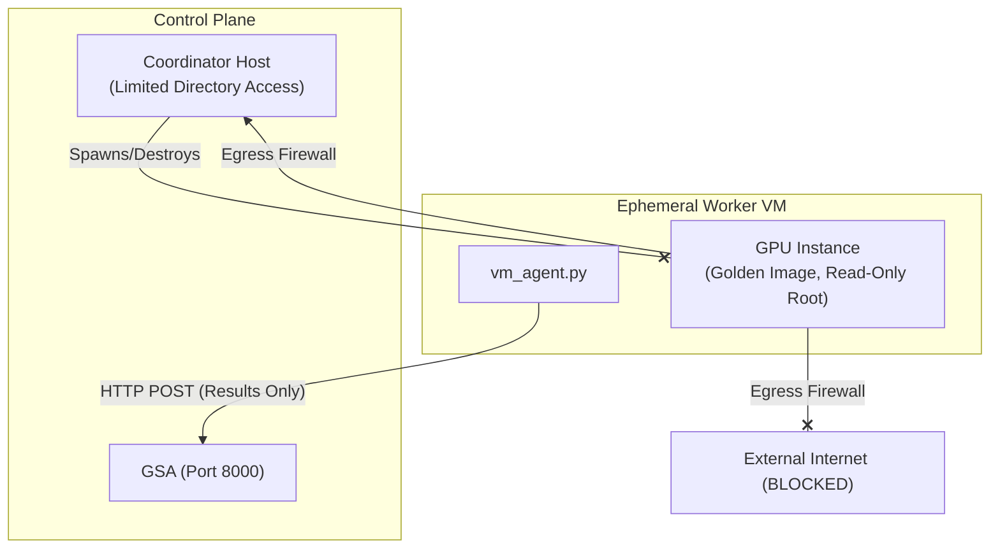

---
{
  "title": "Security Model, Traceability, and Auditing",
  "section": "07",
  "tags": [
    "architecture",
    "security",
    "traceability",
    "auditing",
    "v7.1"
  ]
}
---

[[00 - Index|◀ Back to Index]]

# 🔐 Security, Traceability, and Auditing

This module outlines the security boundaries, cost control mechanisms, observability frameworks, and the verified capabilities of the Pydantic ecosystem used within the documentary pipeline.

---

## 1. Security Model

The documentary pipeline operates on a decentralized, agent-driven architecture where security is enforced at the infrastructure and schema boundaries rather than through fine-grained command authorization.

### 1.1 `bash_command` Security

> [!WARNING]
> **Threat Model:** The `bash_command` tool allows control plane agents and worker VMs to execute arbitrary shell commands. A compromised agent or prompt injection could trigger destructive commands (`rm -rf /`) or data exfiltration.

#### Architectural Commitment (V7.1)
There is **no per-command interactive approval flow** during runtime execution. When an agent calls `bash_command`, it executes immediately. Security is enforced through multi-layered infrastructure containment.



#### Core Defense Layers
1. **VM Isolation:** GPU workers are ephemeral. Each worker VM is provisioned from a static golden image. The root disk is mounted read-only with no persistent writable overlay. Once a stage finishes, the VM is destroyed.
2. **Network Egress Restriction:** Egress firewalls block all outbound network traffic from worker VMs except to the control plane coordinator host (`coordinator.internal`). Direct connections to the public internet are dropped.
3. **Control Plane Sandboxing:** Control plane services (Scenario, Audio, Video, Assembly, Provisioner) run under unprivileged Unix accounts with restricted filesystem write boundaries. They cannot access host credentials or system configurations.
4. **No Secrets on Workers:** Worker VMs do not have access to API keys, JWTs, or cloud credentials. Work descriptions are received via HTTP POST, and results are returned directly in the response payload.

```python
class VMIsolationConfig(BaseModel):
    """Security parameters for ephemeral GPU worker VMs.

    V7.1: No JWT, no credentials, no disk checkpointing.
    VM lifecycle is strictly operator-driven or Provisioner-managed.
    """
    allowed_egress_hosts: list[str] = Field(
        default_factory=lambda: ["coordinator.internal"]
    )
```

> [!TIP]
> **Operator Escape Hatch:** The human operator can POST a `HumanInstruction` to any agent at any time. This allows forcing VM teardowns or aborting runaway agents via immediate manual override.

---

### 1.2 Budget Enforcement

To prevent unbounded costs from LLM API calls, GPU rentals, and cloud egress, the pipeline implements active ledger tracking.

```mermaid
gantt
    title Budget Limit Gate
    dateFormat  X
    axisFormat %s
    section Spending
    LLM Accumulator       :active, 0, 4
    GPU Rental Accumulator :active, 4, 7
    Egress Accumulator     :active, 7, 9
    Threshold Gate ($10)   :crit, 9, 10
```



#### Unbounded cost prevention and budget limits
Every active run must track LLM token counts, GPU lease durations (calculated per-second), and network egress bandwidth against a per-run budget ceiling:
- The default budget is capped at $10.00 USD per run (configurable via `budget_usd` with boundaries: min $0.01, max $1000.00).
- If a projected tool charge or execution step violates the remaining budget, the agent must extract a `PipelineAborted` effect with `reason="budget_exceeded"`. The Provisioner must immediately issue API commands to terminate and destroy all running worker VMs.

```python
class BudgetLedger(BaseModel):
    """Cumulative spend against a per-run budget ceiling."""
    budget_usd: float = Field(default=10.0, ge=0.01, le=1000.0)
    spent_llm_usd: float = Field(default=0.0)
    spent_gpu_usd: float = Field(default=0.0)
    spent_egress_usd: float = Field(default=0.0)

    @property
    def remaining_usd(self) -> float:
        return self.budget_usd - (
            self.spent_llm_usd + self.spent_gpu_usd + self.spent_egress_usd
        )

    def check(self, next_charge_usd: float) -> bool:
        return (self.remaining_usd - next_charge_usd) >= 0.0
```

---

### 1.3 Agent Loop Detection

Agents are protected against infinite execution cycles (e.g., repeating identical tool arguments or failing to make progress on checklists).

#### Loop detection thresholds and resolution actions
To protect against infinite execution cycles (e.g. repeating identical tool arguments or failing to make progress on checklists), the pipeline enforces two detection mechanisms:
- **Duplicate-Effects Detection:** If hashes of observable side-effects (files written, VMs created, jobs queued) produce 2 identical hashes within a window of 10 turns, the agent turn is paused and a `ClarificationRequest` is emitted.
- **No-Progress Detection:** If there is zero progress (delta change of completed task checklist items) over 5 consecutive turns, the agent turn is paused and control is surfaced to the operator.

| Detection Mechanism | Evaluation Criterion | Trigger Threshold | Resolution Action |
| :--- | :--- | :--- | :--- |
| **Duplicate-Effects** | Hashes of observable side-effects (files written, VMs created, jobs queued) | 2 identical hashes within window | Agent turn paused; emits `ClarificationRequest` |
| **No-Progress** | Delta change of completed task checklist items | 0 progress over `N` turns (default: 5) | Agent turn paused; surfaces context to Operator |

```python
class LoopDetectorConfig(BaseModel):
    """Per-agent loop detection parameters."""
    progress_threshold_turns: int = Field(default=5, ge=2, le=20)
    effect_dedup_window: int = Field(default=10, ge=2, le=50)
    enabled_detectors: list[Literal["duplicate_effects", "no_progress"]] = Field(
        default_factory=lambda: ["duplicate_effects", "no_progress"]
    )
```

---

## 2. Traceability and Observability

Observability is built upon the event log and process diagnostics without external tracing daemons.

### 2.1 The Traceability Contract

Every state mutation is represented by an event matching the following metadata structure:

* **`effect_id` (UUIDv7):** Generated client-side. Serves as both the event correlation key and the database-level deduplication invariant.
* **`agent` (string):** The identifier of the agent role that generated the mutation (e.g., `scenario`, `audio`).
* **`timestamp` (float):** Epoch seconds, guaranteeing monotonic ordering.
* **`sequence` (integer):** The autoincrementing primary key in the SQLite event log, defining the absolute sequence of pipeline actions.

---

### 2.2 Operator Observability Ports

Operators monitor and debug the pipeline using direct access points:

1. **State Agent Endpoint:** Querying `GET /` on the **Global State Agent** (GSA, Port 8000) returns the complete, in-memory folded projection bundle (`otio`, `jobs`, `vms`, `state`, and `budget`).
2. **Local Logs:** Debug streams are written in plain text to `/tmp/documentary-pipeline/agent_debug_{role}.log`.
3. **Database Replay:** Reading `/tmp/documentary-pipeline/events.db` provides the raw immutable event history.

---

### 2.3 Logging Specification

Logs are printed to `stdout` in a unified, non-structured format:

```text
YYYY-MM-DD HH:MM:SS.mmm | LEVEL | COMPONENT | effect_id=... | message
```

#### Log Levels
* `INFO`: Applied during normal workflows, turn boundary completions, or event store appends.
* `WARN`: Emitted during recoverable faults (e.g., worker VM timeout, API rate limit retry).
* `ERROR`: Critical errors causing turn failures (e.g., schema validation failure).
* `DEBUG`: Deep internals of the agent execution loops and token trackers (disabled by default in production).

---

### 2.4 Diagnostic Metrics (GSA Projection-Derived)

No external scrapers (Prometheus, StatsD) are run. System metrics are calculated on-demand by calling `GET /` on the GSA.

| Metric | Source Field | Diagnostic Purpose |
| :--- | :--- | :--- |
| **Event Sequence** | `latest_sequence` | Total mutation scale |
| **Pipeline Phase** | `state.current_phase` | High-level execution status |
| **GPU Fleet Count** | `vms.active_count` | Current active lease scale |
| **Timeline Progress** | `otio.delivered_slots` / `otio.total_slots` | Production completeness percentage |
| **Job Backlog** | `len(jobs.jobs)` (grouped by status) | Dispatcher load tracking |

#### External Rate Collector Example
```python
import time
import httpx

class PipelineMonitor:
    def __init__(self, gsa_url: str):
        self.gsa_url = gsa_url
        self.last_seq = 0
        self.last_ts = 0.0

    async def poll(self):
        async with httpx.AsyncClient() as client:
            resp = await client.get(f"{self.gsa_url}/")
            data = resp.json()
            
            seq = data["latest_sequence"]
            now = time.time()
            
            if self.last_ts > 0:
                delta_seq = seq - self.last_seq
                delta_t = now - self.last_ts
                rate = delta_seq / delta_t if delta_t > 0 else 0
                print(f"{rate:.2f} effects/sec | Phase: {data['state']['current_phase']}")
                
            self.last_seq = seq
            self.last_ts = now
```

---

### 2.5 Operator Incident Guide

Since there is no automated notification service (e.g., PagerDuty), the operator is expected to actively poll GSA state and respond to anomalies:

| Observed Symptom | Detection Point | Mitigation Vector |
| :--- | :--- | :--- |
| **Pipeline Stuck** | `state.current_phase == "aborted"` | Check event log for last `PipelineAborted` event; fix script and restart. |
| **Infinite Agent Loop** | Recent events contain duplicated kinds 5+ times | POST `HumanInstruction` to the looping agent to force task modification. |
| **Vast VM Provision Failure** | `production_failures` has `failure_category="vm_provision"` | Verify Vast.ai account credit balance; update VRAM target in config. |
| **Hung Dispatcher** | Pending job created > 5 minutes ago while active VMs is 0 | Terminate and restart the Provisioner process; it will replay the log to recover state. |

---

### 2.6 Distributed Tracing via Causation Chains

Causation and correlation are established by tracing parent identifiers down the event store.

#### Trace Query Utility
```python
def trace_causal_chain(job_id: str, store: EventStore) -> list[EventRecord]:
    """Retrieve all event records tied to a specific job execution."""
    records = store.read_all()
    chain = [
        r for r in records 
        if getattr(r.effect, "job_id", None) == job_id
    ]
    return sorted(chain, key=lambda r: r.sequence)
```

#### Sample Tracing Output
```text
3: QueueJob (job_id=job-901, target=video)
4: VMAllocated (job_id=job-901, instance_id=vast-776)
5: JobStarted (job_id=job-901)
6: JobCompleted (job_id=job-901, artifact_path="/tmp/video_901.mp4")
```

The `X-Effect-ID` header is appended to HTTP responses when writing effects, allowing external agents to match API calls directly to database sequence states.

---

## 3. Pydantic Ecosystem Deep Audit

A thorough codebase audit of the control plane execution environment verified the capabilities and limits of the integrated Pydantic packages.

### 3.1 Package Capabilities

| Package Name | Target Purpose | Active Capabilities | Status |
| :--- | :--- | :--- | :--- |
| `pydantic-deep` | LLM routing & agent bases | `HooksCapability`, `SlidingWindowProcessor` | ✅ Verified |
| `pydantic-ai-summarization` | Context limit compression | `ContextManagerCapability`, `SummarizationCapability` | ✅ Verified |
| `pydantic-ai-shields` | Security & Token Guardrails | `CostTracking`, `ToolGuard`, `InputGuard`, `OutputGuard` | ✅ Verified |
| `pydantic-ai-todo` | Checklist states | `TodoCapability` | ✅ Verified |
| `pydantic-ai-provenance` | Causation graphs | `ProvenanceCapability` (requires manual installation) | ⚠️ Available (External) |

---

### 3.2 Key Capability Specs

#### `TodoCapability` (`pydantic-ai-todo`)
* **Purpose:** Provides structured todo list tooling to the agent's LLM context.
* **Mechanism:** Exposes `create_todo`, `update_todo`, and `delete_todo` to the agent. Updates are dynamically injected into the system prompt prefix on each turn to maintain checklist alignment.

#### `ContextManagerCapability` (`pydantic-ai-summarization`)
* **Purpose:** Manages context window limits during long agent turns.
* **Mechanism:** Tracks cumulative input/output token usage. Triggers a registered `on_before_compress` callback when usage exceeds 90% of the maximum model capacity, summarizing the context window before eviction.

#### `HooksCapability` (`pydantic-deep`)
* **Purpose:** Lifecycles hooks for debugging and middleware.
* **Mechanism:** Implements `on_before_tool_call`, `on_after_tool_call`, and `on_tool_error` handlers. 

> [!IMPORTANT]
> **V7.1 Distinction:** `HooksCapability` does **not** handle agent context compaction. Context compaction (`on_before_compress`) is configured as a direct argument to `create_deep_agent()` and is processed by the agent core, not by tool hooks.

---

### 3.3 Core Capabilities Reference

| Requirement | Preferred Mechanism | Anti-Patterns |
| :--- | :--- | :--- |
| **Tool Logging** | Use `HooksCapability` decorators | Writing print statements inside every tool definition |
| **Prompt Injection** | Subclass `AbstractCapability` and define `get_instructions()` | Appending instructions in custom loops in agent handlers |
| **Global Agent Control** | Inject direct arguments (e.g. `on_before_compress`) | Constructing complex middleware stacks for basic variables |

---

*V7.1 Security & Observability Specification. Built on SQLite WAL transactions and Pydantic-Deep guardrails.*