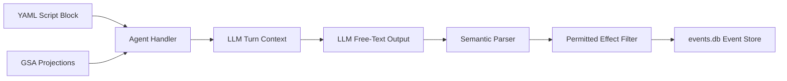

---
{
  "title": "Testing, Concurrency, and Rollout",
  "section": "08",
  "tags": [
    "architecture",
    "testing",
    "concurrency",
    "rollout",
    "v7.1"
  ]
}
---

[[00 - Index|◀ Back to Index]]

# 🧪 Testing, Concurrency, and Rollout

This module outlines the authoring patterns for script-guided agents, defines the integration test suite, establishes the progressive rollout workflow, and specifies the concurrency and timeout invariants of the system.

---

## 1. Authoring Workflow for Quasi-Deterministic Agents

Fully autonomous agents are too unpredictable for structured video production, while traditional scripting is too rigid. The pipeline adopts a **quasi-deterministic hybrid pattern**: agents utilize LLMs to reason but are strictly constrained by structured YAML scripts and runtime execution gates.

### 1.1 The Runtime Execution Gate

1. **Script Injection:** The handler reads the scene YAML script (e.g. `scripts/scene_3.yaml`) and injects its instructions directly into the agent prompt context.
2. **Action Limitations:** The agent does not have general tools to navigate files or invoke arbitrary APIs. Its primary tool is `bash_command` (restricted to coordinator/worker context).
3. **Effect Enforcement:** The post-execution parser extracts only those effects explicitly declared in the scene's `permitted_effects` whitelist. All other extracted effects are ignored.



---

### 1.2 Authoring Format (YAML)

```yaml
# scripts/documentary_scene_3.yaml
scene_num: 3
blocks:
  - block_id: "A1:3:1"
    role: scenario
    instructions: |
      Write narration for the Federal Reserve scene.
      Duration target: 45s. Speaker: V1_Narrator.
    permitted_effects: 
      - update_script
      - noop
      - clarification_request
    escape_conditions:
      - condition: "agent_loop_detected"
        action: "request_clarification"
      - condition: "budget_critical"
        action: "abort_pipeline"

  - block_id: "A1:3:2"
    role: audio
    instructions: |
      Reconcile narration duration to script target (45s ±15%).
      Max attempts: 5. Voice: V1_Narrator.
    permitted_effects:
      - queue_job
      - job_requeued
      - duration_adjusted
      - reconciliation_failed
      - reconciliation_complete
      - noop
    prerequisites:
      - block_id: "A1:3:1"
        required_effect: "update_script"
```

---

### 1.3 Runtime Turn Enforcement Example

```python
async def run_authorized_turn(agent, script_block, projections, store):
    """Run an agent turn constrained by an authored script block."""
    # 1. Verify prerequisites
    for prereq in script_block.prerequisites:
        if not has_effect(projections, prereq.block_id, prereq.required_effect):
            raise PrerequisitesNotMet(prereq)

    # 2. Inject script context into prompt
    instructions = f"""
{ROLE_INSTRUCTIONS[script_block.role]}

=== AUTHORIZED SCRIPT ===
{script_block.instructions}

=== PERMITTED EFFECTS ===
{', '.join(script_block.permitted_effects)}

=== ESCAPE CONDITIONS ===
{yaml.dump(script_block.escape_conditions)}
"""

    # 3. Run Agent (per-turn prompts override default instructions)
    result = await agent.run(
        user_prompt=instructions + "\n\n" + build_narrative(projections, script_block.role),
        deps=PipelineDeps(gsa_url="http://gsa:8000", agent_role=script_block.role),
    )

    # 4. Extract and validate effects
    effects = await parse_agent_text_multi(script_block.role, result.output)
    
    # Filter to permitted kinds after extraction
    permitted = [e for e in effects if e.kind in script_block.permitted_effects]

    # 5. Append validated effects to the event store
    for effect in permitted:
        store.append(effect, otio_hash_before=hash_otio(projections["otio"]))

    return permitted
```

---

### 1.4 Agent Behavior Comparison

| Character | Hard Scripted | Fully Agentic | Quasi-Deterministic (Adopted) |
| :--- | :--- | :--- | :--- |
| **Next Action Determination** | Static branching | LLM choice (Unbounded) | Bounded by YAML task definitions |
| **Error Handling** | Hardcoded exceptions | Hallucinated operations | Structured escape conditions |
| **Effect Output Space** | Single hardcoded type | Unrestricted kinds | Explicit `permitted_effects` whitelist |
| **Edge-Case Safety** | Fatal crash | Runaway infinite loop | Automatic pause → `ClarificationRequest` |

---

## 2. Unit and Integration Tests

The testing suite consists of real-world integration tests driven over active network boundaries. No mock simulators or fake database layers are used.

### 2.1 Core Testing Principle

> [!IMPORTANT]
> **Uncompromised Thoroughness:** Developer convenience, cloud rental fees, and execution time must never compromise verification. All integration and BDD suites must exercise actual VM instantiation, SSH tunnels, worker endpoints, and media validation to mirror production loads.

---

### 2.2 Active BDD Integration Test Suites

1. **Scale Timeline Integrity & Gap Validation Test:**
   * **Context:** SQLite event store holds a script for a 120-block, 3600-second (hour-long) film.
   * **Workflow:** Provisioner triggers 120 TTS and 120 video rendering jobs, logging all completions.
   * **Validation:** Assembly Agent builds the 120-slot OpenTimelineIO timeline. Asserts zero gap overlays, perfect 3600s total duration, and database WAL stability under concurrency.
2. **Multi-VM Job Dispatch & Fleet Coordination Test:**
   * **Context:** 50 pending rendering jobs in queue.
   * **Workflow:** Provisioner spawns and coordinates multiple active worker VMs.
   * **Validation:** Verification that tasks route to correct VM configurations, and events log correct worker assignments.
3. **Localized Segment Recovery & Pipeline Completeness Test:**
   * **Context:** 100-block documentary run where 98 blocks are completed and 2 blocks fail.
   * **Workflow:** Provisioner identifies the failures in the event log.
   * **Validation:** Retries ONLY the 2 failed blocks on clean VM instances; Assembly Agent waits for completions before outputting a solid 100-slot movie.
4. **Provisioning Happy-Path Escalation Test:**
   * **Context:** Pending job queue backlog.
   * **Workflow:** Provisioner starts with 1 VM, escalates by doubling to 2 VMs, and then 4 VMs.
   * **Validation:** Verification of serial execution on single instance, progressing to correct parallel distribution across the escalated worker pool.
5. **Infrastructure Preemption and Failure Recovery Test:**
   * **Context:** Active jobs in progress.
   * **Workflow:** Simulates worker VM cold-boot timeouts, spot instance preemptions, and coordinator restarts.
   * **Validation:** Provisioner detects preemption, condemns timed-out VMs, and recovers active state on restart by replaying the event store without double-allocating resources.
6. **Multi-Scene Transition and Visual Integrity Test:**
   * **Context:** 10-scene screenplay timeline.
   * **Workflow:** Rendering finishes; Assembly Agent applies cross-dissolve transitions.
   * **Validation:** Timelines verify transition tracks align without introducing visual black screens or audio timing overlaps.
7. **Accumulative Duration Drift Correction Test:**
   * **Context:** 60-block timeline containing audio/video block duration differences (e.g., due to float rounding).
   * **Workflow:** Assembly Agent evaluates drift patterns across the timeline.
   * **Validation:** Applies audio time-stretching or video frame trims. Asserts that the final cumulative sync drift at any point is less than **0.05 seconds**.
8. **Audio Loudness Normalization Test:**
   * **Context:** 60 narration blocks with varying recording gains and voice roles.
   * **Workflow:** Assembly Agent processes the final timeline mix using loudness filters.
   * **Validation:** Integrated loudness must measure **-16.0 LUFS +/- 1.0 LUFS** with a maximum true peak of **-1.0 dBTP**.
9. **End-to-End Multi-Agent Orchestration Happy Path Test:**
   * **Context:** A raw screenplay dialogue script is loaded in GSA, and all microservices are running.
   * **Workflow:** The pipeline wakes up all agents sequentially. Scenario Agent splits scenes/blocks, Audio/Video agents queue jobs, Provisioner runs them, and Assembly Agent compiles the output.
   * **Validation:** Event log records full sequential progress, culminating in a successfully validated `pipeline_complete` effect.
10. **Scenario-to-Audio Production Pipeline Happy Path Test:**
    * **Context:** Parsed SD-JSON screenplay loaded. Scenario and Audio agents are active.
    * **Workflow:** Scenario Agent generates narration script blocks. Audio Agent immediately detects them, queues TTS jobs, and completes reconciliation.
    * **Validation:** Checks that `reconciliation_complete` is achieved with all voice durations matched.
11. **Muxing and Timeline Composition Happy Path Test:**
    * **Context:** GSA event store contains completed rendering jobs. Assembly Agent active.
    * **Workflow:** Assembly Agent is triggered, runs `ffmpeg` commands, and validates final output.
    * **Validation:** Asserts output MP4 container and audio codecs match target web specifications.
12. **Integrated Dynamic Offset and Shift Cascade Test:**
    * **Context:** Multiple scene screenplay with narrative audio and video clips fully rendered and aligned.
    * **Workflow:** A duration adjustment (`DurationAdjusted`) is triggered on an early block (e.g. block 1 duration increases by 1.5s). GSA catches this event, and the `CoordinateTimeline` projection dynamically recalculates the start/end coordinates of all subsequent blocks on both narration and visual tracks. The Video Agent is woken up to render a new visual clip matching the new duration target, and the Assembly Agent dynamically compiles and renders the shifted timeline.
    * **Validation:** Verifies that the final compiled MP4 duration has shifted exactly by +1.5s and that all video and audio tracks are perfectly synchronized without audio gaps or visual black frames.
     * **Validation:** Asserts that track-isolated collision checks prevent writing overlapping narration, while allowing concurrent background music and visuals to merge seamlessly during FFmpeg muxing into the final MP4.

### 2.3 Heavy Standalone Test Launchers

To maintain strict segregation of concerns and avoid polluting production agent logic with environment-based branching (e.g., `is_test` flags), complex integration scenarios are driven by dedicated, standalone launcher scripts.

* **Architecture**: Rather than a single runner using global runtime configuration toggles, each complex test scenario has its own dedicated Python script under `tests/units/` (e.g., `run_test_12_dynamic_shift.py`).
* **Process Lifecycle**: The test script launches GSA and the specific production agents as local background servers on their standard ports.
* **Inline Simulation**: Any test-specific simulated/fake behaviors (such as VM allocation mock responses or custom test screenplay seeding) are implemented locally within the test launcher script, driving the production agents via database events and HTTP requests.
* **Teardown**: The script ensures complete, clean background process termination on exit.

---

## 3. Concurrency and Timeouts Invariants

The concurrency model is optimized for a single-run pipeline executing on a unified coordinator host.

### 3.1 Concurrency Model

```text
[Pipeline Orchestration Layer]
            │
            ▼
┌───────────────────────┐
│     One Run Active    │ (Single events.db write boundary)
└───────────┬───────────┘
            │
            ▼
┌──────────────────────────────────────────────┐
│  Parallel Agent Execution (Within the Run)   │
│  - Scenario Agent  - Audio Agent             │
│  - Video Agent     - Assembly Agent          │
└───────────┬───────────────────────┬──────────┘
            │                       │
            ▼                       ▼
┌───────────────────────┐ ┌───────────────────────┐
│   LoopBoundLock       │ │   LoopBoundLock       │ (Serializes turns in-process)
│   (Scenario Agent)    │ │    (Audio Agent)      │
└───────────┬───────────┘ └─────────┬─────────────┘
            │                       │
            ▼                       ▼
      ┌──────────────────────────────────┐
      │      sqlite3 BEGIN IMMEDIATE     │ (OS-level database lock)
      │      (Writes serialized to WAL)  │
      └──────────────────────────────────┘
```

1. **Single-Run Isolation:** Only one pipeline run executes at a time. The database `/tmp/documentary-pipeline/events.db` is dedicated to the active run, ensuring trace clarity.
2. **Parallel Agent Execution:** Within a run, all agents run concurrently. They submit jobs and process tasks in parallel.
3. **Turn Serialization (`LoopBoundLock`):** Within each agent process, overlapping wakeups or background loops are blocked by an in-process lock (`run_lock_manager = LoopBoundLock()`). Turns are executed inside an `async with lock:` block.
4. **Database Serialization:** Across independent agent processes, database write conflicts are prevented by executing SQLite writes within `BEGIN IMMEDIATE` transactions. This serializes OS-level writes with a 30-second busy timeout.
5. **Agent Busy Safeguards:** If an agent is processing a turn, its HTTP endpoints return a safe, immediate response (no double-processing). Integration tests wait until an agent's `GET /` health state returns `"healthy"` before waking it again.
6. **VM Scaling Limit:** VM allocation follows an exponential doubling pattern: 1 VM -> 2 VMs -> 4 VMs. The maximum active GPU fleet is capped at a **soft limit of 4 VMs** per run.

---

### 3.2 Timeout Policy

#### Time-based timeouts are strictly forbidden across all execution and test code
Test execution flows must wait passively or determine timeout using domain-specific conditions. Hard timeouts (like wait loops capped at 15 minutes) are prohibited. Crucially, shell subprocesses (such as `ffmpeg` or `vastai` operations) must never be launched with timeout limits; they must be executed asynchronously and observed for completion. Hang detection, resource unreachability, and execution delays are observed and reacted to dynamically by the helper LLM agent operating from outside the pipeline, usually connected to a human operator directly.

#### Production execution paths must not use mock implementations
Tests validating production pipeline scenarios must run against real agents querying active endpoints. Mocks are restricted to isolated, offline unit test files.

#### Health / Diagnostic Probes Exception
Timeouts are allowed on lightweight network check requests (e.g., pinging an endpoint to determine if a worker VM is active) to prevent the polling coordinator from blocking indefinitely on unreachable resources. Timeouts on agent wakeup POST triggers are strictly forbidden.

#### Compliance Enforcement
The compliance scanner (`cheat_check.py`) scans code for `timeout=` properties on HTTP requests. Probing exceptions must be marked with a `# health probe` comment or contain the word `health` / `probe` to pass verification.

---

## 4. Future Design Recommendations

* **Audio/Video Feedback Loops:** Enhance narration validation by introducing visual/audio analysis models to verify speech clarity and rhythm conformance, feeding results back to the Scenario Agent.
* **Timeline Trimming:** Rather than forcing voice generation to fit exact time limits, over-produce narration blocks by 10-20% and trim the audio/video dynamically at transition boundaries.
* **Separation of Concerns for Job Logs:** Split the `JobCompleted` event into a physical worker log and a logical `MediaExtracted` event. The latter should contain only pure metadata (codecs, dimensions, durations) to streamline OTIO timeline rendering.

---

*V7.1 Test & Concurrency Specifications. Monitored via pytest-bdd, bounded via LoopBoundLock.*