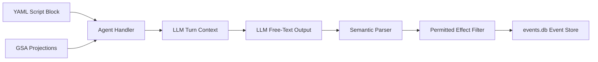

---
{
  "title": "Testing, Concurrency, and Rollout",
  "section": "08",
  "tags": [
    "architecture",
    "testing",
    "concurrency",
    "rollout",
    "v7.1"
  ]
}
---

[[00 - Index|◀ Back to Index]]

# 🧪 Testing, Concurrency, and Rollout

This module outlines the authoring patterns for script-guided agents, defines the integration test suite, establishes the progressive rollout workflow, and specifies the concurrency and timeout invariants of the system.

---

## 1. Authoring Workflow for Quasi-Deterministic Agents

Fully autonomous agents are too unpredictable for structured video production, while traditional scripting is too rigid. The pipeline adopts a **quasi-deterministic hybrid pattern**: agents utilize LLMs to reason but are strictly constrained by structured YAML scripts and runtime execution gates.

### 1.1 The Runtime Execution Gate

1. **Script Injection:** The handler reads the scene YAML script (e.g. `scripts/scene_3.yaml`) and injects its instructions directly into the agent prompt context.
2. **Action Limitations:** The agent does not have general tools to navigate files or invoke arbitrary APIs. Its primary tool is `bash_command` (restricted to coordinator/worker context).
3. **Effect Enforcement:** The post-execution parser extracts only those effects explicitly declared in the scene's `permitted_effects` whitelist. All other extracted effects are ignored.

---

### 1.2 Authoring Format (YAML)

---

### 1.3 Runtime Turn Enforcement Example

---

### 1.4 Agent Behavior Comparison

| Character | Hard Scripted | Fully Agentic | Quasi-Deterministic (Adopted) |
| :--- | :--- | :--- | :--- |
| **Next Action Determination** | Static branching | LLM choice (Unbounded) | Bounded by YAML task definitions |
| **Error Handling** | Hardcoded exceptions | Hallucinated operations | Structured escape conditions |
| **Effect Output Space** | Single hardcoded type | Unrestricted kinds | Explicit `permitted_effects` whitelist |
| **Edge-Case Safety** | Fatal crash | Runaway infinite loop | Automatic pause → `ClarificationRequest` |

---

## 2. Unit and Integration Tests

The testing suite consists of real-world integration tests driven over active network boundaries. No mock simulators or fake database layers are used.

### 2.1 Core Testing Principle

> [!IMPORTANT]
> **Uncompromised Thoroughness:** Developer convenience, cloud rental fees, and execution time must never compromise verification. All integration and BDD suites must exercise actual VM instantiation, SSH tunnels, worker endpoints, and media validation to mirror production loads.

> [!IMPORTANT]
> **Covered-Simulation:** If a simulator or mock implementation (e.g., `DryRunModel`, `TtsJobSimulator`, `LtxJobSimulator`) is utilized anywhere in any test suite for development convenience, performance, or isolation, the underlying real, non-simulated production process (the actual LLM API calls, live Vast.ai VM rental, SSH tunneling, and remote CUDA-based media synthesis) **must be tested in non-simulation form very robustly** to ensure live correctness. Mocks must never be used as a replacement for live, uncompromised boundary validation.
>
> [!NOTE]
> **Philosophy of Hard Failures:** If a Simulation Cover cannot run (due to missing credentials, offline status, or missing physical dependencies), then the simulators it covers cannot be verified, rendering any offline tests relying on them pointless. Therefore, the Simulation Cover must fail immediately (raising a fatal error or assertion failure) to prevent untrusted simulated runs from passing.

---

### 2.2 Active BDD Integration Test Suites

1. **Scale Timeline Integrity & Gap Validation Test:**
   * **Context:** SQLite event store holds a script for a 120-block, 3600-second (hour-long) film.
   * **Workflow:** Provisioner triggers 120 TTS and 120 video rendering jobs, logging all completions.
   * **Validation:** Assembly Agent builds the 120-slot OpenTimelineIO timeline. Asserts zero gap overlays, perfect 3600s total duration, and database WAL stability under concurrency.
2. **Multi-VM Job Dispatch & Fleet Coordination Test:**
   * **Context:** 50 pending rendering jobs in queue.
   * **Workflow:** Provisioner spawns and coordinates multiple active worker VMs.
   * **Validation:** Verification that tasks route to correct VM configurations, and events log correct worker assignments.
3. **Localized Segment Recovery & Pipeline Completeness Test:**
   * **Context:** 100-block documentary run where 98 blocks are completed and 2 blocks fail.
   * **Workflow:** Provisioner identifies the failures in the event log.
   * **Validation:** Retries ONLY the 2 failed blocks on clean VM instances; Assembly Agent waits for completions before outputting a solid 100-slot movie.
4. **Provisioning Happy-Path Escalation Test:**
   * **Context:** Pending job queue backlog.
   * **Workflow:** Provisioner starts with 1 VM, escalates by doubling to 2 VMs, and then 4 VMs.
   * **Validation:** Verification of serial execution on single instance, progressing to correct parallel distribution across the escalated worker pool.
5. **Infrastructure Preemption and Failure Recovery Test:**
   * **Context:** Active jobs in progress.
   * **Workflow:** Simulates worker VM cold-boot timeouts, spot instance preemptions, and coordinator restarts.
   * **Validation:** Provisioner detects preemption, condemns timed-out VMs, and recovers active state on restart by replaying the event store without double-allocating resources.
6. **Multi-Scene Transition and Visual Integrity Test:**
   * **Context:** 10-scene screenplay timeline.
   * **Workflow:** Rendering finishes; Assembly Agent applies cross-dissolve transitions.
   * **Validation:** Timelines verify transition tracks align without introducing visual black screens or audio timing overlaps.
7. **Accumulative Duration Drift Correction Test:**
   * **Context:** 60-block timeline containing audio/video block duration differences (e.g., due to float rounding).
   * **Workflow:** Assembly Agent evaluates drift patterns across the timeline.
   * **Validation:** Applies audio time-stretching or video frame trims. Asserts that the final cumulative sync drift at any point is less than **0.05 seconds**.
8. **Audio Loudness Normalization Test:**
   * **Context:** 60 narration blocks with varying recording gains and voice roles.
   * **Workflow:** Assembly Agent processes the final timeline mix using loudness filters.
   * **Validation:** Integrated loudness must measure **-16.0 LUFS +/- 1.0 LUFS** with a maximum true peak of **-1.0 dBTP**.
9. **End-to-End Multi-Agent Orchestration Happy Path Test:**
   * **Context:** A raw screenplay dialogue script is loaded in GSA, and all microservices are running.
   * **Workflow:** The pipeline wakes up all agents sequentially. Scenario Agent splits scenes/blocks, Audio/Video agents queue jobs, Provisioner runs them, and Assembly Agent compiles the output.
   * **Validation:** Event log records full sequential progress, culminating in a successfully validated `pipeline_complete` effect.
10. **Scenario-to-Audio Production Pipeline Happy Path Test:**
    * **Context:** Parsed SD-JSON screenplay loaded. Scenario and Audio agents are active.
    * **Workflow:** Scenario Agent generates narration script blocks. Audio Agent immediately detects them, queues TTS jobs, and completes reconciliation.
    * **Validation:** Checks that `reconciliation_complete` is achieved with all voice durations matched.
11. **Muxing and Timeline Composition Happy Path Test:**
    * **Context:** GSA event store contains completed rendering jobs. Assembly Agent active.
    * **Workflow:** Assembly Agent is triggered, runs `ffmpeg` commands, and validates final output.
    * **Validation:** Asserts output MP4 container and audio codecs match target web specifications.
12. **Integrated Dynamic Offset and Shift Cascade Test:**
    * **Context:** Multiple scene screenplay with narrative audio and video clips fully rendered and aligned.
    * **Workflow:** A duration adjustment (`DurationAdjusted`) is triggered on an early block (e.g. block 1 duration increases by 1.5s). GSA catches this event, and the `CoordinateTimeline` projection dynamically recalculates the start/end coordinates of all subsequent blocks on both narration and visual tracks. The Video Agent is woken up to render a new visual clip matching the new duration target, and the Assembly Agent dynamically compiles and renders the shifted timeline.
    * **Validation:** Verifies that the final compiled MP4 duration has shifted exactly by +1.5s and that all video and audio tracks are perfectly synchronized without audio gaps or visual black frames.
     * **Validation:** Asserts that track-isolated collision checks prevent writing overlapping narration, while allowing concurrent background music and visuals to merge seamlessly during FFmpeg muxing into the final MP4.

### 2.3 Heavy Standalone Test Launchers

To maintain strict segregation of concerns and avoid polluting production agent logic with environment-based branching (e.g., `is_test` flags), complex integration scenarios are driven by dedicated, standalone launcher scripts.

* **Architecture**: Rather than a single runner using global runtime configuration toggles, each complex test scenario has its own dedicated Python script under `tests/units/` (e.g., `run_test_12_dynamic_shift.py`).
* **Process Lifecycle**: The test script launches GSA and the specific production agents as local background servers on their standard ports.
* **Inline Simulation**: Any test-specific simulated/fake behaviors (such as VM allocation mock responses or custom test screenplay seeding) are implemented locally within the test launcher script, driving the production agents via database events and HTTP requests.
* **Teardown**: The script ensures complete, clean background process termination on exit.

### 2.4 Bash-Guided Agent Script Bootstrapping

To isolate testing-specific simulator implementations (such as mock TTS or Ltx GPU generators) from production ASGI servers with zero environment variables, temporary files, or central registry maps:

1. **Direct Agent Execution:** Each agent application is defined to allow direct execution as a script (e.g. `python server/agents/audio/app.py <port> <test_module_name>`).
2. **CommandLine Argument Passing:** The bash layer (or test runner) launches the required agent scripts in the background, passing the port and the current test module name (e.g. `tests.units.test_simulation_bdd_tts_fleet_cold_start`) as direct CLI arguments.
3. **In-Memory Capability Resolution:** On startup, the agent script parses its arguments, dynamically imports the specified test module, scans for any classes ending with `Simulator` or `Capability`, instantiates them, and passes them to `make_agent_app(role, extra_capabilities=...)`.
4. **Clean Production Isolation:** When imported normally (e.g., in a production pipeline run), the agent apps bypass command-line argument parsing and load with empty capabilities, keeping the production core completely clean.

### 2.5 Simulation Cover Integrity Guard & Execution Trace Auditing

To prevent LLMs and agents from bypass-mocking the 10 Simulation Cover (SC) integration tests, the system implements a multi-layered verification defense:

1. **SC Guard Plugin (Static Enforcer):** 
   A static AST-based plugin (`sc-guard-enforcer`) intercepts file writes/edits in `server/capabilities`. It automatically rejects any code containing:
   * Mocking libraries (`unittest.mock`, `pytest_mock`, `MagicMock`, etc.).
   * Unconditional skips (`pytest.skip`, `unittest.skip`, `@pytest.mark.skip`, etc.).
   * Trivial assertions (e.g. `assert True`, `assert 1 == 1`).

2. **Execution Trace Auditing:** 
   The pipeline harness automatically logs physical side-effects in the event store:
   * `CommandExecuted`: The CLI command, exit status, and stdout hash.
   * `NetworkRequest`: Targeted URL, HTTP method, and response status code.
   * `FileWritten`: Written file path and size.
   * `ProcessSpawned`: Target executable/script and PID.

3. **LLM BDD Judge Correlation:** 
   The BDD Judge evaluates test completion and cross-references domain-level effects with these execution trace logs. If a test claims a domain action completed (e.g. `VMAllocated`, `AudioGenerated`) but the SQLite Event Store lacks corresponding trace logs proving a real command was run, API query sent, or file written, the judge rejects the run and marks the verdict as `fail` (Mocking Detected).

---

### 2.6 Legitimate BDD Simulators

A legitimate BDD simulator is an in-memory or inline simulator capability designed strictly for **simulation tests** to model capability execution. To be legitimate, it must satisfy the following architectural criteria:

1. **Fully Backed by Covering Tests**:
   Every capability modeled by a BDD simulator in **simulation tests** must correspond to a live, non-simulated execution path. This execution path must be validated by one or more **covering tests** to verify that the simulator's logic matches real-world performance, API schemas, and physical operations.

2. **Audited by Architecture Tests**:
   All BDD simulators and the **simulation tests** that leverage them are subject to verification by **architecture tests**. These **architecture tests** run agentic audits to ensure the simulator is not bypassing invariants.

3. **Compliant with Architecture Test Invariants**:
   Under the rules checked by the **architecture tests**, BDD simulators in **simulation tests** must not use forbidden mocking libraries, unconditional skips, time-based timeouts, or trivial assertions. They must instead run as inline capability classes subclassing production interfaces, with their real-world behaviors validated via **covering tests**.

---

### 2.7 Test Suite Execution Order & Early Stopping Rules

To ensure maximum safety and early detection of architectural deviations, the test suite executes in a strict, sequenced pipeline managed by pytest markers and hooks (`tests/conftest.py`):

1. **Architecture Tests First (Immediate Stop)**:
   * **Prefix**: `test_architecture_`
   * **Role**: Runs the agentic architecture auditor checking test files for cheating or mock bypasses.
   * **Execution Rule**: This category must run first. If any **architecture tests** fail, execution aborts immediately (`pytest.exit`), preventing any subsequent tests from executing.

2. **Covering Tests Second (Totality and Gatekeeper)**:
   * **Prefix**: `test_covering_`
   * **Role**: Validates live-boundary components (network, physical databases, external CLI wrappers) without mocking.
   * **Execution Rule**: Runs after **architecture tests**. If any **covering test** fails, the runner continues executing the remaining **covering tests** in totality to get a complete report of live boundary failures. However, if *any* **covering test** fails, the suite will not proceed to the next stage.

3. **Simulation Tests Third (Conditional Execution)**:
   * **Prefix**: `test_simulation_`
   * **Role**: Validates complex agent behaviors and recovery pathways in simulated in-memory/inline capability environments.
   * **Execution Rule**: Runs only if all **covering tests** passed. If any **covering test** failed, all **simulation tests** are skipped entirely.

---

## 3. Concurrency and Timeouts Invariants

The concurrency model is optimized for a single-run pipeline executing on a unified coordinator host.

### 3.1 Concurrency Model

#### No runlevel concurrency
⚡ No runlevel concurrency is allowed; the events.db is dedicated to exactly one active self-contained run at a time

The pipeline is strictly self-contained from start to finish. Runlevel concurrency is completely prohibited; there are no concurrent pipeline runs or parallel instances of the pipeline executing at the same time. The database `/tmp/documentary-pipeline/events.db` is strictly dedicated to the single, active, self-contained run to prevent data corruption and trace pollution.

#### Concurrent agent execution within a run
⚡ Within a single pipeline run, agents may execute concurrently across separate ASGI processes

Within a single active run, all agents (Scenario, Audio, Video, Assembly, and the Provisioner) can and should execute concurrently in their respective ASGI processes. They act concurrently by polling the GSA, submitting media jobs, managing VMs, processing tasks in parallel to maximize runtime efficiency, and performing inquisitive proactive investigation into the run for general checks.

#### Turn serialization via LoopBoundLock
⚡ Within each agent process, all reasoning turns must be serialized via a LoopBoundLock to prevent overlapping execution and state corruption

Within each agent process, overlapping wakeups or concurrent background execution turns are strictly serialized using an in-process `LoopBoundLock` (`run_lock_manager`). Turns must be executed inside the lock boundary to prevent concurrent state corruption.

#### Direct synchronous database writes in WAL mode
Database writes are executed as direct synchronous writes in SQLite Write-Ahead Logging (WAL) mode within the single coordinator process, ensuring immediate durability and eliminating the need for background writer threads or lock contention.

#### Non-blocking agent busy safeguards
If an agent is currently processing a turn, its HTTP endpoints must return an immediate response without blocking (e.g. 409 Conflict for POST, or busy status for GET). Integration test runners must wait passively until the agent's `GET /` health state returns `"healthy"` before issuing new wakeup requests.

#### Exponential VM scaling limits
VM allocation must follow an exponential doubling pattern (1 VM -> 2 VMs -> 4 VMs). The maximum active GPU worker fleet is capped at a soft limit of 4 VMs per run.

#### Zero test-mode branching (Permanent Invariant)
⚡ Agents must never check, query, or branch their execution or startup paths based on whether they are running in "test", "simulation", or "production" mode. 
* The server startup must be instantaneous with zero blocking loops or startup delay polls.
* Background autonomous loops must run with a uniform, static `poll_interval = 0.5` seconds across all environments.
* Capabilities are loaded into memory directly via `extra_capabilities` if provided, without the agent ever setting or checking a `is_testing` flag.

---

### 3.2 Timeout Policy

#### Time-based timeouts are strictly forbidden across all execution and test code
⚡ Time-based timeouts are strictly forbidden across all execution, platform, health checks, and test code. There are absolutely no exceptions, and all network calls, subprocesses, and test verification flows must execute without timeout parameters. Test execution flows must wait passively or determine timeout using domain-specific conditions. Hard timeouts (like wait loops capped at 15 minutes) are prohibited. Crucially, shell subprocesses (such as `ffmpeg` or `vastai` operations) must never be launched with timeout limits; they must be executed asynchronously and observed for completion. Hang detection, resource unreachability, and execution delays are observed and reacted to dynamically by the helper LLM agent operating from outside the pipeline, usually connected to a human operator directly. Test runners and test harnesses are not exempt from the rule of NO-TIMEOUT.

#### Production execution paths must not use mock implementations
Tests validating production pipeline scenarios must run against real agents querying active endpoints. Mocks are restricted to isolated, offline unit test files.

---

## 4. Future Design Recommendations

* **Audio/Video Feedback Loops:** Enhance narration validation by introducing visual/audio analysis models to verify speech clarity and rhythm conformance, feeding results back to the Scenario Agent.
* **Timeline Trimming:** Rather than forcing voice generation to fit exact time limits, over-produce narration blocks by 10-20% and trim the audio/video dynamically at transition boundaries.
* **Separation of Concerns for Job Logs:** Split the `JobCompleted` event into a physical worker log and a logical `MediaExtracted` event. The latter should contain only pure metadata (codecs, dimensions, durations) to streamline OTIO timeline rendering.

---

*V7.1 Test & Concurrency Specifications. Monitored via pytest-bdd, bounded via LoopBoundLock.*