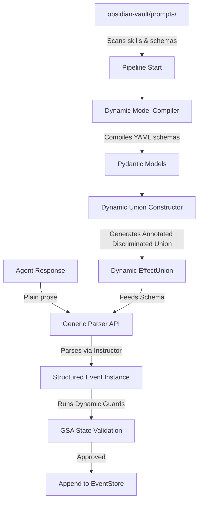

# Architectural Design: Decoupled Algebraic Event Parsing for a Fully Generic Agent System

## Context & Limitations of the Current Design

In the current implementation, agents communicate via plain natural language prose, which is parsed into structured events (or **effects**) using a semantic extraction parser powered by DeepSeek/OpenAI and structured output schemas. 

However, the system is not yet fully generic due to several tight-coupling points in `effects.py` and `effect_parser.py`:
1. **Static Class Declarations**: Every event type is declared as a static Python Pydantic class (`UpdateScript`, `QueueJob`, etc.) in `effects.py`. Adding new events requires codebase modifications.
2. **Fixed Algebraic Sum Type (Union)**: `EffectUnion` is a hardcoded discriminated union containing a static list of event types, which is passed to the LLM extraction parser.
3. **Hardcoded Agent-Event Permitted Mappings**: `ROLE_PERMITTED_KINDS` hardcodes which events each role (`scenario`, `audio`, etc.) is permitted to emit.
4. **Hardcoded GSA Invariant Checks**: `validate_state_invariants` performs specific, hardcoded HTTP/JSON checks for `job_approved` and `merge_into_otio`.

To achieve a **fully generic, polymorphic agent system** where agents load arbitrary skills (and their associated events) at startup without editing any python codebase, the algebraic event parsing must be made fully dynamic.

---

## Proposed Generic Architecture

We can decouple event parsing using a **declarative, schema-driven skill model**. Below is the proposed flow:



### 1. Declarative Event Schema Definition
Instead of writing Python code for each event type, we define them in YAML or JSON schema files inside a `schemas/` directory under `obsidian-vault/prompts/` (or package them alongside skill markdown files).

#### Example: `obsidian-vault/prompts/schemas/queue_job.yaml`
```yaml
kind: queue_job
title: QueueJob
description: "Demand creation of a media artifact by a VM worker."
fields:
  job_id:
    type: string
    description: "Stable unique job identifier"
  job_type:
    type: string
    enum: ["tts", "ltx"]
  scene_num:
    type: integer
    minimum: 1
  block_id:
    type: string
    description: "Narration block ID"
  slot_id:
    type: string
    description: "Canonical slot address (e.g. 'A1:1:s1_b1')"
  params:
    type: object
    default: {}
```

---

### 2. Runtime Pydantic Model Compiler
At server startup, the dynamic model compiler reads all registered YAML schema files and compiles them into standard Pydantic models at runtime using Pydantic's `create_model`.

```python
import yaml
from typing import Any, Dict, Type
from pydantic import create_model, BaseModel, Field
from effects import Effect  # Core base class containing effect_id, agent, timestamp

def compile_schema_to_model(schema_path: str) -> Type[Effect]:
    with open(schema_path, "r", encoding="utf-8") as f:
        schema_data = yaml.safe_load(f)
        
    kind = schema_data["kind"]
    title = schema_data.get("title", kind.title().replace("_", ""))
    description = schema_data.get("description", "")
    
    # Map YAML field types to Python types
    type_mapping = {
        "string": str,
        "integer": int,
        "number": float,
        "boolean": bool,
        "array": list,
        "object": dict,
    }
    
    fields: Dict[str, Any] = {}
    for field_name, properties in schema_data.get("fields", {}).items():
        yaml_type = properties.get("type", "string")
        py_type = type_mapping.get(yaml_type, Any)
        
        # Handle enums
        if "enum" in properties:
            from typing import Literal
            py_type = Literal[tuple(properties["enum"])]
            
        field_desc = properties.get("description", "")
        default_val = properties.get("default", ...) # ... means required
        
        fields[field_name] = (py_type, Field(default=default_val, description=field_desc))
        
    # Inject kind as Literal field for Pydantic discriminator mapping
    from typing import Literal
    fields["kind"] = (Literal[kind], Field(default=kind))
    
    # Dynamically build Pydantic class inheriting from base Effect
    dynamic_model = create_model(
        title,
        __base__=Effect,
        __doc__=description,
        **fields
    )
    return dynamic_model
```

---

### 3. Dynamic ADT (Sum Type/Union) Construction
Once the compiler generates the Pydantic models for all permitted events, we dynamically construct the algebraic sum type (Union) to feed into the extraction parser.

```python
from typing import Annotated, Union, List, Type
from pydantic import Field, BaseModel

def build_dynamic_effect_union(models: List[Type[Effect]]) -> Type[BaseModel]:
    """Builds a dynamic Union annotated with kind discriminator."""
    
    # Construct standard Python union type
    UnionType = Union[tuple(models)]
    
    # Add annotated metadata for discrimination
    DiscriminatedUnion = Annotated[UnionType, Field(discriminator="kind")]
    
    # Wrap in parser schema (e.g. SingleEffect wrapper)
    class DynamicSingleEffect(BaseModel):
        chain_of_thought: str = Field(description="Step-by-step reasoning")
        effect: DiscriminatedUnion = Field(description="The single extracted effect")
        confidence: int = Field(ge=0, le=10)
        
    return DynamicSingleEffect
```

This dynamic schema is then passed directly as the `response_model` to the `instructor` openai client:
```python
client = instructor.from_openai(openai_client)
result = await client.chat.completions.create(
    model="deepseek-chat",
    response_model=dynamic_response_model,  # Created dynamically at boot
    messages=[...],
)
```

---

## Decoupling State Invariant Guards
To avoid hardcoding checks (like verifying if a slot or job exists in the GSA) inside the parser, we can model state invariants in one of two generic ways:

#### Option A: Declarative Guard Rules (JSONPath Validation)
Define the invariant rules directly in the event YAML metadata. The validation engine will execute these queries against GSA state.

```yaml
# In queue_job.yaml
guards:
  - rule: "gsa_path_exists"
    gsa_path: "$.otio.slots.{slot_id}"
    error_message: "Slot {slot_id} not found in GSA timeline"
```
* **Pros**: No Python code required to add a new event or validation rule. The system remains strictly declarative.
* **Cons**: Limited to simple JSONPath existence checks. Hard to model complex logic (e.g., matching WhisperX measurements thresholds or retry count increment loops).

#### Option B: Dynamic Hook Plugins
Allow skills to package optional validator hooks inside a designated subdirectory (e.g., `skills/hooks/`). The engine dynamically imports and loads hooks matching the event kind.

```python
# obsidian-vault/prompts/hooks/validate_queue_job.py
async def validate(effect, gsa_state: dict) -> list[Effect]:
    slot = gsa_state.get("otio", {}).get("slots", {}).get(effect.slot_id)
    if not slot:
        return [ClarificationRequest(
            failure_reason=f"Slot {effect.slot_id} missing",
            question=f"Slot {effect.slot_id} was not found."
        )]
    return [effect]
```
* **Pros**: Expressive power of full Python code; handles arbitrary complex conditional validations.
* **Cons**: Introduces executable code files outside of declarative configuration.

---

## Architectural Open Questions & Tradeoffs

To move forward with implementing this generic architecture, we need to decide on the following aspects:

1. **Guard/Validator Design**: Do you prefer the strictly declarative JSONPath/query validation rules (Option A) or a hook/plugin dynamic Python import approach (Option B)?
2. **Schema Location**: Should the schemas live in a standalone `schemas/` folder under `obsidian-vault/prompts/` (e.g. `obsidian-vault/prompts/schemas/queue_job.yaml`), or should they be embedded in the YAML front-matter of the skill documentation files themselves?
3. **Pydantic Validation Customization**: Pydantic models in python currently have some custom `@field_validator` methods (e.g. parsing time formats like `MM:SS` using `parse_duration`). In a dynamic schema loader, we can standardize standard validation categories (e.g. `format: duration`) to map automatically to common validators like `parse_duration`. Does this approach fit your requirements?
