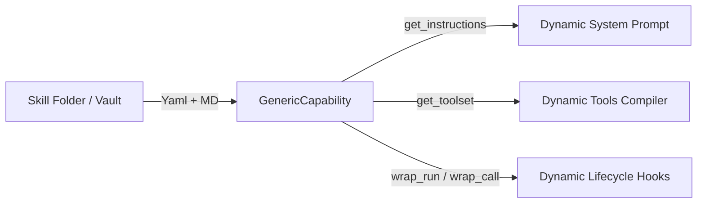

# Architectural Design: Fully Generic Pydantic AI `AbstractCapability` System

## Context: The Role of `AbstractCapability`

In the `pydantic-deep` and `pydantic-ai` ecosystem, agents are extended via **Capabilities** (subclasses of `AbstractCapability`). A capability is structured middleware that can:
1. **Inject Instructions** (`get_instructions()`): Append dynamic system instructions (e.g., Todo lists or rules) to the agent's prompt.
2. **Provide Tools** (`get_toolset()`): Register tool schemas and callbacks (e.g., `create_todo`, `read_script`).
3. **Interpose on Execution Lifecycle** (`wrap_run()`): Act as middleware wrapping agent executions, tool calls, and LLM completions.

Currently, capabilities are statically written in Python (like `ContextManagerCapability`, `TodoCapability`, or `CostTracking`). 

By adopting a **"Hooks, Not Tools"** paradigm, we can treat capabilities in a fully generic manner. Instead of writing custom Python classes for each agent behavior, we can create a single, unified `GenericCapability` (or `DynamicSkillCapability`) class. This class compiles prompts, tools, and lifecycle hooks dynamically from declarative skill metadata.

---

## Proposed Design: The `GenericCapability` Class

The `GenericCapability` class acts as a runtime interpreter for skill configuration files (markdown + YAML) stored in the Obsidian vault.



### 1. Structure of a Declarative Skill Package
A skill is represented as a directory in the vault:
```text
obsidian-vault/prompts/skills/audio_production/
├── skill.yaml          # Metadata, dynamic tool schemas, and hook definitions
├── instructions.md     # Narrative guidelines (injected into prompt)
└── hooks/              # Dynamic Python hooks for lifecycle interposition
    ├── validate_event.py
    └── on_tool_error.py
```

#### Example: `skill.yaml`
```yaml
name: audio_production
description: "Handles TTS generation, duration validation, and reconciliation"

# 1. Tools provided by this capability (compiled dynamically)
tools:
  - name: query_tts_status
    description: "Get TTS job statuses from GSA"
    parameters:
      type: object
      properties:
        job_id: { type: string }
    # Routed to a generic runner or a specific python function in hooks
    handler: "hooks.tools.query_tts_status" 

# 2. Lifecycle hooks (middleware) to register
hooks:
  - phase: "post_event_extraction"
    handler: "hooks.validate_event.validate"
  - phase: "on_tool_error"
    handler: "hooks.on_tool_error.handle"
```

---

### 2. Runtime Python Implementation Draft

Here is how the `GenericCapability` can wrap the Pydantic AI `AbstractCapability` to load skills dynamically:

```python
import os
import yaml
import importlib.util
from typing import Any, List, Dict
from pydantic import BaseModel
from pydantic_ai.tools import Tool
from pydantic_deep.capability import AbstractCapability  # Base capability class

class GenericCapability(AbstractCapability):
    """A fully generic Capability that loads prompts, tools, and hooks from a skill folder."""
    
    def __init__(self, skill_dir: str):
        self.skill_dir = skill_dir
        self.skill_name = os.path.basename(skill_dir)
        self.config = self._load_yaml_config()
        self.instructions = self._load_instructions()
        self.hooks = self._load_hooks()
        
    def _load_yaml_config(self) -> dict:
        config_path = os.path.join(self.skill_dir, "skill.yaml")
        if os.path.exists(config_path):
            with open(config_path, "r", encoding="utf-8") as f:
                return yaml.safe_load(f)
        return {}
        
    def _load_instructions(self) -> str:
        md_path = os.path.join(self.skill_dir, "instructions.md")
        if os.path.exists(md_path):
            with open(md_path, "r", encoding="utf-8") as f:
                return f.read().strip()
        return ""
        
    def _load_hooks(self) -> Dict[str, Any]:
        loaded_hooks = {}
        hooks_config = self.config.get("hooks", [])
        for hook_entry in hooks_config:
            phase = hook_entry["phase"]
            handler_path = hook_entry["handler"] # e.g. "hooks.validate_event.validate"
            
            # Resolve file path dynamically
            module_name = handler_path.split(".")[1]
            func_name = handler_path.split(".")[2]
            file_path = os.path.join(self.skill_dir, "hooks", f"{module_name}.py")
            
            if os.path.exists(file_path):
                # Dynamically import hook function
                spec = importlib.util.spec_from_file_location(module_name, file_path)
                module = importlib.util.module_from_spec(spec)
                spec.loader.exec_module(module)
                loaded_hooks[phase] = getattr(module, func_name)
        return loaded_hooks

    # --- Pydantic AI Capability Overrides ---

    def get_instructions(self) -> str:
        """Injects instructions dynamically from instructions.md."""
        return self.instructions

    def get_toolset(self) -> List[Tool]:
        """Compiles declarative tools in skill.yaml into Pydantic AI Tool objects."""
        tools = []
        for tool_def in self.config.get("tools", []):
            # Dynamic wrapper that redirects call to hook handler
            async def dynamic_tool_call(ctx, **kwargs):
                handler_path = tool_def["handler"]
                # Look up and execute the dynamic handler function
                handler_fn = self._resolve_handler(handler_path)
                return await handler_fn(ctx, **kwargs)
                
            # Compile parameters schema into dynamic pydantic model
            from pydantic import create_model
            params_schema = tool_def.get("parameters", {})
            # Simplified schema to pydantic model generator...
            params_model = self._compile_params_model(params_schema)
            
            tools.append(Tool(
                name=tool_def["name"],
                description=tool_def["description"],
                callback=dynamic_tool_call,
                parameters_model=params_model
            ))
        return tools

    async def wrap_run(self, call_next, *args, **kwargs):
        """Lifecycle middleware intercepting agent runs."""
        # 1. Run pre-run hook if defined
        if "pre_run" in self.hooks:
            await self.hooks["pre_run"](*args, **kwargs)
            
        # 2. Execute agent turn
        result = await call_next(*args, **kwargs)
        
        # 3. Run post-run hook if defined
        if "post_run" in self.hooks:
            result = await self.hooks["post_run"](result, *args, **kwargs)
            
        return result
```

---

## The Power of "Hooks, Not Tools" in Capability Design

By using lifecycle hooks instead of presenting actions as agent tools, we realize major robustness benefits:

1. **Implicit Validation Guards**: 
   Events parsed from agent outputs can be intercepted and validated in the `post_event_extraction` hook phase. If validation fails, the hook can raise a validation exception or append a `ClarificationRequest` to the event store directly—without the agent needing to explicitly run a `validate_action` tool.
2. **Invisible Safety Boundaries**:
   Rate limits, budget-checks, loop-detectors, and command sanitization can be wrapped in `pre_run` or `on_tool_call` hooks. The agent is freed from the cognitive load of managing these constraints; they are enforced transparently by the capability wrapper.
3. **Decoupled Architecture**:
   The LLM agent's output is clean prose. The capability wraps around the agent, registers the parser, runs hooks on the output, and appends to the database. The agent remains simple and generic.

---

## Architectural Choices & Discussion Points

1. **Sandboxing Dynamic Hook Code**: Since Option B (Python hook files) runs arbitrary Python code, does this present any security concerns for your pipeline, or is local execution fully trusted?
2. **State Injection via Capabilities**: In addition to tools and prompts, should capabilities be able to inject reactive context (e.g. dynamic variables or state snapshots) into the agent's working memory?
